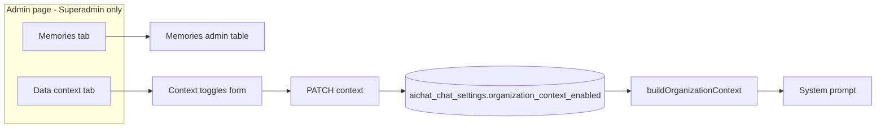

# Aichat Data Context Admin — Implementation Plan

## Goal

- **Storage:** Per-business **read/write** toggles per data context (products, contacts, transactions, product_prices, stock, profit_report, etc.). Each context has **Read** and **Write**.
- **UI:** One admin page with **two tabs**: (1) Memories admin (existing), (2) Data context as a **list view** (table) with **two toggles per row: Read | Write**, following [public/html/apps/user-management/roles/view.html](public/html/apps/user-management/roles/view.html) (Role Permissions table with Read/Write checkboxes per row). Only **ADMINISTRATOR_USERNAMES** (Superadmin middleware) can access this admin page.
- **Semantics:** **Read** = AI chat can access/read that data (section included in prompt). **Write** = AI can edit, modify, or remove (set to null) that data; when both are active for a context, the AI can read and perform updates. `buildOrganizationContext()` includes only sections whose **read** is enabled; write is enforced when implementing AI-triggered updates (e.g. tools or flows that apply changes only if write is true for that context).

---

## Architecture (high level)

- **Config** defines the list of context types (key, label, default read, default write).
- **DB** stores per-business overrides in `aichat_chat_settings.organization_context_enabled` (JSON): for each key, `{ "read": bool, "write": bool }`.
- **ChatUtil** merges config defaults with DB; builds prompt only for sections with **read** true; **write** is used by future AI-update flows to allow edit/modify/remove.

---

## UI reference (list view + Read/Write toggles)

Use [public/html/apps/user-management/roles/view.html](public/html/apps/user-management/roles/view.html) as the layout reference for the Data context tab:

- **Table:** `table align-middle table-row-dashed fs-6 gy-5` inside a card body.
- **Rows:** One row per data context. First column = context name (e.g. "Products", "Contacts"). Second column = **Read** toggle; third column = **Write** toggle.
- **Toggles:** Use Metronic switches: `form-check form-switch form-check-sm form-check-custom form-check-solid` with `form-check-label` "Read" / "Write" (see lines 4625–4664 in roles/view.html for the two-checkbox-per-row pattern; use switches instead of plain checkboxes for consistency with Aichat settings).

---

## 1. Database

**New migration** in `Modules/Aichat/Database/Migrations/`:

- **Table:** `aichat_chat_settings`
- **Column:** `organization_context_enabled` — type `json`, nullable
- **Placement:** after `share_ttl_hours` (match existing migration style in [2026_02_27_010003_create_aichat_chat_settings_and_audit_tables.php](Modules/Aichat/Database/Migrations/2026_02_27_010003_create_aichat_chat_settings_and_audit_tables.php))
- **Down:** drop column

---

## 2. Config

**File:** [Modules/Aichat/Config/config.php](Modules/Aichat/Config/config.php)

Under existing `chat.organization_context`, add key `**context_types`** — full list (Option C – Large) with `**group`** for UI grouping. Shape: `'key' => ['label' => '...', 'group' => '...', 'default_read' => bool, 'default_write' => bool]`. Keep existing `products_limit`, `contacts_limit`, `transactions_limit` unchanged.

**Products & catalog**

- `products` — "Products", group `products_catalog`, default_read true, default_write false
- `product_prices` — "Product prices", group `products_catalog`, default_read false, default_write false
- `product_variations` — "Product variations / SKUs", group `products_catalog`, default_read false, default_write false
- `categories` — "Categories", group `products_catalog`, default_read false, default_write false
- `brands` — "Brands", group `products_catalog`, default_read false, default_write false
- `units` — "Units", group `products_catalog`, default_read false, default_write false
- `stock` — "Stock / inventory", group `products_catalog`, default_read false, default_write false
- `opening_stock` — "Opening stock", group `products_catalog`, default_read false, default_write false

**People & CRM**

- `contacts` — "Contacts", group `people_crm`, default_read true, default_write false
- `contact_types` — "Contact types / segments", group `people_crm`, default_read false, default_write false
- `leads` — "Leads", group `people_crm`, default_read false, default_write false
- `deals` — "Deals / opportunities", group `people_crm`, default_read false, default_write false

**Sales & orders**

- `transactions` — "Sales / Purchase / Orders", group `sales_orders`, default_read true, default_write false
- `sales_orders` — "Sales orders", group `sales_orders`, default_read false, default_write false
- `invoices` — "Invoices", group `sales_orders`, default_read false, default_write false
- `quotations` — "Quotations / quotes", group `sales_orders`, default_read false, default_write false
- `sell_returns` — "Sell returns", group `sales_orders`, default_read false, default_write false
- `pos_sales` — "POS sales", group `sales_orders`, default_read false, default_write false

**Purchases**

- `purchase_transactions` — "Purchase transactions", group `purchases`, default_read false, default_write false
- `purchase_orders` — "Purchase orders", group `purchases`, default_read false, default_write false
- `purchase_returns` — "Purchase returns", group `purchases`, default_read false, default_write false

**Stock & movement**

- `stock_transfers` — "Stock transfers", group `stock_movement`, default_read false, default_write false
- `stock_adjustments` — "Stock adjustments", group `stock_movement`, default_read false, default_write false
- `stock_valuation` — "Stock valuation", group `stock_movement`, default_read false, default_write false

**Financial & accounting**

- `chart_of_accounts` — "Chart of accounts / ledger", group `financial`, default_read false, default_write false
- `journal_entries` — "Journal entries", group `financial`, default_read false, default_write false
- `payments` — "Payments", group `financial`, default_read false, default_write false
- `expenses` — "Expenses", group `financial`, default_read false, default_write false
- `profit_report` — "Profit report", group `financial`, default_read false, default_write false
- `trial_balance` — "Trial balance / P&L", group `financial`, default_read false, default_write false

**Reports**

- `sales_report` — "Sales report", group `reports`, default_read false, default_write false
- `purchase_report` — "Purchase report", group `reports`, default_read false, default_write false
- `stock_report` — "Stock report", group `reports`, default_read false, default_write false
- `tax_report` — "Tax report", group `reports`, default_read false, default_write false
- `custom_reports` — "Custom reports / dashboards", group `reports`, default_read false, default_write false

**Setup & reference**

- `business_settings` — "Business settings", group `setup`, default_read false, default_write false
- `locations` — "Locations / warehouses", group `setup`, default_read false, default_write false
- `tax_rates` — "Tax rates", group `setup`, default_read false, default_write false
- `payment_types` — "Payment types", group `setup`, default_read false, default_write false
- `users` — "Users (names/roles)", group `setup`, default_read false, default_write false
- `currencies` — "Currencies", group `setup`, default_read false, default_write false

**Optional: module-specific** (add only if module is present; can be in same config with conditional registration or a separate list)

- `manufacturing` — "Manufacturing (production, BOM)", group `modules`, default_read false, default_write false
- `project` — "Projects / tasks", group `modules`, default_read false, default_write false
- `repair` — "Repair jobs", group `modules`, default_read false, default_write false
- `assets` — "Assets", group `modules`, default_read false, default_write false
- `payroll` — "Payroll", group `modules`, default_read false, default_write false

**Implementation note:** For each key, `buildOrganizationContext()` (or a dedicated builder) only needs to output content when that key’s **read** is true. Many keys can remain stub/empty until implemented; the admin UI will still show all toggles. Implement in phases: first products, contacts, transactions (existing), then product_prices, stock, then reports and others as needed.

---

## 3. Model

**File:** [Modules/Aichat/Entities/ChatSetting.php](Modules/Aichat/Entities/ChatSetting.php)

- Add to `$casts`: `'organization_context_enabled' => 'array'`.

---

## 4. ChatUtil

**File:** [Modules/Aichat/Utils/ChatUtil.php](Modules/Aichat/Utils/ChatUtil.php)

**New methods (public):**

- `**getContextTypesFromConfig(): array`** — return `config('aichat.chat.organization_context.context_types', [])`. Each item has `label`, `group`, `default_read`, `default_write`; view can group rows by `group`.
- `**getEnabledContextKeysForBusiness(int $business_id): array`** — get ChatSetting; read `organization_context_enabled` (each key => { read, write }); merge with config defaults; return list of keys where **read** is true (for use in buildOrganizationContext).
- `**getContextPermissionsForBusiness(int $business_id): array`** — return full key => ['read' => bool, 'write' => bool] merged with config defaults (for admin form and future write checks).

**Refactor `buildOrganizationContext(int $business_id)`** (lines 1272–1320):

- At start: `$enabled = $this->getEnabledContextKeysForBusiness($business_id)`.
- Build `$lines` in sections: business name; **only if** `'products'` in `$enabled`: product count + product lines; **only if** `'contacts'` in `$enabled`: contact lines; **only if** `'transactions'` in `$enabled`: transaction lines.
- For all other context keys in config: if key is in `$enabled`, call a small builder (e.g. `buildContextSection_$key()` or a map of callables) that returns a string; if no builder exists yet, return empty string or skip. This allows phased implementation: only products, contacts, transactions have real content initially; others are stubs until implemented.

`**updateBusinessSettings()`** (lines 91–126): allow `organization_context_enabled` in `$data`; if present, ensure it is an array of key => ['read' => bool, 'write' => bool] (only keys from config); then `$settings->fill($data)` and save.

---

## 5. Form request

**New file:** `Modules/Aichat/Http/Requests/Chat/UpdateChatContextEnabledRequest.php`

- **authorize:** user authenticated; rely on route Superadmin middleware for admin check.
- **rules:** `context_enabled` nullable array; `context_enabled.*.read` and `context_enabled.*.write` nullable boolean; keys must be in config context_types.
- **prepareForValidation:** merge submitted `context_enabled` with all config keys so every key has `['read' => bool, 'write' => bool]` (submitted or default false).

---

## 6. Routes

**File:** [Modules/Aichat/Routes/web.php](Modules/Aichat/Routes/web.php)

- Add **Superadmin** middleware group inside existing aichat chat prefix:
  - **GET** `/chat/settings/admin` → controller method for tabbed admin page. Name: `aichat.chat.settings.admin`. Query: `tab` (memories | context), default `memories`.
  - **PATCH** `/chat/settings/admin/context` → update context toggles for current business. Name: `aichat.chat.settings.admin.context.update`.
- Redirect GET `settings/memories/admin` to `settings/admin?tab=memories`.

---

## 7. Controller

**ChatMemoryAdminController** ([Modules/Aichat/Http/Controllers/ChatMemoryAdminController.php](Modules/Aichat/Http/Controllers/ChatMemoryAdminController.php)):

- `**adminIndex(Request $request)`**: Superadmin middleware. `$activeTab = $request->input('tab', 'memories')`. Load memories data (perPage, persistentMemories). Load context data: business_id from session; context types from ChatUtil (with `group`); `$contextPermissions = $this->chatUtil->getContextPermissionsForBusiness($business_id)`; build `$contextRows` (key, label, group, read_checked, write_checked). Optionally build `$contextRowsByGroup` (group => [rows]) for Blade so the table can render group headers or separate sections. Pass: persistentMemories, perPage, activeTab, contextRows (or contextRowsByGroup), updateContextUrl. Return view `aichat::chat.admin`.
- `**updateContext(UpdateChatContextEnabledRequest $request)`**: validate; business_id from session; normalize `context_enabled` to key => [read, write]; call `chatUtil->updateBusinessSettings($business_id, ['organization_context_enabled' => ...])`; redirect to `settings/admin?tab=context` with success.
- `**index()`**: redirect to `route('aichat.chat.settings.admin', ['tab' => 'memories'])` so old memories URL still works.

---

## 8. Views

**New parent:** [Modules/Aichat/Resources/views/chat/admin.blade.php](Modules/Aichat/Resources/views/chat/admin.blade.php)

- Extends `layouts.app`. Title from lang (`chat_admin_title`). Toolbar: h1, links to settings and chat index.
- Tabs: Bootstrap 5 / Metronic `nav nav-tabs` — "Memories" (`#tab-memories`), "Data context" (`#tab-context`). Active via `$activeTab`.
- Tab panes: `@include` `partials.memories_admin_tab` and `partials.context_admin_tab`.

**New partial — memories:** [Modules/Aichat/Resources/views/chat/partials/memories_admin_tab.blade.php](Modules/Aichat/Resources/views/chat/partials/memories_admin_tab.blade.php)

- Extract card and table from [memories_admin.blade.php](Modules/Aichat/Resources/views/chat/memories_admin.blade.php) (no @extends). Same forms (updateName, wipe). Per-page form GET `aichat.chat.settings.admin` with `tab=memories` and `per_page`.

**New partial — context (list view, Read + Write toggles):** [Modules/Aichat/Resources/views/chat/partials/context_admin_tab.blade.php](Modules/Aichat/Resources/views/chat/partials/context_admin_tab.blade.php)

- **Reference:** [public/html/apps/user-management/roles/view.html](public/html/apps/user-management/roles/view.html) — "Role Permissions" table (around lines 4610–4750): `table align-middle table-row-dashed fs-6 gy-5`, one row per permission, first column label, second column a `d-flex` with Read and Write checkboxes using `form-check form-check-sm form-check-custom form-check-solid me-5 me-lg-20`, `form-check-label` "Read" / "Write". Use **switches** instead of plain checkboxes: `form-check form-switch form-check-custom form-check-solid` for consistency with existing Aichat settings.
- Card with title/description from lang. Form POST to `$updateContextUrl`, @csrf, @method('PATCH'). **Table:** `<table class="table align-middle table-row-dashed fs-6 gy-5">` with `<thead>`: Data context | Read | Write (lang keys). **Grouping:** Either (A) one `<tbody>` with one `<tr>` per row, optionally a group header row (e.g. `<tr class="table-light"><td colspan="3">{{ group_label }}</td></tr>`) when `group` changes, or (B) one `<tbody>` per group with a group header row and then data rows. Use `$contextRowsByGroup` (group => rows) and lang for group labels (e.g. `chat_context_group_products_catalog` => "Products & catalog"). Each data row: first `<td>` = label; second `<td>` = Read switch `name="context_enabled[{{ $key }}][read]"`; third `<td>` = Write switch `name="context_enabled[{{ $key }}][write]"`. Use `form-check form-switch form-check-sm form-check-custom form-check-solid` and `form-check-label` for "Read" / "Write". Submit button from lang.

---

## 9. Lang

**File:** [Modules/Aichat/Resources/lang/en/lang.php](Modules/Aichat/Resources/lang/en/lang.php)

Add: `chat_admin_title`, `chat_context_admin_title`, `chat_context_admin_description`, `chat_context_admin_save`, `chat_context_admin_read`, `chat_context_admin_write` (table column headers). **Group labels** for Data context table sections: `chat_context_group_products_catalog` => "Products & catalog", `chat_context_group_people_crm` => "People & CRM", `chat_context_group_sales_orders` => "Sales & orders", `chat_context_group_purchases` => "Purchases", `chat_context_group_stock_movement` => "Stock & movement", `chat_context_group_financial` => "Financial & accounting", `chat_context_group_reports` => "Reports", `chat_context_group_setup` => "Setup & reference", `chat_context_group_modules` => "Modules".

---

## 10. Menu (DataController)

**File:** [Modules/Aichat/Http/Controllers/DataController.php](Modules/Aichat/Http/Controllers/DataController.php)

- Update "Memories admin" (or "Chat admin") submenu URL to `route('aichat.chat.settings.admin', ['tab' => 'memories'])`. Active when `request()->routeIs('aichat.chat.settings.admin*')`.
- Optionally add "Data context" submenu → `route('aichat.chat.settings.admin', ['tab' => 'context'])`.

---

## 11. Implementation order

1. Migration — add column; run module migrate.
2. Config — add context_types.
3. Model — cast.
4. ChatUtil — getContextTypesFromConfig, getEnabledContextKeysForBusiness, refactor buildOrganizationContext, updateBusinessSettings.
5. Form request — UpdateChatContextEnabledRequest.
6. Routes — Superadmin group, redirect.
7. Controller — adminIndex, updateContext, index redirect.
8. Views — admin.blade.php, memories_admin_tab.blade.php, context_admin_tab.blade.php.
9. Lang — four keys.
10. Menu — URL and active.

---

## 12. Verification

- Admin user: open Chat admin; Data context tab shows list (table) with Read and Write toggles per row; turn off Read for Products, save; chat prompt should omit products. With Read+Write on for a context, AI can (when implemented) read and edit/modify/remove that data.
- Non-admin: GET settings/admin → 403.
- Old memories link redirects to tabbed page.

---

## Files to add

- Migration: `*_add_organization_context_enabled_to_aichat_chat_settings_table.php`
- [Modules/Aichat/Http/Requests/Chat/UpdateChatContextEnabledRequest.php](Modules/Aichat/Http/Requests/Chat/UpdateChatContextEnabledRequest.php)
- [Modules/Aichat/Resources/views/chat/admin.blade.php](Modules/Aichat/Resources/views/chat/admin.blade.php)
- [Modules/Aichat/Resources/views/chat/partials/memories_admin_tab.blade.php](Modules/Aichat/Resources/views/chat/partials/memories_admin_tab.blade.php)
- [Modules/Aichat/Resources/views/chat/partials/context_admin_tab.blade.php](Modules/Aichat/Resources/views/chat/partials/context_admin_tab.blade.php)

## Files to change

- [Modules/Aichat/Config/config.php](Modules/Aichat/Config/config.php)
- [Modules/Aichat/Entities/ChatSetting.php](Modules/Aichat/Entities/ChatSetting.php)
- [Modules/Aichat/Utils/ChatUtil.php](Modules/Aichat/Utils/ChatUtil.php)
- [Modules/Aichat/Routes/web.php](Modules/Aichat/Routes/web.php)
- [Modules/Aichat/Http/Controllers/ChatMemoryAdminController.php](Modules/Aichat/Http/Controllers/ChatMemoryAdminController.php)
- [Modules/Aichat/Resources/lang/en/lang.php](Modules/Aichat/Resources/lang/en/lang.php)
- [Modules/Aichat/Http/Controllers/DataController.php](Modules/Aichat/Http/Controllers/DataController.php)

## Optional later

- Implement content for product_prices, stock, profit_report, sales_report, purchase_report in buildOrganizationContext.
- Add product price to products section when product_prices is enabled.
- **Write flow:** When the AI suggests or performs edits (update, delete, set to null), backend checks `getContextPermissionsForBusiness()` for that context’s **write**; only allow mutations when write is true.

