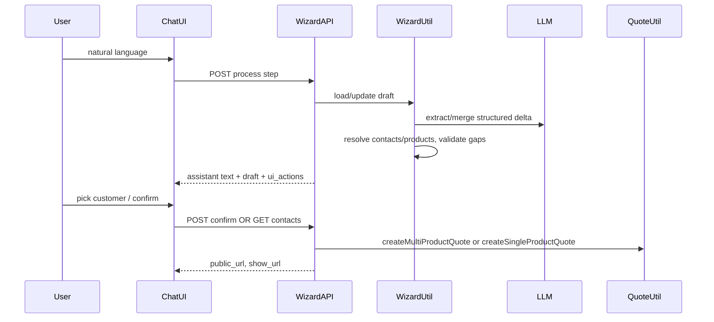

# Aichat ProductQuote chat wizard (phased plan)

## Architecture (data flow)

**Hard rules for implementers**

- All tenant queries: `business_id` from session; contacts/products scoped.
- Mutations: `product_quote.create`; confirm endpoint must re-check permission.
- **Never** create `ProductQuote` from raw LLM output alone: final payload must pass the same validation shape as [StoreProductQuoteRequest](app/Http/Requests/StoreProductQuoteRequest.php) (multi) or [StoreProductBudgetQuoteRequest](app/Http/Requests/StoreProductBudgetQuoteRequest.php) (single).
- **Human confirm** required before `QuoteUtil::create`* ([ai/product-copilot-patterns.md](ai/product-copilot-patterns.md)).
- Controller thin; orchestration in **Aichat Util**; reuse [QuoteUtil](app/Utils/QuoteUtil.php) (`createMultiProductQuote` / `createSingleProductQuote`).
- Public link: `route('product.quotes.public', ['publicToken' => $quote->public_token])` (token set on create per [QuoteUtil](app/Utils/QuoteUtil.php)).

---

## Phase 1 — Foundation (DB, permissions, config)

| Task           | Detail                                                                                                                                                                                                                                |
| -------------- | ------------------------------------------------------------------------------------------------------------------------------------------------------------------------------------------------------------------------------------- |
| 1.1 Migration  | Table `aichat_product_quote_drafts`: `id` (UUID PK), `business_id`, `user_id`, `conversation_id` (UUID FK), `flow` enum `multi                                                                                                        |
| 1.2 Model      | `Modules/Aichat/Entities/ProductQuoteDraft` (or under Entities) with casts, `forBusiness` scope.                                                                                                                                      |
| 1.3 Permission | New gate e.g. `aichat.quote_wizard.use` (seed + register in [DataController user_permissions](Modules/Aichat/Http/Controllers/DataController.php) if Aichat exposes permissions there). Default off or role-based per product policy. |
| 1.4 Config     | `config/aichat.php` (or existing): draft TTL (e.g. 24h), max customer search results, feature flag.                                                                                                                                   |

**Verification:** `php artisan migrate --pretend`; permission visible in role UI if applicable.

---

## Phase 2 — Resolution APIs (no LLM)

Thin JSON endpoints for chat UI and wizard Util (IDs from DB, not model guesses).

| Task | Detail                                                                                                                                                                                                                            |
| ---- | --------------------------------------------------------------------------------------------------------------------------------------------------------------------------------------------------------------------------------- |
| 2.1  | `GET .../quote-wizard/contacts?q=&limit=` — `Contact::where(business_id)->whereIn(type,customer/both)` + name search; return `{ id, name, supplier_business_name }` list. FormRequest for `q` length.                             |
| 2.2  | `GET .../quote-wizard/locations` — business locations for session business.                                                                                                                                                       |
| 2.3  | `GET .../quote-wizard/products?q=` — scoped product search for line resolution (reuse existing product search pattern if any).                                                                                                    |
| 2.4  | `GET .../quote-wizard/costing-defaults` — expose allowed `currency` / `incoterm` keys from [ProductCostingUtil::getDropdownOptions](app/Utils/ProductCostingUtil.php) so wizard can default first line and ask only when missing. |

Routes under [Modules/Aichat/Routes/web.php](Modules/Aichat/Routes/web.php) with `auth`, `SetSessionData`, `can:aichat.quote_wizard.use` (and chat enabled check via [ChatUtil::isChatEnabled](Modules/Aichat/Utils/ChatUtil.php)).

**Verification:** Feature test: 403 without permission; JSON shape stable.

---

## Phase 3 — Wizard orchestration (Util + LLM)

| Task | Detail                                                                                                                                                                                                                                                                                                           |
| ---- | ---------------------------------------------------------------------------------------------------------------------------------------------------------------------------------------------------------------------------------------------------------------------------------------------------------------- |
| 3.1  | `**ChatProductQuoteWizardUtil`** (Modules/Aichat/Utils/): `getOrCreateDraft(conversation_id, user_id, business_id)`, `mergeUserMessage(draft, text)` — call LLM with strict JSON schema for *delta only* (customer_hint, product_hints[], qty, prices/costing hints, location_hint, expires_in_days, flow hint). |
| 3.2  | **Resolution step**: map hints to `contact_id` (exact match or single candidate; else set `draft.payload.needs_clarification = customers_picklist` from DB search). Same for products → `product_id` per line.                                                                                                   |
| 3.3  | **Completeness**: derive missing fields from StoreProductQuoteRequest rules: `contact_id`, `location_id`, `expires_at`, per-line `product_id`, `qty`, `currency`, `incoterm` when shipment_port non-empty (mirror [withValidator](app/Http/Requests/StoreProductQuoteRequest.php) logic).                        |
| 3.4  | **Single flow**: If user/agent sets one product and `flow=single`, validate toward StoreProductBudgetQuoteRequest fields (`qty`, `currency`, etc.) and `single_product_id`.                                                                                                                                      |
| 3.5  | **Assistant copy**: second LLM call optional — turn structured state into short friendly question; or template-based messages for v1 to save cost.                                                                                                                                                               |

**Verification:** Unit tests for merge + completeness on fixture drafts; no DB quote created in this phase.

---

## Phase 4 — Process + confirm HTTP layer

| Task | Detail                                                                                                                                                                                                                                                                                                                                                                                                                                                 |
| ---- | ------------------------------------------------------------------------------------------------------------------------------------------------------------------------------------------------------------------------------------------------------------------------------------------------------------------------------------------------------------------------------------------------------------------------------------------------------ |
| 4.1  | `**ProcessQuoteWizardStepRequest`**: `message` string, optional `draft_id`, optional `selected_contact_id` / `selected_product_id` (when user picks from list).                                                                                                                                                                                                                                                                                        |
| 4.2  | `**POST /aichat/chat/conversations/{id}/quote-wizard/process`**: load draft by conversation + user; apply selections; run WizardUtil; save draft; return JSON `{ assistant_message, draft: { id, status, summary, missing_fields, pick_lists } }`. Append assistant message to chat via existing [ChatUtil::appendMessage](Modules/Aichat/Utils/ChatUtil.php) **or** return text for client to display (prefer persist assistant row for audit trail). |
| 4.3  | `**ConfirmProductQuoteDraftRequest`**: validates draft_id belongs to user+business+conversation, status `ready`.                                                                                                                                                                                                                                                                                                                                       |
| 4.4  | `**POST .../quote-wizard/confirm`**: build array for `Validator::make` against StoreProductQuoteRequest rules (multi) or StoreProductBudgetQuoteRequest (single); on pass, `QuoteUtil::createMultiProductQuote` or `createSingleProductQuote`; set draft `consumed`; audit [ChatAuditUtil](Modules/Aichat/Utils/ChatAuditUtil.php) `quote_created_from_chat`; return `{ quote_id, public_url, admin_url }`.                                            |
| 4.5  | **Final assistant message** (optional job or inline): append message with links.                                                                                                                                                                                                                                                                                                                                                                       |

**Verification:** Feature test full happy path multi-line; single-product path; 422 on invalid draft; idempotency (confirm twice → second fails gracefully).

---

## Phase 5 — Chat UI

| Task | Detail                                                                                                                                                                                                                             |
| ---- | ---------------------------------------------------------------------------------------------------------------------------------------------------------------------------------------------------------------------------------- |
| 5.1  | Entry: toolbar toggle **“Quote assistant”** or slash command; sets client flag so messages hit `quote-wizard/process` instead of/in addition to normal send (product decision: **parallel channel** avoids breaking general chat). |
| 5.2  | Render `pick_lists` as clickable chips (contact id / product id) sending next process with selection.                                                                                                                              |
| 5.3  | When `status === ready`, show **Confirm** button calling confirm API; on success show **Open public quote** + **Open in admin** links.                                                                                             |
| 5.4  | Prepare `window.AppConfig` or extend [buildClientConfig](Modules/Aichat/Utils/ChatUtil.php) with quote-wizard routes (no hardcoded URLs in inline JS beyond config).                                                               |

**Verification:** Manual smoke on Metronic chat page; mobile-friendly chip row.

---

## Phase 6 — Docs, edge cases, cleanup

| Task | Detail                                                                                   |
| ---- | ---------------------------------------------------------------------------------------- |
| 6.1  | Document in `Modules/Aichat/README.md`: flow, permissions, PII (customer names in logs). |
| 6.2  | Expire drafts via scheduled command or lazy check on process.                            |
| 6.3  | Rate-limit confirm + process like existing chat send.                                    |

---

## Constitution checklist (agents)

- No business rules in Blade; config/routes from controller/config.
- FormRequests for all new endpoints.
- Util holds wizard + resolution; QuoteUtil unchanged except if shared validation helper is extracted (prefer **duplicate validation array** or invoke FormRequest validator programmatically — avoid duplicating `withValidator` logic; use `Validator::make` + same closure rules or extract static rules method on Request).
- Tests: Phase 2 feature + Phase 4 feature + Phase 3 unit.

---

## Dependency order

Phase 1 → 2 → 3 → 4 → 5 → 6. Phase 5 can start stubbing once 4.2 returns stable JSON.