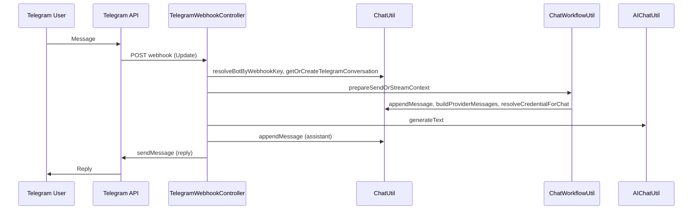

# Aichat Telegram Bot Integration — Implementation Plan

## Goal

- **Multi-org:** Aichat serves multiple organisations (businesses). Each org has its **own** Telegram bot token and chats only with **its own** org data. Nothing per-org (tokens, allowed users, allowed groups) is stored in `.env` — all of that is **per-business in the database**, with the bot token **encrypted at rest**.
- **Only org admin** (users with `aichat.chat.settings`) can add/remove the Telegram bot token and manage which org users are allowed to chat with the bot.
- Admin adds a **bot token** (to verify the bot) and a **list of allowed users** (one per line / multi-user) in Chat Settings. The token is saved **encrypted** in the DB (see §1.1 and §9).
- Only those **allowed users** can chat with the bot, after they **link** their Telegram account in the app (one-time code flow).
- When an allowed, linked user messages the bot, the message is processed by the same Aichat pipeline (using that org’s business_id and data) and the reply is sent back via Telegram.

## Architecture (high level)

## 1. Database

**One migration** adding five tables (bots, allowed_users, chats, link_codes, allowed_groups).

### 1.1 Table `aichat_telegram_bots` (per-org; token encrypted in DB)

- `id` (bigIncrements)
- `business_id` (unsignedInteger, FK to business, unique so one bot per business)
- `linked_user_id` (unsignedInteger, FK to users) — **org admin** who added the bot; used for credential resolution
- `webhook_key` (string, unique, index) — non-guessable key used in webhook URL (e.g. `Str::random(64)`)
- `encrypted_bot_token` (longText) — **per-org token stored only here, encrypted at rest** via `Crypt::encryptString` (same pattern as [ChatUtil](Modules/Aichat/Utils/ChatUtil.php) API keys). **Not in .env**; each org adds its own token in Settings.
- `timestamps`
- Foreign keys: `business_id`, `linked_user_id`

### 1.2 Table `aichat_telegram_allowed_users`

- `id` (bigIncrements)
- `business_id` (unsignedInteger, FK)
- `user_id` (unsignedInteger, FK to users)
- `timestamps`
- Unique index on `(business_id, user_id)` — org users allowed to chat with the bot (only org admin can add/remove).

### 1.3 Table `aichat_telegram_chats`

- `id` (bigIncrements)
- `business_id` (unsignedInteger, FK)
- `telegram_chat_id` (bigInteger) — from Telegram `message.chat.id`
- `conversation_id` (uuid, FK to aichat_chat_conversations)
- `user_id` (unsignedInteger, FK) — app user who linked this Telegram chat (must be in allowed list)
- `timestamps` — Laravel `$table->timestamps();` (created_at, updated_at)
- Unique index on `(business_id, telegram_chat_id)` so one Aichat conversation per Telegram chat

### 1.4 Table `aichat_telegram_link_codes`

- `id` (bigIncrements)
- `business_id` (unsignedInteger, FK)
- `user_id` (unsignedInteger, FK)
- `code` (string, unique, index) — short code user sends to bot (e.g. 6 alphanumeric)
- `expires_at` (dateTime)
- `timestamps`
- Used for one-time "Connect Telegram" flow: allowed user gets a code in app, sends `/start CODE` to bot; webhook creates `aichat_telegram_chats` and deletes the code.

### 1.5 Table `aichat_telegram_allowed_groups` (Allowed groups)

- `id` (bigIncrements)
- `business_id` (unsignedInteger, FK)
- `telegram_chat_id` (bigInteger) — Telegram group chat ID (negative; from `message.chat.id` when `chat.type` is `group` or `supergroup`)
- `title` (string, nullable) — optional label for display (e.g. "Sales team")
- `timestamps`
- Unique index on `(business_id, telegram_chat_id)` — only these groups can use the bot; one shared conversation per group.

## 2. Entities

- **TelegramBot.php** — `aichat_telegram_bots`: `$guarded = ['id']`, relationships `business()`, `user()` (linked_user_id). Decryption only in ChatUtil.
- **TelegramChat.php** — `aichat_telegram_chats`: `$guarded = ['id']`, relationships `business()`, `conversation()`, `user()` (user_id). Scopes: `forBusiness($business_id)`, `forTelegramChatId($telegram_chat_id)`.
- **TelegramAllowedUser.php** — `aichat_telegram_allowed_users`: `$guarded = ['id']`, relationships `business()`, `user()`. Scope: `forBusiness($business_id)`.
- **TelegramLinkCode.php** — `aichat_telegram_link_codes`: `$guarded = ['id']`, relationships `business()`, `user()`. Scope: `forBusiness($business_id)`, not expired.
- **TelegramAllowedGroup.php** — `aichat_telegram_allowed_groups`: `$guarded = ['id']`, relationships `business()`. Scope: `forBusiness($business_id)`. Stores allowed group chat IDs for private-bot use in groups.

## 3. ChatUtil extensions

In [ChatUtil](Modules/Aichat/Utils/ChatUtil.php):

- `**encryptBotToken(string $plain): string`** and `**decryptBotToken(string $encrypted): string`** — same pattern as `encryptApiKey` / `decryptApiKey` (use `Crypt::encryptString` / `decryptString`). Use for Telegram bot token only.
- `**findTelegramBotByWebhookKey(string $webhookKey): ?TelegramBot`**  
Returns the TelegramBot model (with `business_id`, `linked_user_id`, `encrypted_bot_token`) or null. Used by webhook to resolve business and linked user.
- `**getOrCreateTelegramConversation(int $business_id, int $telegram_chat_id, int $linked_user_id): ChatConversation`**  
  - Look up `TelegramChat::forBusiness($business_id)->forTelegramChatId($telegram_chat_id)->first()`.  
  - If found, return the associated `ChatConversation`.  
  - If not, create a new conversation via existing `createConversation($business_id, $linked_user_id, 'Telegram')`, then create a `TelegramChat` row linking `(business_id, telegram_chat_id, conversation_id, linked_user_id)` and return the conversation.
- `**saveTelegramBot(int $business_id, int $linked_user_id, string $botToken): TelegramBot`**  
  - Validate token format (e.g. non-empty; optional: call Telegram `getMe` to verify).  
  - Generate a new `webhook_key` (e.g. `Str::random(64)`).  
  - Encrypt token via `encryptBotToken`.  
  - Create or update the single row for this `business_id` (update linked_user_id, encrypted_bot_token, webhook_key).  
  - Return the TelegramBot model (so caller can register webhook URL).
- `**deleteTelegramBot(int $business_id): bool`**  
Delete the TelegramBot for this business (and optionally unset webhook via Telegram API). Return true if deleted.
- `**getTelegramBotForBusiness(int $business_id): ?TelegramBot`**  
Return the TelegramBot for the business (no decryption); used by settings page to show status and webhook URL (without exposing token).
- **Allowed users (org admin only):** `**getTelegramAllowedUserIds(int $business_id): array`** (list of user_id). `**syncTelegramAllowedUsers(int $business_id, array $user_ids): void`** — replace allowed list with the given user_ids (each must belong to business). `**isUserAllowedForTelegram(int $business_id, int $user_id): bool`**.
- **Linking:** `**createTelegramLinkCode(int $business_id, int $user_id): string`** — create a short-lived code, return it for the user to send to the bot. `**consumeTelegramLinkCode(int $business_id, string $code, int $telegram_chat_id): ?TelegramChat`** — validate code, create TelegramChat (and conversation) for that user_id and telegram_chat_id, delete code, return the TelegramChat (or null if invalid/expired).
- **getOrCreateTelegramConversation** — signature changes to: when TelegramChat exists, use its `user_id` for the conversation; when creating via link flow, use the user_id from the link code. For webhook: first resolve TelegramChat by (business_id, telegram_chat_id); if not found, reply "Link your account in Aichat Settings first."; if found, check `isUserAllowedForTelegram(business_id, user_id)`; if not allowed, reply "You are not allowed to use this bot."; if allowed, proceed with that user_id.
- **Allowed groups (org admin only):** `**getTelegramAllowedGroups(int $business_id): array`** (list of allowed group records: telegram_chat_id, title). `**isGroupAllowedForTelegram(int $business_id, int $telegram_chat_id): bool`**. `**addTelegramAllowedGroup(int $business_id, int $telegram_chat_id, ?string $title = null): TelegramAllowedGroup`** and `**removeTelegramAllowedGroup(int $business_id, int $telegram_chat_id): bool**` (or `syncTelegramAllowedGroups($business_id, array $items)` where each item has telegram_chat_id + optional title). For group chats we need a conversation owner: use `**getOrCreateTelegramGroupConversation(int $business_id, int $telegram_chat_id, int $owner_user_id): ChatConversation**` — get or create TelegramChat with `user_id = $owner_user_id` (bot's linked_user_id) and the group's telegram_chat_id; one conversation per group, shared by all members.

## 4. Telegram API helper (optional but recommended)

`**Modules/Aichat/Utils/TelegramApiUtil.php`** (new):

- `**setWebhook(string $botToken, string $webhookUrl, ?string $secretToken = null): array`**  
POST to `https://api.telegram.org/bot{token}/setWebhook` with `url` (and optionally `secret_token`). Return decoded JSON response.
- `**deleteWebhook(string $botToken): array`**  
POST to `deleteWebhook`. Return decoded JSON.
- `**sendMessage(string $botToken, int $chatId, string $text, array $options = []): array`**  
POST to `sendMessage` with `chat_id`, `text` (max 4096 chars; truncate or split if needed). Return decoded JSON.
- `**getMe(string $botToken): array`**  
Optional: validate token when saving. Return decoded JSON.

Use Guzzle (already used in [AIChatUtil](Modules/Aichat/Utils/AIChatUtil.php)) or Laravel HTTP client. Handle timeouts and non-2xx responses; throw or return structured error so webhook can log and optionally send a short "Sorry, error" reply.

## 5. Webhook controller

`**Modules/Aichat/Http/Controllers/TelegramWebhookController.php`** (new):

- `**__construct(ChatUtil $chatUtil, ChatWorkflowUtil $chatWorkflowUtil, AIChatUtil $aiChatUtil, TelegramApiUtil $telegramApi)`** — inject the four dependencies.
- `**webhook(Request $request, string $webhookKey): Response`**  
  - No auth; route public, identified by `webhookKey`.  
  - `$bot = $this->chatUtil->findTelegramBotByWebhookKey($webhookKey)`; if null, return 200.  
  - Parse body JSON (Update). Extract `message.text`, `message.chat.id`, `message.chat.type`. If missing message/chat, return 200.  
  - **Optional /register (groups):** If text is `/register` and `chat.type` is `group` or `supergroup`, reply with: "Group ID for this chat: **{chat.id}**. Add this ID in Aichat Settings > Telegram > Allowed groups to allow this group." (No auto-add; admin pastes ID in UI.) Return 200.  
  - **Linking (private only):** If `chat.type` is `private` and text is `/start CODE`, call `consumeTelegramLinkCode(...)`. If success, send "Linked. You can chat now."; else "Invalid or expired code." Return 200.  
  - **Branch by chat type:**  
    - **Group / supergroup:** If `message.chat.type` is `group` or `supergroup`, check `isGroupAllowedForTelegram($bot->business_id, $chatId)`. If not allowed, send "This group is not allowed to use this bot." and return 200. Get or create group conversation via `getOrCreateTelegramGroupConversation($bot->business_id, $chatId, $bot->linked_user_id)`; use `$bot->linked_user_id` for credential and conversation owner. Then run same AI flow (payload, prepareSendOrStreamContext, generateText, appendMessage, sendMessage). Return 200.  
    - **Private:** Look up `TelegramChat` by (business_id, telegram_chat_id). If not found, send "Link your account in Aichat Settings first." and return 200. If found, check `isUserAllowedForTelegram(...)`; if not, send "You are not allowed to use this bot." and return 200. Get conversation, run AI flow with `$telegramChat->user_id`, send reply. Return 200.
  - If chat disabled for business, send "Chat is disabled." and return 200 before any of the above.  
  - **Error handling**: Wrap in try/catch; on exception log and send "An error occurred" to the user, then return 200.

## 6. Routes

- **Public (no auth)**  
  - `POST /aichat/telegram/webhook/{webhookKey}` → `TelegramWebhookController@webhook`  
  - Name: `aichat.telegram.webhook`. No `auth` or `SetSessionData` middleware. Optionally throttle by `webhookKey` (e.g. 60/min) to avoid abuse.
- **Authenticated (web + auth + SetSessionData)**  
  - `POST /aichat/chat/settings/telegram` → storeTelegramBot (org admin only).  
  - `DELETE /aichat/chat/settings/telegram` → destroyTelegramBot (org admin only).  
  - `PATCH /aichat/chat/settings/telegram/allowed-users` → updateTelegramAllowedUsers (org admin only).  
  - `POST /aichat/chat/settings/telegram/allowed-groups` → add allowed group (body: telegram_chat_id, optional title).  
  - `DELETE /aichat/chat/settings/telegram/allowed-groups/{telegram_chat_id}` → remove allowed group (org admin only).  
  - `GET` or `POST` for "Connect my Telegram" (allowed users): e.g. `GET /aichat/chat/settings/telegram/link` → show a one-time code and instructions ("Send /start YOUR_CODE to the bot"); backend creates link code via `createTelegramLinkCode($business_id, auth()->id())` and passes code to view.  
  Add to [Modules/Aichat/Routes/web.php](Modules/Aichat/Routes/web.php): webhook in a group with no auth; settings routes inside existing `aichat.chat` prefix and auth group.

## 7. Settings: one Telegram card (org admin only)

**Access:** Only users with `aichat.chat.settings` (org admin) may add/remove the bot token and manage allowed users. The entire Telegram card is shown only when `auth()->user()->can('aichat.chat.settings')`.

- **FormRequests**  
  - **StoreTelegramBotRequest**: `authorize()` → `aichat.chat.settings`; `rules()` → `bot_token` required, string, min length.  
  - **UpdateTelegramAllowedUsersRequest**: `authorize()` → `aichat.chat.settings`; `rules()` → `user_ids` array, each exists and belongs to business (or use a list of valid user_ids from `User::forDropdown($business_id)`).
- **ChatSettingsController**  
  - **index**: Pass `telegramBot`, `telegramWebhookUrl`, `telegramAllowedUsers`, `telegramAllowedGroups` (list of allowed group records for display), and `businessUsersForDropdown`. Only when `can('aichat.chat.settings')`.  
  - **storeTelegramBot(StoreTelegramBotRequest)**: Save bot, register webhook, redirect back with success.  
  - **destroyTelegramBot(Request)**: Delete webhook, delete bot, redirect back.  
  - **updateTelegramAllowedUsers(UpdateTelegramAllowedUsersRequest)**: Call `ChatUtil::syncTelegramAllowedUsers(...)`, redirect back with success.  
  - **storeTelegramAllowedGroup(Request or FormRequest)**: Validate telegram_chat_id (integer) and optional title; call `ChatUtil::addTelegramAllowedGroup($business_id, $telegram_chat_id, $title)`; redirect back with success.  
  - **destroyTelegramAllowedGroup(Request, int $telegram_chat_id)**: Call `ChatUtil::removeTelegramAllowedGroup($business_id, $telegram_chat_id)`; redirect back with success.
- **Settings view** — one **Telegram Bot** card in [Modules/Aichat/Resources/views/chat/settings.blade.php](Modules/Aichat/Resources/views/chat/settings.blade.php) (inside `@if(auth()->user()->can('aichat.chat.settings'))`):  
  - **Block 1 — Verify bot:** Token input (password) + "Save / Verify" button (POST to store). If bot exists: show "Bot connected", webhook URL (read-only), "Disconnect" (DELETE).  
  - **Block 2 — Users allowed to chat with the bot:** List of allowed users, **one per line** (each line: user name/username + "Remove" or similar). Below the list: "Add user" — dropdown of business users (from `$businessUsersForDropdown`) + button to add (POST to update allowed users with current list + new user_id). Alternatively: form that submits the full list of `user_ids[]` (e.g. multi-select or multiple rows) so admin can add/remove in one submit.  
  - **Block 3 — Allowed groups (private bot in groups):** List of allowed Telegram group chat IDs, **one per line** (each line: group ID + optional title + "Remove"). Help text: "To get a group ID: add the bot to the group, then send /register in the group; the bot will reply with the group ID. Paste that ID here to allow the group." "Add group" — text input for group chat ID (number, can be negative) + optional title + button to add (POST to allowed-groups). Remove: DELETE to allowed-groups/{telegram_chat_id}. Pass `telegramAllowedGroups` from controller (list of { telegram_chat_id, title }).  
  - All data for the card (telegramBot, telegramWebhookUrl, telegramAllowedUsers, telegramAllowedGroups, businessUsersForDropdown) prepared in controller/Util; no business logic in Blade.
- **Connect Telegram (for allowed users):** If the current user has `aichat.chat.view` and is in the allowed list for the business, show a small block "Connect your Telegram" in the same settings page: "Send /start CODE to the bot" with a code. Controller (e.g. in index) calls `createTelegramLinkCode($business_id, auth()->id())` when the user opens the link/block (or a dedicated route that returns the code) and passes the code to the view. Code expires after a short TTL (e.g. 10 minutes).

### 7a. Allowed groups (subsection summary)

- **Table:** `aichat_telegram_allowed_groups` — `business_id`, `telegram_chat_id` (bigInteger, group chat ID), optional `title`. Unique on (business_id, telegram_chat_id).
- **Webhook branch:** When `message.chat.type` is `group` or `supergroup`, check `isGroupAllowedForTelegram(business_id, chat_id)`. If not allowed, reply "This group is not allowed." If allowed, get-or-create one conversation per group via `getOrCreateTelegramGroupConversation(business_id, telegram_chat_id, bot->linked_user_id)` and run the same AI flow (owner = linked_user_id for credential).
- **/register command (optional):** When someone sends `/register` in a group, bot replies with the group's chat ID and instructions: "Add this ID in Aichat Settings > Telegram > Allowed groups." No auto-add; admin pastes the ID in the UI.
- **UI:** Block 3 in the Telegram card: list of allowed groups (telegram_chat_id + optional title + Remove); "Add group" = text input for group ID (+ optional title) + submit; help text explaining /register to get the group ID.
- **Routes:** POST `.../settings/telegram/allowed-groups` (add), DELETE `.../settings/telegram/allowed-groups/{telegram_chat_id}` (remove). Controller: storeTelegramAllowedGroup, destroyTelegramAllowedGroup.

## 8. Method signatures summary

| Where                     | Method                               | Signature                                                                                |
| ------------------------- | ------------------------------------ | ---------------------------------------------------------------------------------------- |
| ChatUtil                  | encryptBotToken                      | `(string $plain): string`                                                                |
| ChatUtil                  | decryptBotToken                      | `(string $encrypted): string`                                                            |
| ChatUtil                  | getDecryptedBotToken                 | `(TelegramBot $bot): string`                                                             |
| ChatUtil                  | findTelegramBotByWebhookKey          | `(string $webhookKey): ?TelegramBot`                                                     |
| ChatUtil                  | getOrCreateTelegramConversation      | `(int $business_id, int $telegram_chat_id, int $linked_user_id): ChatConversation`       |
| ChatUtil                  | saveTelegramBot                      | `(int $business_id, int $linked_user_id, string $botToken): TelegramBot`                 |
| ChatUtil                  | deleteTelegramBot                    | `(int $business_id): bool`                                                               |
| ChatUtil                  | getTelegramBotForBusiness            | `(int $business_id): ?TelegramBot`                                                       |
| TelegramApiUtil           | setWebhook                           | `(string $botToken, string $webhookUrl, ?string $secretToken = null): array`             |
| TelegramApiUtil           | deleteWebhook                        | `(string $botToken): array`                                                              |
| TelegramApiUtil           | sendMessage                          | `(string $botToken, int $chatId, string $text, array $options = []): array`              |
| TelegramWebhookController | webhook                              | `(Request $request, string $webhookKey): Response`                                       |
| ChatSettingsController    | storeTelegramBot                     | `(StoreTelegramBotRequest $request)`                                                     |
| ChatSettingsController    | destroyTelegramBot                   | `(Request $request)`                                                                     |
| ChatSettingsController    | updateTelegramAllowedUsers           | `(UpdateTelegramAllowedUsersRequest $request)`                                           |
| ChatUtil                  | getTelegramAllowedUserIds            | `(int $business_id): array`                                                              |
| ChatUtil                  | syncTelegramAllowedUsers             | `(int $business_id, array $user_ids): void`                                              |
| ChatUtil                  | isUserAllowedForTelegram             | `(int $business_id, int $user_id): bool`                                                 |
| ChatUtil                  | createTelegramLinkCode               | `(int $business_id, int $user_id): string`                                               |
| ChatUtil                  | consumeTelegramLinkCode              | `(int $business_id, string $code, int $telegram_chat_id): ?TelegramChat`                 |
| ChatUtil                  | getTelegramAllowedGroups             | `(int $business_id): array`                                                              |
| ChatUtil                  | isGroupAllowedForTelegram            | `(int $business_id, int $telegram_chat_id): bool`                                        |
| ChatUtil                  | addTelegramAllowedGroup              | `(int $business_id, int $telegram_chat_id, ?string $title = null): TelegramAllowedGroup` |
| ChatUtil                  | removeTelegramAllowedGroup           | `(int $business_id, int $telegram_chat_id): bool`                                        |
| ChatUtil                  | getOrCreateTelegramGroupConversation | `(int $business_id, int $telegram_chat_id, int $owner_user_id): ChatConversation`        |
| ChatSettingsController    | storeTelegramAllowedGroup            | `(Request $request)`                                                                     |
| ChatSettingsController    | destroyTelegramAllowedGroup          | `(Request $request, int $telegram_chat_id)`                                              |

## 9. Config / env — multi-org: no token in env; token encrypted in DB

**Per-org data is not in env.** Each org (business) has its own bot token, allowed users, and allowed groups; all of that is stored **per business_id** in the database. The bot token is stored only in `aichat_telegram_bots.encrypted_bot_token` and decrypted in memory when needed (e.g. to call Telegram API or register webhook).

**Do not put in .env:**

- Bot token (each org has its own; stored encrypted in DB).
- Webhook URL per org (derived from `config('app.url')` + route with that org’s bot `webhook_key`).
- Allowed users or allowed groups (DB tables).

**Optional app-wide settings in config/env (if needed):**

- `config('app.url')` — used to build the webhook URL when registering with Telegram (HTTPS).
- Optional: e.g. `aichat.telegram.webhook_timeout_seconds`, `aichat.telegram.rate_limit_per_chat` — defaults only; no secrets.
- Optional: webhook secret is **per-bot** (stored with the bot row when you add §13 improvements), not a single env value.

**Flow:** Org admin pastes token in Settings → backend saves it encrypted in `aichat_telegram_bots` for that `business_id` → when registering webhook or sending a reply, decrypt in memory, use, never log.

## 10. Security and compliance

- **Tenant isolation**: All lookups by `business_id` from the TelegramBot row; conversation and messages remain scoped to that business.  
- **Token storage**: Bot token is **per-org, encrypted in the database** (`encrypted_bot_token`); never in .env; never log or expose plain or decrypted value.  
- **Webhook key**: Long random string so it is not guessable; no auth session required for webhook route.  
- **CSRF**: Webhook is POST from Telegram; exempt webhook route from CSRF (Laravel typically allows stateless routes; ensure this route is in the exception list if needed).  
- **Validation**: StoreTelegramBotRequest validates token; optional server-side validation via Telegram `getMe` before saving.

## 11. Verification steps

- Run migration; confirm tables and FKs.  
- Unit or feature test: `getOrCreateTelegramConversation` creates one conversation per (business_id, telegram_chat_id); second call returns same.  
- Manual: Add bot token in settings; check DB for encrypted token and webhook_key; call Telegram setWebhook with your HTTPS URL; send a message to the bot and confirm reply.  
- Confirm credential is resolved for `linked_user_id` (user or business key) so AI requests succeed.

## 12. Files to add or touch (summary)

| Action          | Path                                                                                                                                                                                                                            |
| --------------- | ------------------------------------------------------------------------------------------------------------------------------------------------------------------------------------------------------------------------------- |
| New migration   | `Modules/Aichat/Database/Migrations/YYYY_MM_DD_HHMMSS_create_aichat_telegram_tables.php` (five tables: bots, allowed_users, chats, link_codes, **allowed_groups**)                                                              |
| New entity      | `Modules/Aichat/Entities/TelegramBot.php`                                                                                                                                                                                       |
| New entity      | `Modules/Aichat/Entities/TelegramChat.php`                                                                                                                                                                                      |
| New entity      | `Modules/Aichat/Entities/TelegramAllowedUser.php`                                                                                                                                                                               |
| New entity      | `Modules/Aichat/Entities/TelegramLinkCode.php`                                                                                                                                                                                  |
| New entity      | `Modules/Aichat/Entities/TelegramAllowedGroup.php`                                                                                                                                                                              |
| New util        | `Modules/Aichat/Utils/TelegramApiUtil.php`                                                                                                                                                                                      |
| New controller  | `Modules/Aichat/Http/Controllers/TelegramWebhookController.php`                                                                                                                                                                 |
| New FormRequest | `Modules/Aichat/Http/Requests/Chat/StoreTelegramBotRequest.php`                                                                                                                                                                 |
| New FormRequest | `Modules/Aichat/Http/Requests/Chat/UpdateTelegramAllowedUsersRequest.php`                                                                                                                                                       |
| Extend          | `Modules/Aichat/Utils/ChatUtil.php` (bot token, allowed users, link codes, **allowed groups**, getOrCreateTelegramConversation, getOrCreateTelegramGroupConversation)                                                           |
| Extend          | `Modules/Aichat/Http/Controllers/ChatSettingsController.php` (index: + telegramAllowedGroups; storeTelegramBot; destroyTelegramBot; updateTelegramAllowedUsers; **storeTelegramAllowedGroup**; **destroyTelegramAllowedGroup**) |
| Extend          | `Modules/Aichat/Routes/web.php` (webhook; telegram store/delete; allowed-users; **allowed-groups store/delete**; optional link route)                                                                                           |
| Extend          | `Modules/Aichat/Resources/views/chat/settings.blade.php` (Telegram card: token; allowed users; **Block 3: allowed groups** list + add by group ID, help text for /register; Connect Telegram)                                   |
| Extend          | `Modules/Aichat/Resources/lang/en/lang.php` (labels for Telegram section)                                                                                                                                                       |

No changes to `ChatController`, `ChatWorkflowUtil`, or `AIChatUtil` beyond using their existing public APIs.

---

## 13. Improvements (workflow, memory, security)

Short checklist of recommended improvements beyond the core plan.

**Workflow**

- **Fast 200:** Webhook returns 200 immediately; dispatch a job (e.g. `ProcessTelegramWebhookJob`) to resolve chat, run Aichat, and send reply. Avoids Telegram timeouts and retries.
- **Rate limits:** Throttle by `webhook_key` (e.g. 60/min) and by `telegram_chat_id` (e.g. 20/min per chat); optional per-business cap (e.g. 100/min) to protect cost.
- **Long replies:** Telegram limit 4096 chars. Truncate or split reply into multiple messages; optionally "Send 'more' for the rest" if buffering a tail.
- **Optional:** `sendChatAction(chat_id, "typing")` before calling AI; `/help` (short instructions); `/new` (start a fresh conversation for this chat).

**Chat memory**

- Use the same history/retention limits as web Aichat when building the prompt (no unbounded context).
- For **group** conversations, prepend a one-line system hint: "You are replying in a Telegram group; keep answers concise."
- Apply same `retention_days` (and pruning) to Telegram-backed conversations.

**Security**

These Security checklist items are intentionally deferred to **Phase 2 (follow-up deployment)** after Phase 1 core/reliability items are live.

- **Webhook secret:** Store a `secret_token` (e.g. `Str::random(32)`) with the bot; pass it to `setWebhook`; in webhook, validate `X-Telegram-Bot-Api-Secret-Token` header and reject (403 or 200+ignore) if missing or wrong.
- **Token:** Never log or echo the bot token (plain or decrypted).
- **Input:** Enforce max length on `message.text` (e.g. 4096 or 12000) before passing to Aichat.
- **PII/logs:** When logging webhook events, redact or avoid storing full message text and Telegram IDs in plain form where sensitive.
- **HTTPS:** Webhook URL must be HTTPS (Telegram requirement); document if behind a proxy.

---

## 14. Implementation todos

Track in order; core first, then improvements.

**Deployment split:** Todos **1-6 = Phase 1 (initial deploy)**, Todo **7 = Phase 2 (deploy later)**.

| #   | Todo                             | Section / notes                                                                                                                                                                                                                            |
| --- | -------------------------------- | ------------------------------------------------------------------------------------------------------------------------------------------------------------------------------------------------------------------------------------------ |
| 1   | Core implementation              | Migration (5 tables), entities, ChatUtil, TelegramApiUtil, TelegramWebhookController, FormRequests, ChatSettingsController + index/store/destroy/update allowed users+groups, routes, settings view (Blocks 1–3 + Connect Telegram), lang. |
| 2   | Add webhook secret               | Store `webhook_secret` (or `secret_token`) on bot; pass to `setWebhook`; in webhook (or job), validate `X-Telegram-Bot-Api-Secret-Token`.                                                                                                  |
| 3   | Add ProcessTelegramWebhookJob    | Webhook validates update, returns 200, dispatches job with raw payload + webhookKey; job does resolve bot, chat type, linking/allowed checks, AI flow, sendMessage.                                                                        |
| 4   | Add rate limits                  | Middleware or in-controller: throttle by webhook_key (e.g. 60/min); in job or controller throttle by telegram_chat_id (e.g. 20/min) and optionally by business_id.                                                                         |
| 5   | Reply length and typing          | Truncate/split `sendMessage` text to 4096 chars; optional `TelegramApiUtil::sendChatAction(typing)` before AI call.                                                                                                                        |
| 6   | Optional commands and group hint | `/help` reply with short instructions; `/new` create new conversation for that chat; for group conversations add one-line system-prompt hint for conciseness.                                                                              |
| 7   | Security checklist               | **Phase 2 (deploy later):** max prompt length; never log token; HTTPS doc; PII-safe logging.                                                                                                                                              |

