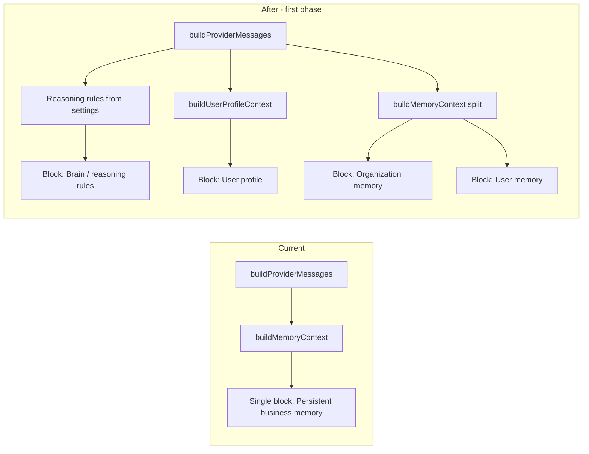

# Aichat: User profile and user memory for better per-user chat

## Current state

- **Memory**: [Modules/Aichat/Entities/ChatMemory.php](Modules/Aichat/Entities/ChatMemory.php) stores key/value facts with `business_id` and `user_id` (nullable = org-level). `memory_value` is already encrypted.
- **Prompt**: [Modules/Aichat/Utils/ChatUtil.php](Modules/Aichat/Utils/ChatUtil.php) `buildProviderMessages()` calls `buildMemoryContext($business_id, $user_id)`, which merges org facts (`user_id` null) and user facts (`user_id` set) into a single "Persistent business memory" section.
- **Flow**: [Modules/Aichat/Utils/ChatWorkflowUtil.php](Modules/Aichat/Utils/ChatWorkflowUtil.php) passes `$user_id` into `buildProviderMessages()`, so user-scoped memory is already injected.
- **Settings**: [Modules/Aichat/Resources/views/chat/settings.blade.php](Modules/Aichat/Resources/views/chat/settings.blade.php) lists org + user memory; users can add/edit/delete only their own facts (stored with their `user_id`).

What is missing: **per user_id, inside that org**, the AI should receive: (1) **USER.md-style content** — name, how to address them, timezone, and **Context** (what they care about, what to talk about) via `concerns_topics` and `preferences` only in the first version. (2) **User MEMORY** — long-term curated facts about that user (decisions, preferences, important events), stored in `aichat_chat_memory` where `user_id` = current user, injected as a distinct "User memory" block. (3) **User daily logs** are deferred to a later phase. The plan below adds the profile table, prompt split (org vs user memory), and reasoning rules (brain block).

## 1. Database: user chat profile table

- **New migration** (e.g. `create_aichat_user_chat_profile_table`) in `Modules/Aichat/Database/Migrations/`.
- **Table** `aichat_user_chat_profile`:
  - `id` (bigIncrements)
  - `business_id` (unsignedInteger, FK to business, cascade)
  - `user_id` (unsignedInteger, FK to users, cascade)
  - `display_name` (string, nullable) — how to address the user
  - `timezone` (string, nullable)
  - `concerns_topics` (text, nullable) — what they care about / what to talk about
  - `preferences` (text, nullable) — communication or topic preferences
  - `timestamps`
  - Unique on `(business_id, user_id)`; index on `(business_id, user_id)` for lookups.
- **USER.md mapping**: Name/how to address = `display_name`; timezone = `timezone`; **Context** (what they care about, what to talk about) = `concerns_topics` + `preferences` only. Columns `working_on` and `annoys` are **not** in initial scope; add in a later phase if needed.
- **Encryption**: Sensitive free-text fields (`concerns_topics`, `preferences`) will be encrypted at rest via Laravel’s `encrypted` cast in the model (same pattern as `ChatMemory::memory_value`). Non-sensitive: `display_name`, `timezone` can stay plain if desired; for consistency and future-proofing, encrypting all text is acceptable.

## 2. Entity and Util

- **New entity** `Modules/Aichat/Entities/UserChatProfile.php`:
  - Table `aichat_user_chat_profile`, `$guarded = ['id']`.
  - Casts: `concerns_topics` and `preferences` as `encrypted` (and any other sensitive columns).
  - Relationships: `business()`, `user()`.
  - Scopes: `scopeForBusiness($query, $business_id)`, `scopeForUser($query, $business_id, $user_id)`.
- **ChatUtil** ([Modules/Aichat/Utils/ChatUtil.php](Modules/Aichat/Utils/ChatUtil.php)):
  - **New method** `getOrCreateUserChatProfile(int $business_id, int $user_id): UserChatProfile` — firstOrCreate by `(business_id, user_id)` with default nulls.
  - **New method** `buildUserProfileContext(int $business_id, int $user_id): string` — load profile for that user; if missing or all empty, return `''`. Otherwise return a short, formatted block (e.g. "User profile: Display name: X. Timezone: Y. Concerns/topics: Z. Preferences: W.") for injection into the system prompt.
  - **Refactor** `buildMemoryContext` (or add two helpers) so the prompt can get:
    - **Organization memory** string: facts where `user_id` is null.
    - **User memory** string: facts where `user_id` = current user. This is **User MEMORY** — long-term curated facts about that user (decisions, preferences, important events). Users manage these in Settings (add/edit/delete key-value facts); they persist across conversations.
  - In `buildProviderMessages()`:
    - Insert a **"User profile and context"** section using `buildUserProfileContext($business_id, $user_id)` when `$user_id` is not null (only for authenticated user chat).
    - Replace the single "Persistent business memory" block with two sections when user memory is used: **"Organization memory"** (org facts) and **"User memory"** (user facts), so the model clearly sees what is org-wide vs user-specific. Add one line of instruction: use user profile and user memory to tailor tone and topics for this user.

## 3. Prompt wording (system message)

- Keep existing rules (Aichat, UPOS, no PII, etc.).
- **Order of system sections**: (1) Static rules (Aichat, UPOS, no PII). (2) **Reasoning rules** (brain block from `aichat_chat_settings.reasoning_rules`), when non-empty. (3) Additional business instruction (`system_prompt`). (4) Organization context. (5) User profile and context (when user_id present). (6) Organization memory. (7) User memory. (Section 8 — daily log / recent context — deferred to a later phase.) So the model sees "how to reason" (including summarization) before org and user context.
- Add after organization context:
  - If `$user_id` present and user profile or user memory non-empty: **"User profile and context:"** + `buildUserProfileContext()` output; then **"Organization memory:"** + org facts; then **"User memory:"** + user facts. Add: "Use the user profile and user memory above to tailor tone, topics, and what to bring up for this user."
- If no user profile/memory or no `$user_id`: keep current single "Persistent business memory" block (org-only) so shared/anon flows are unchanged.

## 4. Settings UI and API

- **Routes** ([Modules/Aichat/Routes/web.php](Modules/Aichat/Routes/web.php)): Under the existing chat settings group, add:
  - `GET` (or reuse settings index) — profile is shown on the same settings page.
  - `PATCH` or `PUT` route for updating the current user’s chat profile (e.g. `aichat.chat.settings.profile.update`).
- **FormRequest**: New `UpdateUserChatProfileRequest` (or `StoreUserChatProfileRequest`): authorize with `aichat.chat.settings`; validate `display_name` (nullable, string, max length), `timezone` (nullable, string, max length), `concerns_topics` (nullable, string, max 5000), `preferences` (nullable, string, max 5000).
- **ChatSettingsController** (or a thin dedicated controller if preferred):
  - In `index()`, load the current user’s `UserChatProfile` for the current business (via `getOrCreateUserChatProfile`) and pass it to the view as `userChatProfile`.
  - New method `updateProfile(UpdateUserChatProfileRequest $request)`: resolve `business_id` and `user_id` from auth/session; get or create profile; fill and save; redirect back with success message.
- **View** ([Modules/Aichat/Resources/views/chat/settings.blade.php](Modules/Aichat/Resources/views/chat/settings.blade.php)):
  - Add a **"Your chat profile"** card (above or below the existing memory card): form with fields display name, timezone, concerns/topics (textarea), preferences (textarea). Submit to the new PATCH route. Use existing Metronic form patterns; labels and placeholders from lang file.
- **Lang** ([Modules/Aichat/Resources/lang/en/lang.php](Modules/Aichat/Resources/lang/en/lang.php)): Add keys for "Your chat profile", "Display name", "Timezone", "Concerns / topics", "Preferences", "Profile updated", and any placeholders.

## 4a. User daily logs — DEFERRED (Phase 2)

- **Status**: Not in initial implementation. Implement profile + memory split + reasoning rules first.
- **Purpose (when implemented)**: Give the model short-term continuity per user (like OpenClaw `memory/YYYY-MM-DD.md`) without relying only on conversation history. Load "today" and "yesterday" for the current user and inject as a "Recent context (last 2 days)" block.
- **Storage**: New table `aichat_user_daily_log`: `id`, `business_id`, `user_id`, `log_date` (date), `content` (text, encrypted), `timestamps`. Unique on `(business_id, user_id, log_date)`. One row per user per day.
- **Entity**: `UserDailyLog` with encrypted `content` cast; scopes `forBusiness`, `forUser`, `forDate`.
- **ChatUtil**: `buildUserDailyLogContext(int $business_id, int $user_id): string` — load rows for today and yesterday (app or user timezone); format as a short block; return empty if none. Config flag `daily_log_enabled` (default true) to turn off.
- **Prompt**: When `$user_id` present and daily log enabled, add **"Recent context (last 2 days):"** + `buildUserDailyLogContext()` after User profile or before User memory.
- **How logs are written**: (1) **Manual**: In Settings, add a "Today's note" (or "Daily log") textarea that upserts the row for (business_id, user_id, today). (2) **Later**: Optional AI/system step that appends a short summary to today's log (out of scope for initial implementation).
- **Config**: `config('aichat.chat.daily_log_enabled', true)` and optionally `daily_log_max_chars` (e.g. 2000) when building the block to cap size.

## 4b. Dedicated "brain" block — reasoning rules (internal step then reply)

- **Approach**: Use a **single prompt** with an explicit "internal step" then "reply". The model is instructed to do two things in order: first, internally, summarize the user's ask and align with user profile/memory; second, output only the reply to the user. The internal summary is not shown to the user. This keeps one API call per turn while making the reasoning sequence clear to the model.
- **Purpose**: A separate, editable block of instructions that tell the model *how* to reason and respond — e.g. "internally summarize and align with profile/memory, then reply clearly". This is the "brain" / reasoning rules so the AI behaves consistently and with better understanding each turn.
- **Storage**: Add a new column to `**aichat_chat_settings`** (one row per business): `reasoning_rules` (text, nullable). Same permission as editing `system_prompt` (e.g. `aichat.chat.settings`). Migration: e.g. `add_reasoning_rules_to_aichat_chat_settings_table.php`.
- **ChatSetting model**: Add `reasoning_rules` to `$fillable` (or ensure it is not in `$guarded`); no encryption needed unless the org wants to hide rules (plain text is fine).
- **ChatUtil**: In `buildProviderMessages()`, after the static rules (Aichat, UPOS, no PII) and before organization context, inject a **"Reasoning and response rules:"** (or **"Brain / reasoning rules:"**) section when `reasoning_rules` is non-empty. Load from `getOrCreateBusinessSettings($business_id)->reasoning_rules`. Order in system message: static rules → **reasoning rules** → (optional) additional business instruction (system_prompt) → organization context → user profile → org memory → user memory → daily log.
- **Default / sample content**: Provide a default or placeholder that encodes the "internal step then reply" pattern in natural language. Example: "For each user message, do two things in order. First, internally: in one sentence summarize what they are asking or what they want, and note any relevant user profile or memory above. Second, in your reply to the user: answer clearly and concisely using that summary and context. Do not output the internal summary to the user; only output the final answer." Avoid numbered lists (1, 2, 3) in the default text so it reads naturally. Admins can edit or replace this per business.
- **Settings UI**: On the same Chat settings page (e.g. in the same card as System Prompt or an adjacent card), add a **"Reasoning rules"** or **"Brain / reasoning rules"** textarea: label, placeholder or default text with the summarization rule, name `reasoning_rules`. Save via the existing business settings update flow (or a dedicated PATCH if you split it). Same permission as system prompt.
- **Lang**: Add keys e.g. `chat_reasoning_rules`, `chat_reasoning_rules_placeholder`, `chat_reasoning_rules_updated`.
- **Config**: Optional `config('aichat.chat.reasoning_rules_default')` (string) for a global default when the business has not set any (so new businesses get the summarization rule out of the box).

## 5. Permissions and security

- Reuse `aichat.chat.settings`: only users with this permission can view/edit their own chat profile. No new permission unless you explicitly want a separate one.
- All queries scoped by `business_id` from session and `user_id` from auth so users only ever read/update their own profile for the current business.
- Encryption of `concerns_topics` and `preferences` ensures sensitive “user character” data is encrypted at rest (same as `aichat_chat_memory.memory_value`).

## 6. Optional: org-level memory from settings

- Currently, the "Add memory" form in settings creates only **user-scoped** facts (StoreChatMemoryFactRequest uses current user’s `user_id`). If you want users with a role like `aichat.manage_all_memories` to add **organization-level** facts from the same page, add an optional "Save as organization memory" checkbox (or scope dropdown) that, when checked and authorized, creates the fact with `user_id` = null. This is an enhancement; the core plan does not depend on it.

## 6a. How users update memory_value

- **Today**: Users update memory (key/value facts) only from **Chat Settings**. Same page that shows "Your chat profile" (after this plan) has a **Persistent memory** card where they can:
  - **Add**: Form with `memory_key` and `memory_value`; submit creates a row with their `user_id` (user-scoped).
  - **Edit**: Each fact they own has an inline PATCH form (key + value); submit updates that row.
  - **Delete**: Delete button per fact (only for their own facts; org facts are read-only unless they have `aichat.manage_all_memories`).
- **No in-chat flow yet**: There is no "remember this" or "save to my memory" action from inside the chat UI. Adding that later (e.g. a button or slash command that creates a fact from the current message or selection) would call the same `ChatUtil::createMemoryFact()` or a dedicated API; the plan does not require it.
- **User profile** (new in this plan): Updated via the "Your chat profile" form on the same Settings page (display name, timezone, concerns, preferences); one row per user per business, so it is always "update" not "add another profile."

## 6b. Performance and scaling: DB size and load

- **Conversations and messages**: The DB already stays bounded for chat history:
  - [PruneChatConversationsCommand](Modules/Aichat/Console/Commands/PruneChatConversationsCommand.php) deletes **conversations** older than `retention_days` (per-business; from ChatSetting or config, default 90). Schedule it (e.g. daily cron: `php artisan aichat:chat-prune`) so old conversations and their messages are removed.
  - When building the prompt, only the **last N messages** are sent (e.g. `historyLimit = 30` in `buildProviderMessages`). So even if a conversation has hundreds of messages before pruning, each request only loads 30.
- **Memory facts**: Today there is **no limit** on how many facts an org or user can have. `buildMemoryContext()` does `->get()` with no `limit()`, so every request loads **all** org + user facts into the system prompt. That can make the prompt large (tokens, latency) and the query heavier as tables grow.
- **Mitigations to add in this plan**:
  - **Config limits**: In [config.php](Modules/Aichat/Config/config.php) add e.g. `memory_facts_max_per_scope` (default 50) and/or `memory_context_max_chars` (default 8000). Use these when building the prompt so the DB and prompt size stay bounded.
  - **Cap in buildMemoryContext (and split helpers)**: When loading org facts and user facts, order by `updated_at` desc and take only the first `memory_facts_max_per_scope` per scope (org vs user). Optionally, after formatting, truncate the combined memory string to `memory_context_max_chars` and append "(truncated)" so the model knows context was cut.
  - **Optional UI guard**: When creating a new fact (StoreChatMemoryFactRequest / ChatUtil::createMemoryFact), if the user (or org) already has >= `memory_facts_max_per_scope` facts, reject with a message asking them to delete or merge an existing one. Prevents unbounded growth and makes the cap visible.
- **Indexes**: Existing indexes on `(business_id, user_id)` and `(business_id, user_id, memory_key)` are sufficient for the capped query (limit N, order by updated_at).

## 6c. Database vs .md — no conflict

- This plan uses **database only** for all storage. There are **no .md files** in the implementation.
- "USER.md-style" and "memory/YYYY-MM-DD" are **content and structure references** (same semantics as OpenClaw's files), not an implementation that reads/writes .md on disk. Tables and columns hold that content instead.
- **Why database**: Multi-tenant scoping (business_id, user_id), permissions, encryption at rest, backups with the app, no file-per-org/user on disk. Aligns with the earlier decision for Aichat.

## 6c-2. OpenClaw file → Aichat implementation (USER.md, SOUL.md, MEMORY, …)

| OpenClaw file            | What it is                                                                                                                   | In Aichat (this plan)                                                                                                                                                                                                                                                                                 |
| ------------------------ | ---------------------------------------------------------------------------------------------------------------------------- | ----------------------------------------------------------------------------------------------------------------------------------------------------------------------------------------------------------------------------------------------------------------------------------------------------- |
| **USER.md**              | Who the human is: name, what to call them, pronouns, timezone, Context (care about, working on, annoys, what to talk about). | `**aichat_user_chat_profile`** table (per business_id, user_id). Columns: `display_name`, `timezone`, `concerns_topics`, `preferences` only in first phase. Optional columns `pronouns`, `working_on`, `annoys` can be added later. Injected as **"User profile and context"** in the prompt.         |
| **SOUL.md**              | Who the AI is: tone, boundaries, persona ("be helpful, have opinions, you're a guest").                                      | **Not in this plan.** Aichat already has org-level `system_prompt` in `aichat_chat_settings` (business instruction). SOUL would be an optional extra: e.g. a dedicated `soul_prompt` or "org persona" block so each business can set tone/boundaries without editing the global system text. See §6d. |
| **MEMORY.md**            | Long-term curated memory (decisions, lessons, things to remember). Loaded only in main session.                              | **User MEMORY** = rows in `**aichat_chat_memory`** where `user_id` = current user. Injected as **"User memory"** in the prompt. Org-level MEMORY = rows where `user_id` is null → **"Organization memory"**. Same table; scope by user_id.                                                            |
| **memory/YYYY-MM-DD.md** | Daily log per day (raw notes). OpenClaw reads today + yesterday.                                                             | **Deferred.** Table `aichat_user_daily_log` and "Recent context (last 2 days)" block to be added in a later phase.                                                                                                                                                                                    |
| **AGENTS.md**            | Session startup order (read SOUL → USER → daily → MEMORY), red lines, when to load what.                                     | **Code** in `ChatUtil::buildProviderMessages()`: order of sections (org context → user profile → org memory → user memory → optional daily log) and the static system rules (Aichat, UPOS, no PII). No separate DB "AGENTS" document; behavior is in code + system prompt.                            |

So: **USER.md** → user profile table; **SOUL.md** → optional org persona (not in plan); **MEMORY** → `aichat_chat_memory` (user + org); **memory/YYYY-MM-DD** → optional daily log table; **AGENTS.md** → buildProviderMessages logic and system prompt.

## 6d. OpenClaw-inspired improvements (suggested, not required for this plan)

Ideas from [.openclaw/workspace](.openclaw/workspace) that could improve Aichat later:

| OpenClaw                                 | Suggestion for Aichat                                                                                                                                                                                                                         |
| ---------------------------------------- | --------------------------------------------------------------------------------------------------------------------------------------------------------------------------------------------------------------------------------------------- |
| **USER.md — Pronouns**                   | Add optional `pronouns` (string) to `aichat_user_chat_profile` and include in buildUserProfileContext so the AI can address the user correctly.                                                                                               |
| **USER.md — "What makes them laugh"**    | Already covered by Context (concerns_topics / preferences); optionally add a hint in the profile form placeholder.                                                                                                                            |
| **AGENTS — "Remember this"**             | In-chat flow: when the user says "remember this" (or uses a button), create a memory fact or append to today's daily log. Requires a small API + UI (e.g. "Save to my memory" on a message or selection).                                     |
| **AGENTS — MEMORY only in main session** | Do **not** load user profile / user memory when the conversation is "shared" or "guest" (e.g. shared link view). Load only org context so personal context does not leak. Add a `session_type` or `is_shared` check in buildProviderMessages. |
| **AGENTS — AI can update MEMORY**        | OpenClaw lets the AI update MEMORY.md from conversation. Optional: after a turn, let the AI suggest a memory fact ("Save this to your memory?") or a scheduled job that proposes facts from recent conversations for the user to approve.     |
| **SOUL.md / IDENTITY**                   | Org-level "persona" (tone, boundaries): optional `aichat_chat_settings.soul_prompt` or similar, loaded as a "How to behave for this org" block so each business can tune the assistant vibe without touching code.                            |
| **BOOTSTRAP / first run**                | Optional first-time onboarding: when a user has no profile yet, show a short flow ("What should we call you? Timezone? What do you care about most?") and create the profile from answers.                                                    |
| **Memory maintenance**                   | OpenClaw reviews daily files and promotes to MEMORY. Optional: UI "Review recent notes" that shows last N daily log entries and lets the user "Promote to long-term memory" (creates a memory fact from a log line).                          |

These are **add-ons**; the current plan does not depend on them.

## 7. Verification

- Run migration for Aichat; confirm `aichat_user_chat_profile` exists and unique on `(business_id, user_id)`.
- As a user with `aichat.chat.settings`, open Chat settings, fill "Your chat profile", save; confirm row in `aichat_user_chat_profile` and encrypted columns are not stored in plain text.
- Start a new conversation; send a message. In logs or by inspecting the provider payload, confirm the system message includes "User profile and context", "Organization memory", and "User memory" when applicable, and that the model response can reflect the user’s stated concerns/preferences.
- Run existing Aichat tests (if any) and fix any breakage from new method signatures or prompt structure.
- Lint and convention check: [AGENTS.md](AGENTS.md), [.cursor/rules/laravel-coding-constitution.mdc](.cursor/rules/laravel-coding-constitution.mdc) (no business logic in Blade; controller thin; validation in FormRequest; view data prepared in controller).

## File checklist

| Area        | File(s)                                                                                                                                                                                      |
| ----------- | -------------------------------------------------------------------------------------------------------------------------------------------------------------------------------------------- |
| Migration   | `create_aichat_user_chat_profile_table.php`; `add_reasoning_rules_to_aichat_chat_settings_table.php`. (Daily log table deferred.)                                                            |
| Entity      | `UserChatProfile.php`; extend `ChatSetting` usage for `reasoning_rules`. (UserDailyLog deferred.)                                                                                            |
| Util        | `ChatUtil.php` (getOrCreateUserChatProfile, buildUserProfileContext, buildMemoryContext split; inject reasoning_rules in buildProviderMessages). No buildUserDailyLogContext in first phase. |
| FormRequest | `UpdateUserChatProfileRequest.php`; extend `UpdateChatBusinessSettingsRequest` (or add) for `reasoning_rules` if saved with settings                                                         |
| Controller  | `ChatSettingsController.php` (index + updateProfile; save reasoning_rules in business settings flow). No daily log update in first phase.                                                    |
| Routes      | `web.php` (profile update). No daily log route in first phase.                                                                                                                               |
| View        | `chat/settings.blade.php` (Your chat profile card; **Reasoning rules** textarea). No Today's note / daily log in first phase.                                                                |
| Lang        | `lang.php` (profile keys + reasoning_rules label/placeholder). No daily log keys in first phase.                                                                                             |
| Config      | `config.php` (optional reasoning_rules_default). No daily_log_enabled / daily_log_max_chars in first phase.                                                                                  |

## Summary

- **Scope (first phase):** (1) **USER.md-style profile** — `display_name`, timezone, **Context** via `concerns_topics` + `preferences` only (no `working_on`/`annoys` columns yet). (2) **User MEMORY** — long-term curated facts from `aichat_chat_memory` where `user_id` = current user, injected as "User memory"; org facts as "Organization memory". (3) **Dedicated brain block** — `aichat_chat_settings.reasoning_rules`; injected as "Reasoning and response rules:" near the start of the system message. (4) **User daily logs** — deferred to a later phase (no table, no "Recent context last 2 days" block in first implementation).
- **Database (first phase):** New `aichat_user_chat_profile` (one row per business_id, user_id; columns: display_name, timezone, concerns_topics, preferences). New column `reasoning_rules` on `aichat_chat_settings`. No `aichat_user_daily_log` table yet. Encrypted text for sensitive profile fields.
- **Prompt order**: Static rules → **Reasoning rules (brain)** → business system_prompt → organization context → user profile → org memory → user memory. (Daily log block omitted in first phase.)
- **UI**: "Your chat profile" card on Chat settings; **Reasoning rules** (brain) textarea. No "Today's note" / daily log in first phase. Data prepared in controller; Blade presentation-only.
- **Security**: Same permission as settings; business_id/user_id scoping; encryption at rest.

