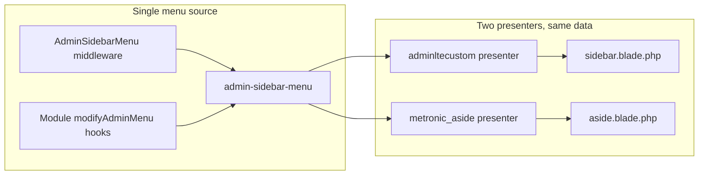

# Aside Nav Linked to admin-sidebar-menu — Implementation Plan

## Goal

- **Data:** Aside nav must show the same items as the sidebar (Home, User management, Contacts, Products, etc.) — i.e. use the existing `admin-sidebar-menu` built in [app/Http/Middleware/AdminSidebarMenu.php](app/Http/Middleware/AdminSidebarMenu.php) and extended by modules via `modifyAdminMenu`.
- **UI:** Keep the current Metronic aside design: same wrapper (`#kt_aside`), same classes (`menu`, `menu-item`, `menu-link`, `menu-sub`, `menu-sub-accordion`), and footer. Only the **inner menu content** becomes dynamic.

## Reference audit: admin-sidebar-menu and adminltecustom

All usages are covered by this plan; nothing is left out.

**admin-sidebar-menu**


| Location                                                                                                         | Usage                                                                   | In plan?                                                                   |
| ---------------------------------------------------------------------------------------------------------------- | ----------------------------------------------------------------------- | -------------------------------------------------------------------------- |
| [app/Http/Middleware/AdminSidebarMenu.php](app/Http/Middleware/AdminSidebarMenu.php)                             | `Menu::create('admin-sidebar-menu', ...)` — builds core menu            | Yes — single data source; unchanged                                        |
| [resources/views/layouts/partials/sidebar.blade.php](resources/views/layouts/partials/sidebar.blade.php)         | `Menu::render('admin-sidebar-menu', 'adminltecustom')` — sidebar output | Yes — unchanged; sidebar keeps current presenter                           |
| [config/menus.php](config/menus.php)                                                                             | No direct reference; only defines presenter styles                      | Yes — we add `metronic_aside` here; no change to menu name                 |
| [Modules/Aichat/Http/Controllers/DataController.php](Modules/Aichat/Http/Controllers/DataController.php)         | `Menu::modify('admin-sidebar-menu', ...)` — adds AI Chat items          | Yes — no code change; items appear in both sidebar and aside automatically |
| [Modules/Essentials/Http/Controllers/DataController.php](Modules/Essentials/Http/Controllers/DataController.php) | `Menu::modify('admin-sidebar-menu', ...)` — adds module items           | Yes — no code change; items appear in both sidebar and aside automatically |


**adminltecustom**


| Location                                                                                                 | Usage                                                                             | In plan?                                                                  |
| -------------------------------------------------------------------------------------------------------- | --------------------------------------------------------------------------------- | ------------------------------------------------------------------------- |
| [config/menus.php](config/menus.php)                                                                     | `'adminltecustom' => \App\Http\AdminlteCustomPresenter::class`                    | Yes — unchanged; we only add a new style key                              |
| [resources/views/layouts/partials/sidebar.blade.php](resources/views/layouts/partials/sidebar.blade.php) | Used as second argument to `Menu::render('admin-sidebar-menu', 'adminltecustom')` | Yes — sidebar stays as-is; no edits to sidebar or AdminlteCustomPresenter |


**Summary:** No existing file that references `admin-sidebar-menu` or `adminltecustom` is modified except [resources/views/layouts/partials/aside.blade.php](resources/views/layouts/partials/aside.blade.php) (replace static HTML with one render call). The new [app/Http/MetronicAsidePresenter.php](app/Http/MetronicAsidePresenter.php) is the only new consumer of `admin-sidebar-menu` (via `Menu::render(..., 'metronic_aside')`).

## Architecture




- Sidebar continues to use `Menu::render('admin-sidebar-menu', 'adminltecustom')` (Tailwind-style markup).
- Aside will use `Menu::render('admin-sidebar-menu', 'metronic_aside')` (Metronic aside markup).

## Implementation Steps

### 1. Create MetronicAsidePresenter

**File:** [app/Http/MetronicAsidePresenter.php](app/Http/MetronicAsidePresenter.php) (new)

- Extend `Nwidart\Menus\Presenters\Presenter` (same base as [app/Http/AdminlteCustomPresenter.php](app/Http/AdminlteCustomPresenter.php)).
- Implement the same interface methods used by the package when rendering:
  - `getOpenTagWrapper()` / `getCloseTagWrapper()` — Return empty string so the existing `<div class="menu ..." id="#kt_aside_menu">` in the Blade remains the only wrapper.
  - `getMenuWithoutDropdownWrapper($item)` — Output a single Metronic aside item: `<div class="menu-item">` with `<a class="menu-link ..." href="...">`, `<span class="menu-icon">` (icon), `<span class="menu-title">` (title). Use `$item->getUrl()`, `$item->title`, `$item->icon`, `$item->getAttributes()`, and active state.
  - `getMenuWithDropDownWrapper($item)` — Output accordion item: outer `<div class="menu-item menu-accordion" data-kt-menu-trigger="click">` with `here show` when `$item->hasActiveOnChild()`. Inner: `<span class="menu-link">` (icon, title, `menu-arrow`), then `<div class="menu-sub menu-sub-accordion">` containing the result of `getChildMenuItems($item)`.
  - `getChildMenuItems($item)` — Loop `$item->getChilds()` and output for each: `<div class="menu-item">` and `<a class="menu-link" href="...">` with `<span class="menu-bullet"><span class="bullet bullet-dot"></span></span>` and `<span class="menu-title">`. Add `active` class when `$child->isActive()`. Control sub visibility with Metronic classes or `display` based on `hasActiveOnChild()` so expanded state matches current route.
  - `getActiveState($item)` / `getActiveStateOnChild($item)` — Return Metronic active classes (e.g. `active`, `here show`) for links and parent items; reuse the same logic as in the existing static aside (e.g. `menu-link active`, `menu-item here show`).
  - `getDividerWrapper()`, `getHeaderWrapper()` — Return appropriate minimal markup or empty string if not used by admin-sidebar-menu.
  - `getMultiLevelDropdownWrapper($item)` — Return empty or delegate to avoid nested accordions unless needed.
  - **Icon handling:** Reuse the same approach as AdminlteCustomPresenter: if `$item->icon` contains `<svg`, output it inside `<span class="menu-icon">`; otherwise wrap in `<i class="...">` or a Metronic icon wrapper so existing SVG icons from the middleware work unchanged.

Reference the exact Metronic structure from the current [resources/views/layouts/partials/aside.blade.php](resources/views/layouts/partials/aside.blade.php) (e.g. lines 9–84) for one top-level accordion and one child link, and mirror that in the presenter so the DOM and classes match what Metronic’s JS expects (`data-kt-menu="true"`, `data-kt-menu-trigger="click"`, etc.).

### 2. Register the presenter

**File:** [config/menus.php](config/menus.php)

- In the `styles` array, add: `'metronic_aside' => \App\Http\MetronicAsidePresenter::class`.

### 3. Replace static menu in aside.blade.php

**File:** [resources/views/layouts/partials/aside.blade.php](resources/views/layouts/partials/aside.blade.php)

- **Keep unchanged:** Lines 1–7 (entire `#kt_aside` container, `aside-menu`, scroll wrapper, and the opening `<div class="menu menu-column menu-sub-indention ..." id="#kt_aside_menu" data-kt-menu="true">`).
- **Remove:** The entire block of static menu items from the first `<!--begin:Menu item-->` (line 8) through the closing `</div><!--end::Menu-->` that immediately precedes the scroll wrapper’s closing `</div>` (i.e. the content that ends around line 3332).
- **Insert:** A single line: `{!! Menu::render('admin-sidebar-menu', 'metronic_aside') !!}` so the menu div now contains only this render call.
- **Keep unchanged:** The following closing `</div>`s for the menu, scroll wrapper, and aside-menu; the aside footer (e.g. “Docs & Components” button); and the final `</div>` for `#kt_aside`.

Resulting structure:

```blade
<div id="kt_aside" class="aside px-2" ...>
    <div class="aside-menu flex-column-fluid">
        <div class="hover-scroll-overlay-y ..." id="kt_aside_menu_wrapper" ...>
            <div class="menu menu-column ..." id="#kt_aside_menu" data-kt-menu="true">
                {!! Menu::render('admin-sidebar-menu', 'metronic_aside') !!}
            </div>
        </div>
    </div>
    <div class="aside-footer ..."> ... </div>
</div>
```

### 4. Verification

- **Lint:** Run linter on new/edited PHP and Blade files.
- **Manual:** Load a page that uses the aside layout; confirm the aside shows the same items as the sidebar (Home, Contacts, Products, Sale, etc.) with correct links and permissions.
- **Active state:** Navigate to e.g. Home, then a sub-item (e.g. Users under User management); confirm the aside highlights the current section and expands the correct accordion.
- **No regression:** Sidebar still renders and works as before (unchanged).

## Files to touch


| Action | File                                                                                                                                             |
| ------ | ------------------------------------------------------------------------------------------------------------------------------------------------ |
| Create | [app/Http/MetronicAsidePresenter.php](app/Http/MetronicAsidePresenter.php)                                                                       |
| Edit   | [config/menus.php](config/menus.php) (add one line)                                                                                              |
| Edit   | [resources/views/layouts/partials/aside.blade.php](resources/views/layouts/partials/aside.blade.php) (replace static block with one render line) |


## Compliance

- **Constitution:** No business logic in Blade; view only receives and renders. Menu data is built in middleware and presenters; Blade just calls `Menu::render()`.
- **AGENTS.md:** No new UI classes; use existing Metronic patterns from the current aside. Single source of menu data (admin-sidebar-menu) for both sidebar and aside.

