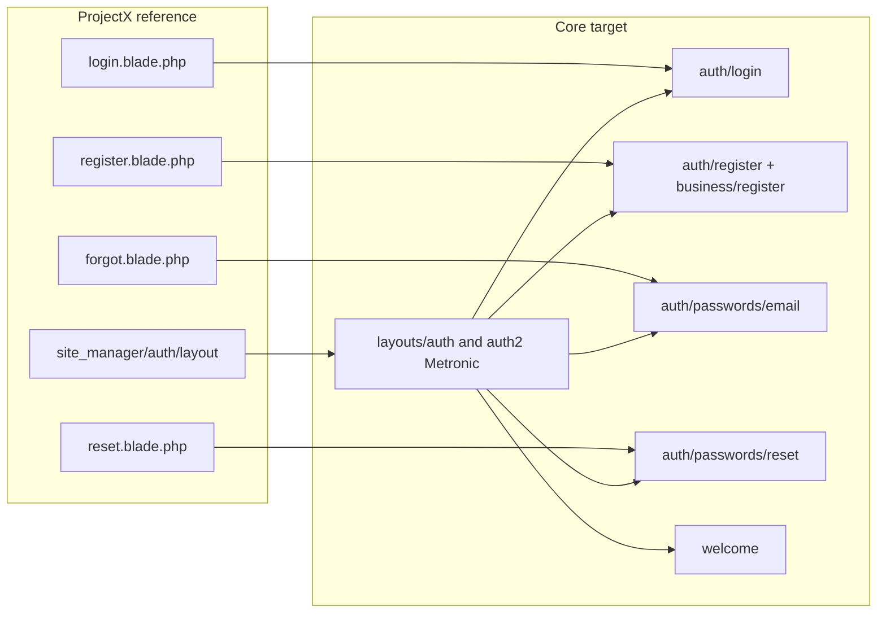

# Core auth migration to Metronic 8.3.3 (reference: ProjectX site_manager/auth)

**Reference only — no runtime dependency on dreampos:** The folder `dreampos/Modules/ProjectX/Resources/views/site_manager/auth` is used only as a **reference** when building the core auth layout and views. The `dreampos/` folder will be deleted later. All delivered code must live under `resources/views/`, `app/Http/Controllers/`, and core assets `public/assets/`. Do not `@extends`, `@include`, or reference any view or asset inside `dreampos/`; copy structure and markup into core only.

## Current state

- **Core auth views:** [resources/views/auth/login.blade.php](resources/views/auth/login.blade.php), [resources/views/auth/register.blade.php](resources/views/auth/register.blade.php), [resources/views/auth/passwords/email.blade.php](resources/views/auth/passwords/email.blade.php), [resources/views/auth/passwords/reset.blade.php](resources/views/auth/passwords/reset.blade.php).
- **Other views using auth layout:** [resources/views/business/register.blade.php](resources/views/business/register.blade.php), [resources/views/welcome.blade.php](resources/views/welcome.blade.php).
- **Layouts:** [resources/views/layouts/auth.blade.php](resources/views/layouts/auth.blade.php) (legacy, used only by `auth/register`); [resources/views/layouts/auth2.blade.php](resources/views/layouts/auth2.blade.php) (used by login, password email/reset, business/register, welcome). Neither uses Metronic 8.3.3.
- **Reference (copy from only; dreampos will be deleted):** [dreampos/Modules/ProjectX/Resources/views/site_manager/auth/layout.blade.php](dreampos/Modules/ProjectX/Resources/views/site_manager/auth/layout.blade.php) provides the target structure to copy into core. Do not reference dreampos at runtime. `#kt_body.auth-bg`, two-column flex layout, left aside (logo + title + subtitle), right card (`bg-body rounded-4 w-md-600px`) yielding `auth_content`, footer links. ProjectX uses `asset('modules/projectx/...')`; core must use `asset('assets/...')` per [AGENTS.md](AGENTS.md) Section 10 and [ai/ui-components.md](ai/ui-components.md).

---

## 1. Single Metronic auth layout (replace auth + auth2)

**Target:** One auth layout only, fully aligned with Metronic 8.3.3. **Replace** [resources/views/layouts/auth.blade.php](resources/views/layouts/auth.blade.php) and [resources/views/layouts/auth2.blade.php](resources/views/layouts/auth2.blade.php) so both files contain the same Metronic layout (or keep one file and have the other `@include` it). Recommended: put the full Metronic layout content into `auth2.blade.php` (so all current `extends('layouts.auth2')` keep working), then **replace** `auth.blade.php` with the same content so any view extending `layouts.auth` also gets Metronic; alternatively delete `auth.blade.php` and change the one view that extends it to `extends('layouts.auth2')`. End state: all auth layout usage is Metronic 8.3.3.

**Content:** Mirror [dreampos/Modules/ProjectX/Resources/views/site_manager/auth/layout.blade.php](dreampos/Modules/ProjectX/Resources/views/site_manager/auth/layout.blade.php) with these changes:

- **Assets:** Use core paths only: `asset('assets/...')` for favicon, `asset('assets/plugins/global/plugins.bundle.css')`, `asset('assets/css/style.bundle.css')`, same for `.js`. No `$asset` or `modules/projectx/`.
- **Background:** Either use a core auth background from `public/assets/media/` (if present) or a simple CSS background / inline style consistent with Metronic auth (e.g. `auth-bg bgi-size-cover bgi-position-center`); avoid referencing ProjectX media paths.
- **Structure (unchanged from reference):**
  - `body#kt_body` with class `auth-bg bgi-size-cover bgi-attachment-fixed bgi-position-center bgi-no-repeat`.
  - Theme mode script (same as ProjectX).
  - `div.d-flex.flex-column.flex-root` > `div.d-flex.flex-column.flex-column-fluid.flex-lg-row`.
  - Left: `div.d-flex.flex-center.w-lg-50.pt-15...` with logo link, `@yield('aside_title')`, `@yield('aside_subtitle')`.
  - Right: `div.d-flex.flex-column-fluid.flex-lg-row-auto...` > card `bg-body d-flex flex-column ... rounded-4 w-md-600px` containing `@yield('auth_content')` and footer links (Sign in / Register).
- **Sections:** `title`, `aside_title`, `aside_subtitle`, `auth_content`, `javascript`.
- **CSRF:** `<meta name="csrf-token" content="{{ csrf_token() }}">` in head.
- **App name:** Use `config('app.name', 'POS')` for default aside title/subtitle and footer; no `@php` for defaults (layout only yields sections).

**Compliance:** No business logic in the layout; only structure and asset includes. Favicon: `{{ asset('assets/media/logos/favicon.ico') }}`.

---

## 2. Migrate auth views to the new layout and Metronic markup

Each view will extend the single Metronic auth layout (`layouts.auth2` after replacement, or `layouts.auth` if both files are identical). Use `@section('auth_content')` (and `aside_title`, `aside_subtitle`, `javascript` as needed). Use only Metronic/Bootstrap 5 form and layout classes from [ai/ui-components.md](ai/ui-components.md) and the ProjectX auth blades as markup reference.

### 2.1 Login — [resources/views/auth/login.blade.php](resources/views/auth/login.blade.php)

- **Layout:** Extend the Metronic auth layout (e.g. `layouts.auth2`). Sections: `title`, `aside_title`, `aside_subtitle`, `auth_content`, `javascript`.
- **Markup:** Follow [dreampos/Modules/ProjectX/Resources/views/site_manager/auth/login.blade.php](dreampos/Modules/ProjectX/Resources/views/site_manager/auth/login.blade.php): outer `div.w-100`, heading with `text-gray-900 fw-bolder`, form with `form-control`, `fv-row`, `form-check form-check-custom form-check-solid`, `btn btn-primary`, `invalid-feedback`, `alert alert-success/alert-danger` for status. Replace any Tailwind/custom classes with Metronic equivalents.
- **Demo block:** The current login page has a large demo section (components.widget, btn-app, etc.). Options: (a) Keep demo in a Metronic card with `card`, `card-body`, `btn btn-primary` / `btn btn-light-`* and Metronic icons where needed, or (b) Move demo into a separate partial and style it with Metronic only. Prefer (a) for a single file; use `card`, `card-body`, and grid/buttons from Metronic.
- **Data:** Move any `@php` (e.g. demo_types, username/password defaults) into the controller that renders login; pass `$demo_types`, `$username`, `$password` (or equivalent) so the view is presentation-only (per Laravel constitution and AGENTS.md 2.5a).

### 2.2 Password forgot — [resources/views/auth/passwords/email.blade.php](resources/views/auth/passwords/email.blade.php)

- **Layout:** Extend the Metronic auth layout. Sections: `title`, `aside_title`, `aside_subtitle`, `auth_content`, `javascript` (only if needed for e.g. language switcher).
- **Markup:** Mirror [dreampos/Modules/ProjectX/Resources/views/site_manager/auth/forgot.blade.php](dreampos/Modules/ProjectX/Resources/views/site_manager/auth/forgot.blade.php): heading, `form.form.w-100`, `fv-row mb-8`, `form-label fw-semibold text-gray-900`, `form-control bg-transparent`, `is-invalid` / `invalid-feedback`, `btn btn-primary`, link back to login. Remove all `tw-`* and custom classes.

### 2.3 Password reset — [resources/views/auth/passwords/reset.blade.php](resources/views/auth/passwords/reset.blade.php)

- **Layout:** Same as forgot.
- **Markup:** Mirror [dreampos/Modules/ProjectX/Resources/views/site_manager/auth/reset.blade.php](dreampos/Modules/ProjectX/Resources/views/site_manager/auth/reset.blade.php): hidden `token`, email, password, password_confirmation fields with Metronic form classes and validation feedback.
- **Bug fix:** Form action must be `route('password.update')`, not `route('password.request')` (current file has wrong action).

### 2.4 Business registration — [resources/views/business/register.blade.php](resources/views/business/register.blade.php) (Metronic stepper + full form UI)

- **Layout:** Extend the Metronic auth layout. Use `auth_content` for the main form block.
- **Requirement — Metronic 8.3.3 stepper and form UI:** Refactor the register flow to follow [dreampos/Modules/ProjectX/Resources/views/site_manager/auth/register.blade.php](dreampos/Modules/ProjectX/Resources/views/site_manager/auth/register.blade.php). All UI must use Metronic 8.3.3 form style:
  - Multi-step form using Metronic stepper: `stepper`, `data-kt-stepper-element="nav"` / `"content"`, `stepper-item`, `stepper-title`, `nav-line-tabs`.
  - Form fields: `form-control form-control-solid`, `form-select form-select-solid`, `fv-row`, `form-label required`, `invalid-feedback`, `form-check form-check-custom form-check-solid` for checkboxes.
  - Buttons: `btn btn-primary`, `btn btn-light-primary`, `data-kt-stepper-action="previous"` / `"next"` / `"submit"`.
  - No legacy `box`, `input-group-addon`, or non-Metronic classes.
- **Refactor scope:** Either refactor [resources/views/business/partials/register_form.blade.php](resources/views/business/partials/register_form.blade.php) into Metronic stepper steps (reuse step structure from ProjectX register) or inline the fields into a single Metronic stepper view. All labels, inputs, and layout must follow Metronic 8.3.3 forms (see [ai/ui-components.md](ai/ui-components.md) and `public/html/forms/`).
- **Data:** All variables (`$currencies`, `$timezone_list`, `$months`, `$accounting_methods`, `$package_id`, system_settings for terms, etc.) must be provided by the controller (see Section 4); no defaulting or logic in Blade.

### 2.5 Auth register (legacy) — [resources/views/auth/register.blade.php](resources/views/auth/register.blade.php)

- **Current:** Extends `layouts.auth` (AdminLTE/box). Used if a route points to this view; business registration is at `business.getRegister`.
- **Action:** Migrate to the Metronic auth layout and full Metronic 8.3.3 form markup (same form/stepper patterns as business register, or a single Metronic card/form if this is a simpler flow). Controller must provide all data. If this view is unused, the route can redirect to `business.getRegister` and the view can be removed; otherwise it must align with Metronic.

### 2.6 Welcome — [resources/views/welcome.blade.php](resources/views/welcome.blade.php)

- **Layout:** Extend the Metronic auth layout. Use `auth_content` for a simple centered title and optional link(s) (e.g. Login / Register) using Metronic typography and buttons (`text-gray-900 fw-bolder`, `btn btn-primary`). Remove all `tw-`* and custom gradient classes.

---

## 3. Replace auth and auth2 layouts (all auth aligned with Metronic)

- **Replace layouts:** After the Metronic layout content is implemented:
  1. **Replace** [resources/views/layouts/auth2.blade.php](resources/views/layouts/auth2.blade.php) with the full Metronic 8.3.3 auth layout (two-column, `#kt_body.auth-bg`, yields `title`, `aside_title`, `aside_subtitle`, `auth_content`, `javascript`). All views that currently extend `layouts.auth2` will then use this layout without changing their `@extends`.
  2. **Replace** [resources/views/layouts/auth.blade.php](resources/views/layouts/auth.blade.php) with the **same** Metronic auth layout content so that any view extending `layouts.auth` (e.g. `auth/register.blade.php`) also gets Metronic. Alternatively, delete `auth.blade.php` and update the single view that extends it to `@extends('layouts.auth2')`.
- **Result:** Only one auth layout implementation exists; both `auth.blade.php` and `auth2.blade.php` either contain the same Metronic layout or one is removed and references updated. All auth pages (login, register, password forgot/reset, welcome) use a Metronic 8.3.3-aligned layout.
- **Partials:** [resources/views/layouts/partials/header-auth.blade.php](resources/views/layouts/partials/header-auth.blade.php) is no longer used once both auth layouts are replaced (the Metronic layout has its own left-column branding). It can be left in place unused or removed.
- **Routes:** No route changes required; only layout file content and view markup change.

---

## 4. Controller updates (required where needed)

Controllers must be changed as needed so that all view data is prepared server-side; no business logic or variable defaulting in Blade (Laravel constitution and AGENTS.md 2.5a).

- **Login:** **Update** the controller that returns `auth.login` (e.g. `App\Http\Controllers\Auth\LoginController@showLoginForm`) to pass all data the view needs: e.g. `$demo_types`, `$username`, `$password` for demo mode, so the view has no `@php` blocks for defaults or logic.
- **Business register:** **Update** `BusinessController::getRegister` to pass every variable required by the register view and any partials: `currencies` (or `currencies` keyed for select), `timezone_list`, `months`, `accounting_methods`, `package_id`, `system_settings` (or flags for terms/conditions), and any other options. The view must only render; no defaulting in Blade.
- **Auth register (if kept):** If [resources/views/auth/register.blade.php](resources/views/auth/register.blade.php) remains in use, the controller that returns it must pass the same kind of register data (currencies, etc.) so the view is presentation-only.
- **Password email/reset:** Controllers for `auth.passwords.email` and reset typically pass `$token` (and `$email` for reset); ensure no logic is added in Blade. Change controllers only if additional data (e.g. app name for title) is needed.

---

## 5. Verification and reference checklist

- Auth layout(s) use only `asset('assets/...')` and match Metronic 8.3.3 auth structure from ProjectX.
- `resources/views/layouts/auth.blade.php` and `resources/views/layouts/auth2.blade.php` have been **replaced** with the same Metronic layout; all auth layout usage is aligned with Metronic 8.3.3.
- All six views (login, passwords/email, passwords/reset, business/register, auth/register, welcome) extend the Metronic auth layout and use `auth_content` with Metronic form/card/button/stepper classes.
- Register form is refactored to Metronic 8.3.3 stepper and form UI (form-control-solid, form-select-solid, fv-row, stepper nav/content); no legacy box or Tailwind form classes.
- No `tw-`* or legacy `box` / `hold-transition` in migrated views.
- Form actions and routes are correct (especially `password.update` for reset).
- View data (including demo and register form options) is provided by controllers; no business logic or variable defaulting in Blade.
- Controllers (login, BusinessController getRegister, and any that return auth/register) updated to pass all required data.
- [ai/ui-components.md](ai/ui-components.md) and ProjectX site_manager/auth used as reference for structure and classes.
- No runtime dependency on `dreampos/`: no `@extends`, `@include`, or `asset()` pointing to dreampos; all code under `resources/views/`, `app/`, `public/assets/` only (dreampos is reference-only and will be deleted).

---

## 6. File list summary

| Action   | File                                                                                                                                                                                                                                 |
| -------- | ------------------------------------------------------------------------------------------------------------------------------------------------------------------------------------------------------------------------------------ |
| Replace  | [resources/views/layouts/auth2.blade.php](resources/views/layouts/auth2.blade.php) — content replaced with full Metronic 8.3.3 auth layout                                                                                           |
| Replace  | [resources/views/layouts/auth.blade.php](resources/views/layouts/auth.blade.php) — content replaced with same Metronic auth layout (or delete and update auth/register to extend auth2)                                              |
| Update   | [resources/views/auth/login.blade.php](resources/views/auth/login.blade.php) — Metronic markup; use data from controller                                                                                                             |
| Update   | [resources/views/auth/passwords/email.blade.php](resources/views/auth/passwords/email.blade.php) — Metronic form                                                                                                                     |
| Update   | [resources/views/auth/passwords/reset.blade.php](resources/views/auth/passwords/reset.blade.php) — Metronic form; action `password.update`                                                                                           |
| Update   | [resources/views/business/register.blade.php](resources/views/business/register.blade.php) — Metronic stepper + full Metronic 8.3.3 form UI                                                                                          |
| Update   | [resources/views/auth/register.blade.php](resources/views/auth/register.blade.php) — Metronic layout + form (or redirect to business/register)                                                                                       |
| Update   | [resources/views/welcome.blade.php](resources/views/welcome.blade.php) — Metronic typography and buttons                                                                                                                             |
| Refactor | [resources/views/business/partials/register_form.blade.php](resources/views/business/partials/register_form.blade.php) — Metronic 8.3.3 form/stepper fields only                                                                     |
| Update   | Login controller (e.g. `App\Http\Controllers\Auth\LoginController`) — pass `$demo_types`, `$username`, `$password` for demo                                                                                                          |
| Update   | [app/Http/Controllers/BusinessController.php](app/Http/Controllers/BusinessController.php) — `getRegister` passes all register data (currencies, timezone_list, months, accounting_methods, package_id, system_settings/terms flags) |

