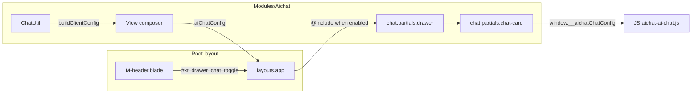

# Clone AI Chat to Modules/Aichat — Phase-by-Phase Plan

## Scope and Conventions

- **Source:** [dreampos/Modules/ProjectX](dreampos/Modules/ProjectX) (chat routes, controllers, entities, utils, views, JS, config, migrations, lang).
- **Target:** New root module [Modules/Aichat](Modules/Aichat). Skeleton reference: [Modules/Essentials](Modules/Essentials) (module.json, provider, routes, migrations).
- **Root integration:** Chat drawer in [resources/views/layouts/app.blade.php](resources/views/layouts/app.blade.php) (lines 632–1010, block between first `<!--begin::Chat drawer-->` and `<!--end::Chat drawer-->`) will be replaced conditionally with Aichat drawer when module is enabled. Header toggles in [resources/views/layouts/partials/M-header.blade.php](resources/views/layouts/partials/M-header.blade.php) (lines 706–716 and 971–977) keep `id="kt_drawer_chat_toggle"`; no structural change.
- **UI:** 100% Metronic 8.3.3 (Bootstrap 5). Use only existing Metronic classes; build any missing JS/CSS under `Modules/Aichat/Resources/assets` and publish to `public/modules/aichat/`.
- **Naming:** All `projectx` → `aichat`, `projectx.chat` → `aichat.chat`, `projectx::` → `aichat::`. Tables: `projectx_chat_`* → `aichat_chat_`*. Config key: `aichat` (e.g. `config('aichat.chat.*')`).

### Scope and security (non-negotiable)

- **General chat with org data only (no fabric/trim).** This clone is a **database-backed AI chat** (tables `aichat_chat_`*) that lets users chat about **their organization’s data** (products, contacts, sales, reports, etc.). It is **not** tied to fabric, trim, or quote. Fabric/trim/quote context and apply-updates are removed or stubbed.
- **PII exclusion.** Users may chat with “all information” **except** sensitive data. The following must **not** be sent to the AI or must be redacted/blocked: **auth** (tokens, session identifiers), **passwords**, **email** addresses, **phone** numbers. Enforce via:
  - **PII policy:** Keep and use `applyPiiPolicy()` in ChatUtil/ChatWorkflowUtil; ensure `config('aichat.chat.pii_policy')` (off / warn / block) is respected. Default at least `warn`; recommend `block` for email/phone/password.
  - **Config:** Ensure PII patterns or config explicitly cover email, phone, password, and auth-related strings so they are stripped or the message is blocked before sending to the provider.
- **Org (tenant) isolation.** Users may **only** chat with **their own organization’s data**. Other organizations (other `business_id`) must **not** see, list, or access another org’s conversations or chat context.
  - **Enforcement:** Every controller must take `business_id` from **session only**: `(int) request()->session()->get('user.business_id')`. Never use `business_id` from request input for scoping.
  - **All queries** on chat entities (conversations, messages, credentials, settings, memory, feedback, audit) must use `forBusiness($business_id)` (or equivalent `where('business_id', $business_id)`). Shared conversation view must validate that the conversation’s `business_id` is not exposed to other tenants (signed link scoped to that conversation only).
  - **Verification:** In Phase 3 (entities) and Phase 4 (Utils), ensure every Chat* model query is scoped by `business_id`. In Phase 5 (controllers), ensure no endpoint uses input-based `business_id` for data access.

---

## Phase 1: Module skeleton and config

**Goal:** Create the Aichat module shell, config, and register it so it can be enabled/disabled like Essentials.

| Task                            | Details                                                                                                                                                                                                                                                                                                                                                                                                                                                                                                                                                                                                                                                                                                                |
| ------------------------------- | ---------------------------------------------------------------------------------------------------------------------------------------------------------------------------------------------------------------------------------------------------------------------------------------------------------------------------------------------------------------------------------------------------------------------------------------------------------------------------------------------------------------------------------------------------------------------------------------------------------------------------------------------------------------------------------------------------------------------- |
| 1.1 Create module structure     | Run `php artisan module:make Aichat` (or manually create). Ensure: [Modules/Aichat/module.json](Modules/Aichat/module.json), [Modules/Aichat/Providers/AichatServiceProvider.php](Modules/Aichat/Providers/AichatServiceProvider.php), [Modules/Aichat/Routes/web.php](Modules/Aichat/Routes/web.php), [Modules/Aichat/Config/config.php](Modules/Aichat/Config/config.php). Follow [Modules/Essentials](Modules/Essentials) layout.                                                                                                                                                                                                                                                                                   |
| 1.2 module.json                 | Name: "Aichat", alias: "aichat", description e.g. "AI Chat assistant (drawer and full page)". providers: `Modules\\Aichat\\Providers\\AichatServiceProvider`. active: 1, order as needed.                                                                                                                                                                                                                                                                                                                                                                                                                                                                                                                              |
| 1.3 Config                      | Copy chat section from [dreampos/Modules/ProjectX/Config/config.php](dreampos/Modules/ProjectX/Config/config.php) (from `'chat' => [` through providers) into [Modules/Aichat/Config/config.php](Modules/Aichat/Config/config.php). Replace `config('projectx.chat.*')` usage with `config('aichat.chat.*')`. Remove or stub: `fabric_context`, `fabric_updates`, `project_reference_path` (or point to a generic path under Aichat). Keep: enabled, workflow_profile, general_first_mode, throttle, default_provider/model, share_ttl_hours, retention_days, pii_policy, moderation_*, suggested_replies, providers (openai, gemini, openrouter, deepseek, groq), etc. Use env vars with prefix e.g. `AICHAT_CHAT_`*. |
| 1.4 Provider boot (no chat yet) | In AichatServiceProvider: registerConfig, registerTranslations, registerViews, loadMigrationsFrom. Do **not** yet register chat routes or view composer.                                                                                                                                                                                                                                                                                                                                                                                                                                                                                                                                                               |
| 1.5 Register module             | Ensure [modules_statuses.json](modules_statuses.json) (or app bootstrap) includes Aichat so the module appears in Install > Modules and can be turned on/off.                                                                                                                                                                                                                                                                                                                                                                                                                                                                                                                                                          |

**Verification:** Module appears in module list; enabling it loads provider; config keys `aichat.chat.`* exist.

---

## Phase 2: Database and permissions

**Goal:** All chat tables and permissions exist for Aichat with no dependency on ProjectX.

| Task                             | Details                                                                                                                                                                                                                                                                                                                                                                                                                                                                                                                                                                                                                                                                                                                                                                                                                                                                                                                                                                                                                                                                                                                                                                                                                                                                                         |
| -------------------------------- | ----------------------------------------------------------------------------------------------------------------------------------------------------------------------------------------------------------------------------------------------------------------------------------------------------------------------------------------------------------------------------------------------------------------------------------------------------------------------------------------------------------------------------------------------------------------------------------------------------------------------------------------------------------------------------------------------------------------------------------------------------------------------------------------------------------------------------------------------------------------------------------------------------------------------------------------------------------------------------------------------------------------------------------------------------------------------------------------------------------------------------------------------------------------------------------------------------------------------------------------------------------------------------------------------- |
| 2.1 Migrations (copy and rename) | Copy in dependency order, renaming class and table names. **Order:** (1) [2026_02_27_010000_create_projectx_chat_conversations_table](dreampos/Modules/ProjectX/Database/Migrations/2026_02_27_010000_create_projectx_chat_conversations_table.php) → `create_aichat_chat_conversations_table`, (2) [2026_02_27_010001_create_projectx_chat_messages_table](dreampos/Modules/ProjectX/Database/Migrations/2026_02_27_010001_create_projectx_chat_messages_table.php), (3) [2026_02_27_010002_create_projectx_chat_credentials_table](dreampos/Modules/ProjectX/Database/Migrations/2026_02_27_010002_create_projectx_chat_credentials_table.php), (4) [2026_02_27_010003_create_projectx_chat_settings_and_audit_tables](dreampos/Modules/ProjectX/Database/Migrations/2026_02_27_010003_create_projectx_chat_settings_and_audit_tables.php), (5) [2026_02_27_010005_create_projectx_chat_message_feedback_table](dreampos/Modules/ProjectX/Database/Migrations/2026_02_27_010005_create_projectx_chat_message_feedback_table.php), (6) [2026_03_01_000007_create_projectx_chat_memory_table](dreampos/Modules/ProjectX/Database/Migrations/2026_03_01_000007_create_projectx_chat_memory_table.php). Replace every `projectx_chat_`* with `aichat_chat_`* and adjust foreign keys/index names. |
| 2.2 Optional fabric columns      | [2026_02_27_030000_add_fabric_id_to_projectx_chat_conversations_table](dreampos/Modules/ProjectX/Database/Migrations/2026_02_27_030000_add_fabric_id_to_projectx_chat_conversations_table.php) and [2026_02_27_030001_add_fabric_context_columns_to_projectx_chat_messages_table](dreampos/Modules/ProjectX/Database/Migrations/2026_02_27_030001_add_fabric_context_columns_to_projectx_chat_messages_table.php): either **omit** (cleaner for root-only) or add as nullable columns and never use in logic. Recommendation: omit for root-only clone.                                                                                                                                                                                                                                                                                                                                                                                                                                                                                                                                                                                                                                                                                                                                         |
| 2.3 User ID on memory            | Copy [2026_03_07_000002_add_user_id_to_projectx_chat_memory_table](dreampos/Modules/ProjectX/Database/Migrations/2026_03_07_000002_add_user_id_to_projectx_chat_memory_table.php) as `add_user_id_to_aichat_chat_memory_table`.                                                                                                                                                                                                                                                                                                                                                                                                                                                                                                                                                                                                                                                                                                                                                                                                                                                                                                                                                                                                                                                                 |
| 2.4 Permissions migration        | New migration: create permissions `aichat.chat.view`, `aichat.chat.edit`, `aichat.chat.settings` (guard `web`). Do **not** copy from projectx.quote; optionally copy from a root permission (e.g. `user.view` → `aichat.chat.view`) or leave unassigned for admin to assign in Role management. Clear permission cache after.                                                                                                                                                                                                                                                                                                                                                                                                                                                                                                                                                                                                                                                                                                                                                                                                                                                                                                                                                                   |

**Verification:** `php artisan migrate` (or `php artisan module:migrate Aichat`) runs without errors; tables `aichat_chat`_* exist; permissions exist in DB.

---

## Phase 3: Entities (models)

**Goal:** All Eloquent models for chat under Aichat namespace, using `aichat_chat_`* tables.

| Task                        | Details                                                                                                                                                                                                                                                                                                                                                                                                                                                                                                                                                                                                                                                                                                                                                                                                                                                              |
| --------------------------- | -------------------------------------------------------------------------------------------------------------------------------------------------------------------------------------------------------------------------------------------------------------------------------------------------------------------------------------------------------------------------------------------------------------------------------------------------------------------------------------------------------------------------------------------------------------------------------------------------------------------------------------------------------------------------------------------------------------------------------------------------------------------------------------------------------------------------------------------------------------------- |
| 3.1 Copy and adapt entities | Copy from dreampos/ProjectX/Entities: [ChatConversation](dreampos/Modules/ProjectX/Entities/ChatConversation.php), [ChatMessage](dreampos/Modules/ProjectX/Entities/ChatMessage.php), [ChatSetting](dreampos/Modules/ProjectX/Entities/ChatSetting.php), [ChatCredential](dreampos/Modules/ProjectX/Entities/ChatCredential.php), [ChatMemory](dreampos/Modules/ProjectX/Entities/ChatMemory.php), [ChatMessageFeedback](dreampos/Modules/ProjectX/Entities/ChatMessageFeedback.php), [ChatAuditLog](dreampos/Modules/ProjectX/Entities/ChatAuditLog.php). Put in [Modules/Aichat/Entities/](Modules/Aichat/Entities/). Namespace `Modules\Aichat\Entities`. Update `$table` to `aichat_chat_conversations`, `aichat_chat_messages`, etc. Remove or keep nullable `fabric_id` (and fabric-related scopes) per Phase 2.2. Ensure all queries use `business_id` scope. |

**Verification:** Models load; relationship methods work; no references to `projectx_chat_`* or `Modules\ProjectX`.

---

## Phase 4: Utils (business logic)

**Goal:** Chat business logic in Aichat Utils with ProjectX/fabric/trim/quote/sales-order context stubbed or removed.

| Task                        | Details                                                                                                                                                                                                                                                                                                                                                                                                                                                                                                                                                                                                                                                                                                                                                                                                                                                                                                                                                                                                                                                                                                                                                                                                                                                                                                                                                                                                                                                                                                                                                                                      |
| --------------------------- | -------------------------------------------------------------------------------------------------------------------------------------------------------------------------------------------------------------------------------------------------------------------------------------------------------------------------------------------------------------------------------------------------------------------------------------------------------------------------------------------------------------------------------------------------------------------------------------------------------------------------------------------------------------------------------------------------------------------------------------------------------------------------------------------------------------------------------------------------------------------------------------------------------------------------------------------------------------------------------------------------------------------------------------------------------------------------------------------------------------------------------------------------------------------------------------------------------------------------------------------------------------------------------------------------------------------------------------------------------------------------------------------------------------------------------------------------------------------------------------------------------------------------------------------------------------------------------------------- |
| 4.1 ChatUtil                | Copy [dreampos/Modules/ProjectX/Utils/ChatUtil.php](dreampos/Modules/ProjectX/Utils/ChatUtil.php) to [Modules/Aichat/Utils/ChatUtil.php](Modules/Aichat/Utils/ChatUtil.php). Namespace `Modules\Aichat\Utils`. Replace all `config('projectx.chat.*')` with `config('aichat.chat.*')`, `projectx::lang` with `aichat::lang`, and route names `projectx.chat.`* with `aichat.chat.`*. Entity imports → `Modules\Aichat\Entities\`*. **Stub/remove for root:** `resolveFabricContext` → return `['context' => '', 'fabric_id' => null, 'warnings' => []]`. `resolveQuoteContext`, `resolveTrimContext`, `resolveSalesOrderContext` → return empty context and no warnings. `applyFabricUpdatesFromAssistantMessage`, `applyFabricUpdatesFromPayload` → remove or throw a clear "not supported in Aichat" if ever called. Remove or no-op `findLatestQuoteForFabricContext` and any Quote/Fabric/Trim/Transaction model use. Keep: `listConversationsForUser`, `getOrCreateConversation`, `createConversation` (signatures can keep optional `$fabric_id = null` but ignore it). `buildClientConfig`: remove `apply_fabric_updates_url_template` and fabric-related warnings; keep all other URLs and i18n. **PII:** Keep `applyPiiPolicy()`; ensure it (or config) explicitly covers **auth, password, email, phone** so they are redacted or the message blocked (see Scope and security). **Org isolation:** Every method that queries conversations, messages, credentials, settings, memory, or audit must use `forBusiness($business_id)` only; never scope by user-supplied business_id. |
| 4.2 ChatWorkflowUtil        | Copy [ChatWorkflowUtil](dreampos/Modules/ProjectX/Utils/ChatWorkflowUtil.php). Namespace and entity/config/lang/route renames as above. **Stub context:** After PII check, set `$fabricContext = ''`, `$appliedFabricId = null`, `$appliedFabricInsight = false`; set `$quoteContext = ''`, `$trimContext = ''`, `$salesOrderContext = ''` (or call stubbed ChatUtil methods that return empty). Do not call FabricManagerUtil or Quote/Trim/Transaction. Keep: credential resolve, appendMessage (with null fabric args), buildProviderMessages, call to AIChatUtil for completion/stream, append assistant message, moderation, audit.                                                                                                                                                                                                                                                                                                                                                                                                                                                                                                                                                                                                                                                                                                                                                                                                                                                                                                                                                     |
| 4.3 ChatMessageRendererUtil | Copy [ChatMessageRendererUtil](dreampos/Modules/ProjectX/Utils/ChatMessageRendererUtil.php). Namespace and `projectx::lang` → `aichat::lang`. Replace `projectx-chat-content-root` with `aichat-chat-content-root` if needed for isolation.                                                                                                                                                                                                                                                                                                                                                                                                                                                                                                                                                                                                                                                                                                                                                                                                                                                                                                                                                                                                                                                                                                                                                                                                                                                                                                                                                  |
| 4.4 ChatAuditUtil           | Copy [ChatAuditUtil](dreampos/Modules/ProjectX/Utils/ChatAuditUtil.php). Namespace and table name `aichat_chat_audit_logs`.                                                                                                                                                                                                                                                                                                                                                                                                                                                                                                                                                                                                                                                                                                                                                                                                                                                                                                                                                                                                                                                                                                                                                                                                                                                                                                                                                                                                                                                                  |
| 4.5 AIChatUtil              | Copy [AIChatUtil](dreampos/Modules/ProjectX/Utils/AIChatUtil.php). Namespace and `config('projectx.chat.*')` → `config('aichat.chat.*')`, `projectx::lang` → `aichat::lang`. No fabric/quote logic.                                                                                                                                                                                                                                                                                                                                                                                                                                                                                                                                                                                                                                                                                                                                                                                                                                                                                                                                                                                                                                                                                                                                                                                                                                                                                                                                                                                          |

**Verification:** No references to ProjectX, Fabric, Quote, Trim, Transaction. ChatUtil::buildClientConfig returns valid structure without fabric URLs. Unit test or tinker one method per Util if desired.

---

## Phase 5: Form requests and controllers

**Goal:** All chat endpoints work under Aichat with correct authorization and validation.

| Task                       | Details                                                                                                                                                                                                                                                                                                                                                                                                                                                                                                                                                                                                                                 |
| -------------------------- | --------------------------------------------------------------------------------------------------------------------------------------------------------------------------------------------------------------------------------------------------------------------------------------------------------------------------------------------------------------------------------------------------------------------------------------------------------------------------------------------------------------------------------------------------------------------------------------------------------------------------------------- |
| 5.1 Form requests          | Copy all from [dreampos/Modules/ProjectX/Http/Requests/Chat/](dreampos/Modules/ProjectX/Http/Requests/Chat/). **Omit** [ApplyChatFabricUpdatesRequest](dreampos/Modules/ProjectX/Http/Requests/Chat/ApplyChatFabricUpdatesRequest.php). Paste into [Modules/Aichat/Http/Requests/Chat/](Modules/Aichat/Http/Requests/Chat/). Namespace `Modules\Aichat\Http\Requests\Chat`. Replace permission strings `projectx.chat.`* with `aichat.chat.`*.                                                                                                                                                                                          |
| 5.2 ChatController         | Copy [dreampos/Modules/ProjectX/Http/Controllers/ChatController.php](dreampos/Modules/ProjectX/Http/Controllers/ChatController.php) to [Modules/Aichat/Http/Controllers/ChatController.php](Modules/Aichat/Http/Controllers/ChatController.php). Namespace `Modules\Aichat\Http\Controllers`. Use `Modules\Aichat\Entities\`*, `Modules\Aichat\Utils\`*, `Modules\Aichat\Http\Requests\Chat\*`. Replace every `projectx.chat` permission and route name with `aichat.chat`. Remove `applyFabricUpdates` method entirely. Views: `projectx::chat.*`→`aichat::chat.*`.                                                                    |
| 5.3 ChatSettingsController | Copy [ChatSettingsController](dreampos/Modules/ProjectX/Http/Controllers/ChatSettingsController.php). Same namespace, permission, route, and lang replacements.                                                                                                                                                                                                                                                                                                                                                                                                                                                                         |
| 5.4 DataController (menu)  | Create [Modules/Aichat/Http/Controllers/DataController.php](Modules/Aichat/Http/Controllers/DataController.php). Implement `getModuleData($function_name, $arguments)` so that for `modifyAdminMenu` it adds sidebar menu items: "AI Chat" (link to `aichat.chat.index`) and "Chat Settings" (link to `aichat.chat.settings`) when module enabled and user has `aichat.chat.view` / `aichat.chat.settings`. Follow pattern from [dreampos/Modules/ProjectX/Http/Controllers/DataController.php](dreampos/Modules/ProjectX/Http/Controllers/DataController.php) `modifyAdminMenu` (use Menu facade and same structure as other modules). |

**Verification:** Every controller method uses `aichat.chat.`* permissions and returns views/redirects to `aichat::chat.`* or JSON with no projectx references.

---

## Phase 6: Routes

**Goal:** All chat routes registered under Aichat with auth and session middleware.

| Task           | Details                                                                                                                                                                                                                                                                                                                                                                                                                                                                                                                                                                                                                                                 |
| -------------- | ------------------------------------------------------------------------------------------------------------------------------------------------------------------------------------------------------------------------------------------------------------------------------------------------------------------------------------------------------------------------------------------------------------------------------------------------------------------------------------------------------------------------------------------------------------------------------------------------------------------------------------------------------- |
| 6.1 Web routes | In [Modules/Aichat/Routes/web.php](Modules/Aichat/Routes/web.php), define routes inside the same middleware group as Essentials/ProjectX (auth, SetSessionData). Prefix e.g. `aichat` and name prefix `aichat.chat.`*. Mirror dreampos ProjectX chat routes but **omit** `applyFabricUpdates`. Include: index, config, conversations (index, store, destroy, show), send, stream, feedback, regenerate, share, export, shared show (public route with appropriate middleware); settings index, storeCredential, updateBusiness, storeMemory, updateMemory, destroyMemory. Use throttle middleware with `config('aichat.chat.throttle_per_minute', 30)`. |

**Verification:** `php artisan route:list --name=aichat` shows all chat routes; no fabric_updates route.

---

## Phase 7: Views (Blade) — Metronic only

**Goal:** All chat views under Aichat namespace, 100% Metronic 8.3.3, no business logic in Blade.

| Task                               | Details                                                                                                                                                                                                                                                                                                                                                                                                                                                                                                                                                                                                                                                                                                                                                                                                                                                                                                                           |
| ---------------------------------- | --------------------------------------------------------------------------------------------------------------------------------------------------------------------------------------------------------------------------------------------------------------------------------------------------------------------------------------------------------------------------------------------------------------------------------------------------------------------------------------------------------------------------------------------------------------------------------------------------------------------------------------------------------------------------------------------------------------------------------------------------------------------------------------------------------------------------------------------------------------------------------------------------------------------------------- |
| 7.1 Partials: drawer and chat-card | Copy [drawer.blade.php](dreampos/Modules/ProjectX/Resources/views/chat/partials/drawer.blade.php) and [chat-card.blade.php](dreampos/Modules/ProjectX/Resources/views/chat/partials/chat-card.blade.php) to [Modules/Aichat/Resources/views/chat/partials/](Modules/Aichat/Resources/views/chat/partials/). Replace `projectx::` with `aichat::`, `route('projectx.chat.*')` with `route('aichat.chat.*')`, `__('projectx::lang.*')` with `__('aichat::lang.*')`. In chat-card, **hide or remove** the "Fabric Insight" toggle block (data-chat-fabric-toggle-wrap) so it is not shown on root. Keep all Metronic classes (card, form-select, btn, menu, etc.). Drawer must output `id="kt_drawer_chat"` and `data-kt-drawer-toggle="#kt_drawer_chat_toggle"` so root header toggle works.                                                                                                                                        |
| 7.2 Sidebar partial                | Copy [sidebar.blade.php](dreampos/Modules/ProjectX/Resources/views/chat/partials/sidebar.blade.php); same renames. (Used only if you add a sidebar layout later; for root drawer-only it may be unused.)                                                                                                                                                                                                                                                                                                                                                                                                                                                                                                                                                                                                                                                                                                                          |
| 7.3 Full-page views                | Copy [index.blade.php](dreampos/Modules/ProjectX/Resources/views/chat/index.blade.php), [settings.blade.php](dreampos/Modules/ProjectX/Resources/views/chat/settings.blade.php), [shared.blade.php](dreampos/Modules/ProjectX/Resources/views/chat/shared.blade.php), [export_pdf.blade.php](dreampos/Modules/ProjectX/Resources/views/chat/export_pdf.blade.php). **Layout:** They extend `projectx::layouts.main` in source; for root they must extend **root** layout: `layouts.app`. Replace all `projectx::` and `route('projectx.chat.*')` and `__('projectx::lang.*')` with aichat equivalents. Remove or hide Fabric Insight UI (e.g. the checkbox and any "Apply changes to fabric" UI). Use only Metronic components (card, form-control, badge, btn, table, etc.) per [ai/ui-components.md](ai/ui-components.md). Ensure settings view uses Metronic form patterns (form-label, form-control-solid, form-check, etc.). |

**Verification:** No `@php` assignments or business logic in Blade; all data from controller; view paths resolve as `aichat::chat.`*.

---

## Phase 8: Lang (translations)

**Goal:** All chat strings under aichat namespace.

| Task           | Details                                                                                                                                                                                                                                                                                                                                                                                                                                                                                                                                                                                                                                                                                                                                                                                    |
| -------------- | ------------------------------------------------------------------------------------------------------------------------------------------------------------------------------------------------------------------------------------------------------------------------------------------------------------------------------------------------------------------------------------------------------------------------------------------------------------------------------------------------------------------------------------------------------------------------------------------------------------------------------------------------------------------------------------------------------------------------------------------------------------------------------------------ |
| 8.1 Lang files | Copy from [dreampos/Modules/ProjectX/Resources/lang/en/lang.php](dreampos/Modules/ProjectX/Resources/lang/en/lang.php) **only the keys** used by chat (see list in Phase 7 and grep for `projectx::lang` in Aichat views/Utils). Put in [Modules/Aichat/Resources/lang/en/lang.php](Modules/Aichat/Resources/lang/en/lang.php) (or under `lang/en/` with correct loader). Namespace `aichat::lang` so `__('aichat::lang.chat_no_conversations')` etc. work. Include: ai_assistant, ai_chat, ai_chat_settings, chat_* (all chat_ keys from projectx lang), permission_chat_*, new_chat, type_message, send_message, you, coming_soon, unauthorized_action. Remove or keep as no-op: fabric/trim/quote/sales-order specific strings (e.g. chat_apply_fabric_changes, chat_warning_fabric_*). |

**Verification:** No missing translation keys when loading chat index/settings/drawer.

---

## Phase 9: JavaScript and CSS (Metronic)

**Goal:** Single JS bundle for chat behavior; global config variable and routes for Aichat; optional minimal CSS. 100% Metronic-compatible behavior (drawer, scroll, forms).

| Task                         | Details                                                                                                                                                                                                                                                                                                                                                                                                                                                                                                                                                                                                                                                                                                                                                                                                                                                                                                                                                                                           |
| ---------------------------- | ------------------------------------------------------------------------------------------------------------------------------------------------------------------------------------------------------------------------------------------------------------------------------------------------------------------------------------------------------------------------------------------------------------------------------------------------------------------------------------------------------------------------------------------------------------------------------------------------------------------------------------------------------------------------------------------------------------------------------------------------------------------------------------------------------------------------------------------------------------------------------------------------------------------------------------------------------------------------------------------------- |
| 9.1 Config variable          | In backend, where client config is built (ChatUtil::buildClientConfig), use key `window.__aichatChatConfig` (not `__projectxChatConfig`). Pass same structure: enabled, routes (list_url, create_url, destroy_url_template, conversation_url_template, send_url_template, stream_url_template, share_url_template, export_url_template, config_url, settings_url, feedback_url_template, regenerate_url_template; **no** apply_fabric_updates_url_template), i18n object, model_options, default_provider, default_model, etc.                                                                                                                                                                                                                                                                                                                                                                                                                                                                    |
| 9.2 Clone and adapt JS       | Copy [dreampos/Modules/ProjectX/Resources/assets/js/custom/apps/chat/projectx-ai-chat.js](dreampos/Modules/ProjectX/Resources/assets/js/custom/apps/chat/projectx-ai-chat.js) to [Modules/Aichat/Resources/assets/js/custom/apps/chat/aichat-ai-chat.js](Modules/Aichat/Resources/assets/js/custom/apps/chat/aichat-ai-chat.js). Replace `window.__projectxChatConfig` with `window.__aichatChatConfig`. Remove or stub: `getCurrentFabricId`, `getCurrentTrimId`, `getCurrentQuoteId`, `getCurrentTransactionId`, `getConversationScopeFabricId` (return null), any `apply_fabric_updates` or "Apply changes to fabric" UI logic. Replace route templates and i18n keys to match Aichat. Ensure selectors (e.g. `[data-projectx-chat-container]`) are renamed to `[data-aichat-chat-container]` in both JS and Blade where needed. Keep: conversation list, send/stream, feedback, regenerate, copy, share, export, new conversation, provider/model select, message rendering, scroll behavior. |
| 9.3 Secondary sidebar JS/CSS | For root we only use the drawer; the "secondary sidebar" (fabric/trim context) is not used. Do **not** copy projectx-chat-secondary-sidebar.js or its CSS, or copy and leave unused. No need to load it in root layout.                                                                                                                                                                                                                                                                                                                                                                                                                                                                                                                                                                                                                                                                                                                                                                           |
| 9.4 Build or publish assets  | Option A: Add a build step (e.g. webpack/mix or vite) under Modules/Aichat that outputs to `public/modules/aichat/js/` and `public/modules/aichat/css/` if you add Aichat-specific CSS. Option B: Publish raw JS (and optional CSS) from `Modules/Aichat/Resources/assets` to `public/modules/aichat/` via provider `publishes([...], 'aichat-assets')`. Ensure one file e.g. `aichat-ai-chat.js` is loaded on pages that show the chat drawer or full chat page.                                                                                                                                                                                                                                                                                                                                                                                                                                                                                                                                 |
| 9.5 Load script in layout    | Where the chat drawer or full chat page is rendered, output `` (and optional CSS) only when Aichat is enabled and user has permission. Prefer loading in the main app layout when `aiChatConfig` is present so the drawer works on every page.                                                                                                                                                                                                                                                                                                                                                                                                                                                                                                                                                                                                                                                         |

**Verification:** Drawer opens from header toggle; send/stream, feedback, regenerate, copy, new conversation, provider/model switch work; no JS errors; no fabric/apply-updates code paths.

---

## Phase 10: Root layout integration (drawer and composer)

**Goal:** Reuse existing `#kt_drawer_chat_toggle` in M-header; replace static chat drawer in app.blade with Aichat drawer when module enabled.

| Task                                                | Details                                                                                                                                                                                                                                                                                                                                                                                                                                                                                                                                                                                                                                                                                                            |
| --------------------------------------------------- | ------------------------------------------------------------------------------------------------------------------------------------------------------------------------------------------------------------------------------------------------------------------------------------------------------------------------------------------------------------------------------------------------------------------------------------------------------------------------------------------------------------------------------------------------------------------------------------------------------------------------------------------------------------------------------------------------------------------ |
| 10.1 View composer                                  | In [Modules/Aichat/Providers/AichatServiceProvider.php](Modules/Aichat/Providers/AichatServiceProvider.php), register a view composer for `**layouts.app`** (root layout). In the composer: if not auth, or module not installed (use ModuleUtil::isModuleInstalled('Aichat')), or user cannot `aichat.chat.view`, or business_id missing, set `aiChatConfig = null`. Otherwise call `ChatUtil::buildClientConfig($business_id, auth()->id())` and pass `aiChatConfig` to the view. Use try/catch and set null on failure.                                                                                                                                                                                         |
| 10.2 Replace chat drawer block in app.blade         | In [resources/views/layouts/app.blade.php](resources/views/layouts/app.blade.php), replace the block from line 632 (`<!--begin::Chat drawer-->`) through line 1010 (`<!--end::Chat drawer-->`) with: conditional that checks `!empty($aiChatConfig) && !empty($aiChatConfig['enabled'])`: then `@include('aichat::chat.partials.drawer', ['config' => $aiChatConfig])`. Else: output an empty placeholder (e.g. same `#kt_drawer_chat` div with data-kt-drawer attributes but empty body, or a short message "Enable AI Chat module") so the drawer toggle does not break. Ensure the included drawer outputs exactly one element with `id="kt_drawer_chat"` and `data-kt-drawer-toggle="#kt_drawer_chat_toggle"`. |
| 10.3 Optional: show toggle only when Aichat enabled | In [resources/views/layouts/partials/M-header.blade.php](resources/views/layouts/partials/M-header.blade.php), wrap the two chat toggle buttons (e.g. lines 706–716 and 971–977) in `@if(!empty($aiChatConfig) && !empty($aiChatConfig['enabled']))` so the icon is hidden when chat is disabled.                                                                                                                                                                                                                                                                                                                                                                                                                  |

**Verification:** With Aichat enabled and permission granted, opening any page that uses layouts.app shows the Aichat drawer when clicking the header chat icon; with Aichat disabled, no errors and either empty drawer or placeholder.

---

## Phase 11: Commands and final wiring

**Goal:** Optional artisan commands; provider registers all components; no leftover ProjectX references.

| Task                        | Details                                                                                                                                                                                                                                                                                                                                                                                                   |
| --------------------------- | --------------------------------------------------------------------------------------------------------------------------------------------------------------------------------------------------------------------------------------------------------------------------------------------------------------------------------------------------------------------------------------------------------- |
| 11.1 Commands               | Copy [PruneChatConversationsCommand](dreampos/Modules/ProjectX/Console/Commands/PruneChatConversationsCommand.php) and [EncryptChatMemoryCommand](dreampos/Modules/ProjectX/Console/Commands/EncryptChatMemoryCommand.php) if present. Adapt to Aichat entities and config (`aichat.chat.retention_days`). Register in AichatServiceProvider.                                                             |
| 11.2 Provider register/boot | In AichatServiceProvider: register RouteServiceProvider, register Commands. In boot: registerConfig, registerTranslations, registerViews, loadMigrationsFrom, **registerChatViewComposer** (composer for layouts.app from Phase 10.1), registerAssets (publish aichat-assets). Ensure DataController is resolvable so getModuleData('modifyAdminMenu') works (no extra binding needed if autodiscovered). |
| 11.3 ModuleUtil contract    | Ensure the app’s ModuleUtil::getModuleData() discovers Aichat’s DataController (same pattern as other modules: e.g. DataController in module namespace). Add Aichat to the list of modules that are checked for getModuleData if your codebase uses an explicit list.                                                                                                                                     |
| 11.4 Grep and fix           | Final grep for `projectx\.chat`, `projectx::`, `__projectxChatConfig`, `projectx_chat`_, `ProjectX\\` in [Modules/Aichat](Modules/Aichat). Fix any remaining references.                                                                                                                                                                                                                                  |

**Verification:** `php artisan route:list`, `php artisan module:list`; enable Aichat, assign permissions, open chat from drawer and from full page; run prune command if implemented.

---

## Phase 12: Testing and compliance

**Goal:** No regressions; constitution and AGENTS.md compliance.

| Task                | Details                                                                                                                                                                                                                                                                                                                                                                                                                                                                                                                                                                                                                                              |
| ------------------- | ---------------------------------------------------------------------------------------------------------------------------------------------------------------------------------------------------------------------------------------------------------------------------------------------------------------------------------------------------------------------------------------------------------------------------------------------------------------------------------------------------------------------------------------------------------------------------------------------------------------------------------------------------- |
| 12.1 Lint and tests | Run linter on all new/edited files. Run existing test suite. Add minimal feature test for one chat route (e.g. config or conversations list) and permission check if time allows.                                                                                                                                                                                                                                                                                                                                                                                                                                                                    |
| 12.2 Checklist      | Blade: no business logic; no variable defaulting in Blade (all from controller/composer). Controller: thin (auth, validate, Util, response). Validation: FormRequest for all chat endpoints. Permissions: aichat.chat.view/edit/settings checked. View data: aiChatConfig from composer; no N+1 (eager-load where needed). **Multi-tenant (org isolation):** All chat data access uses `business_id` from **session only**; every Chat* query uses `forBusiness($business_id)`; no endpoint accepts business_id from request for scoping. **PII:** applyPiiPolicy enforced before send; auth, password, email, phone excluded or blocked per config. |

---

## Data flow (summary)

---

## File and artifact checklist (quick ref)

| Category    | Source (dreampos/ProjectX)                                                     | Target (root)                                         |
| ----------- | ------------------------------------------------------------------------------ | ----------------------------------------------------- |
| Config      | Config/config.php `chat` section                                               | Modules/Aichat/Config/config.php                      |
| Migrations  | 10 chat migrations                                                             | Modules/Aichat/Database/Migrations (aichat_chat_*)    |
| Entities    | 7 Chat* entities                                                               | Modules/Aichat/Entities/                              |
| Utils       | ChatUtil, ChatWorkflowUtil, ChatMessageRendererUtil, ChatAuditUtil, AIChatUtil | Modules/Aichat/Utils/                                 |
| Controllers | ChatController, ChatSettingsController                                         | Modules/Aichat/Http/Controllers/; + DataController    |
| Requests    | Http/Requests/Chat/* (except ApplyChatFabricUpdates)                           | Modules/Aichat/Http/Requests/Chat/                    |
| Views       | chat/*.blade.php, chat/partials/*.blade.php                                    | Modules/Aichat/Resources/views/chat/                  |
| Lang        | lang/en lang.php (chat keys)                                                   | Modules/Aichat/Resources/lang/en/lang.php             |
| JS          | projectx-ai-chat.js                                                            | Modules/Aichat/Resources/assets/.../aichat-ai-chat.js |
| Root        | —                                                                              | layouts.app (drawer block), M-header (optional wrap)  |

---

## What was missing (addendum)

These items were not explicit in the phases above; add them so the clone works end-to-end without bugs.

| Gap                                                   | What to add                                                                                                                                                                                                                                                                                                                                                                                                                                                                      |
| ----------------------------------------------------- | -------------------------------------------------------------------------------------------------------------------------------------------------------------------------------------------------------------------------------------------------------------------------------------------------------------------------------------------------------------------------------------------------------------------------------------------------------------------------------- |
| **JS config not set for drawer**                      | The drawer JS reads `window.__aichatChatConfig`. In ProjectX this is set in the layout (`window.__projectxChatConfig = @json($aiChatConfig)`). **Add:** When rendering the Aichat drawer in root (Phase 10.2), output a script that sets the config, e.g. right after the drawer include: ``. Otherwise the drawer opens but send/list/config requests will fail because the JS has no routes or i18n. |
| **Shared route must be public**                       | The shared conversation URL should be viewable without login (signed link only). **Add in Phase 6:** Register `aichat.chat.shared.show` **outside** the auth middleware group (e.g. in a separate `Route::middleware(['web','signed'])->group(...)` so unauthenticated users can open the signed link. Use only `signed` (and optionally throttle) middleware.                                                                                                                   |
| **shared.blade.php and export_pdf.blade.php layouts** | Both are standalone (no `@extends`). **Add in Phase 7:** For `shared.blade.php`, replace `asset('modules/projectx/...')` with either root Metronic `asset('assets/...')` or `asset('modules/aichat/...')` after publish, and use `aichat::lang` for all strings. For `export_pdf.blade.php`, only lang and conversation/messages are needed; no layout change.                                                                                                                   |
| **Controller base class**                             | ChatController and ChatSettingsController must **extend `App\Http\Controllers\Controller*`* so `respondSuccess`, `respondWithError`, `respondUnauthorized`, `respondWentWrong` exist. AGENTS.md already requires this for module controllers; call it out in Phase 5.2/5.3.                                                                                                                                                                                                      |
| **CSRF for AJAX**                                     | All chat AJAX (send, stream, feedback, etc.) needs the CSRF token. **Check:** Root [layouts/app.blade.php](resources/views/layouts/app.blade.php) (or head partial) includes `<meta name="csrf-token" content="{{ csrf_token() }}">`. If missing, add it so the JS can send it in headers.                                                                                                                                                                                       |
| **Default permission assignment**                     | After enabling the module, no role may have `aichat.chat.view`. **Add in Phase 2.4 or 11:** Optionally, in the permissions migration (or a follow-up), assign `aichat.chat.view`, `aichat.chat.edit`, and `aichat.chat.settings` to roles that have e.g. `user.view` (so Admin gets chat by default). Otherwise document that admin must assign these in Role management after enabling Aichat.                                                                                  |
| **Asset publish verification**                        | **Add in Phase 9 or 11:** After implementation, run `php artisan vendor:publish --tag=aichat-assets --force` (or the tag used in the provider) so `public/modules/aichat/` is populated. If `public/modules/` is in `.gitignore`, document that deploy/install must run this command.                                                                                                                                                                                            |
| **.env / config documentation**                       | **Add in Phase 1 or 12:** Document Aichat env vars (e.g. `AICHAT_CHAT_ENABLED`, `AICHAT_CHAT_DEFAULT_PROVIDER`, `AICHAT_CHAT_OPENAI_BASE_URL`, etc.) in `.env.example` or in `Modules/Aichat/readme.md` so deployers know what to set.                                                                                                                                                                                                                                           |
| **Drawer partial: no @php default**                   | Source drawer has `@php $chatConfig = $config ?? null; @endphp`. Per constitution, avoid variable defaulting in Blade. **Add in Phase 7.1:** In Aichat drawer partial, receive `$config` from the include only (caller passes `aiChatConfig` when present); remove the `@php` block and use `$config` directly inside the `@if` that checks `!empty($chatConfig) && !empty($chatConfig['enabled'])`.                                                                             |
| **Conversation ID format**                            | Routes use `->whereUuid('id')` for conversation id. Ensure [ChatConversation](dreampos/Modules/ProjectX/Entities/ChatConversation.php) uses `'id'` as uuid (string) and that the Aichat entity has the same. Plan already mentions uuid in migrations; no change if you copy the entity as-is.                                                                                                                                                                                   |

This plan ensures the full AI chat feature is cloned into Modules/Aichat with no ProjectX/fabric/trim/quote dependency, 100% Metronic UI, and correct integration with the existing header drawer toggle and root layout.