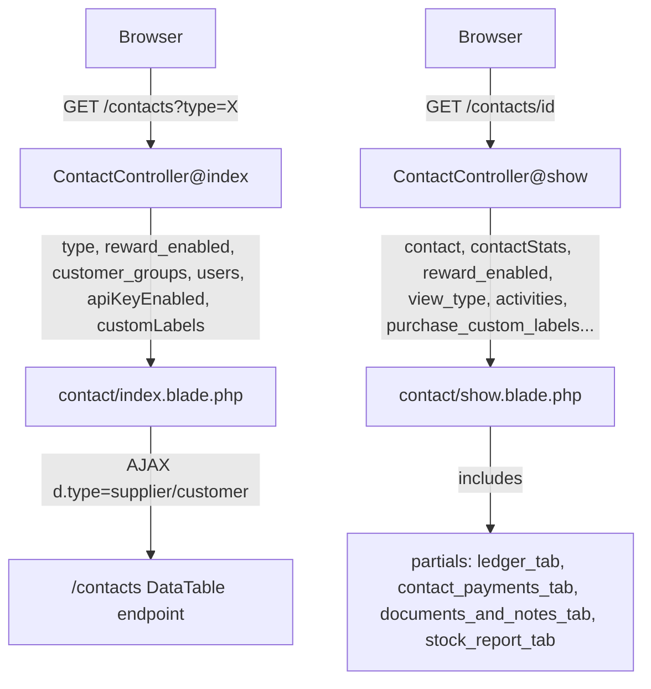

# Contact UI Metronic Rebuild

## Goal

Two separate Blade files get new Metronic-faithful shells:

- **List page** (`/contacts?type=customer` / `?type=supplier`) → matches `[public/html/apps/customers/list.html](d:\wamp64\www\upos612\public\html\apps\customers\list.html)`
- **Detail page** (`/contacts/{id}`) → matches `[public/html/account/overview.html](d:\wamp64\www\upos612\public\html\account\overview.html)`

Routes, DataTable columns, AJAX endpoints, permission checks, and JS in `public/js/app.js` are **not changed**.

## Data Flow




## Phase 1 — Controller Prep (clean Blade violations before touching views)

Files: `[app/Http/Controllers/ContactController.php](d:\wamp64\www\upos612\app\Http\Controllers\ContactController.php)`

**Task 1.1 — Fix `index()` view data**

Currently `index.blade.php` contains:

```php
@php $api_key = env('GOOGLE_MAP_API_KEY'); @endphp
```

and a table header that does:

```php
@php $custom_labels = json_decode(session('business.custom_labels'), true); @endphp
```

Move both to the controller and pass them as view variables:

- `$api_key_enabled` (boolean, not the raw key)
- `$custom_labels` (decoded array)

**Task 1.2 — Fix `show()` contact stats for overview header card**

The `overview.html` header card shows stat boxes (Earnings, Projects, Success Rate). For contacts this maps to real columns already present on `$contact` from `getContactInfo()`:

- Customers: `total_invoice`, `invoice_received`, `total_sell_return`, `balance`
- Suppliers: `total_purchase`, `purchase_paid`, `total_purchase_return`, `balance`

Prepare a `$contact_stats` array in `show()` with pre-formatted values using `num_f()` so Blade only renders.

## Phase 2 — Rebuild `contact/index.blade.php`

File: `[resources/views/contact/index.blade.php](d:\wamp64\www\upos612\resources\views\contact\index.blade.php)`
Reference: `[public/html/apps/customers/list.html](d:\wamp64\www\upos612\public\html\apps\customers\list.html)` lines 4390–4530+

**Task 2.1 — Toolbar block**

Copy inner toolbar HTML from `list.html` lines 4390–4511 into `@section('content')`. Change:

- Title: `@lang('lang_v1.' . $type . 's')` instead of "Customer List"
- Breadcrumb: wire to `route('home')` + dynamic `$type`
- "Filter" button: keep as `data-kt-menu-trigger` dropdown (list.html pattern) — contains our existing filter fields (checkboxes + selects) in the dropdown body
- "Create" button: keep existing `btn-modal` `data-href` with permission guard

**Task 2.2 — Card + table block**

Copy card HTML from `list.html`. Wire:

- Search input: keep `id="contact_table_search"` (app.js depends on it)
- Hidden type: `<input type="hidden" value="{{ $type }}" id="contact_type">` (app.js depends on it)
- Table: keep `id="contact_table"` with exact existing `<thead>` / `<tfoot>` column structure
- Modals at bottom: keep `.contact_modal` and `.pay_contact_due_modal` divs

**Task 2.3 — CSS section**

Keep `@section('css')` for Google Maps styles, now driven by `$api_key_enabled` from controller instead of `@php env()`.

**Task 2.4 — JS section**

Keep `@section('javascript')` Google Maps script block, driven by `$api_key_enabled`.

## Phase 3 — Rebuild `contact/show.blade.php`

File: `[resources/views/contact/show.blade.php](d:\wamp64\www\upos612\resources\views\contact\show.blade.php)`
Reference: `[public/html/account/overview.html](d:\wamp64\www\upos612\public\html\account\overview.html)` — **hero card block only** (lines 4518–4941)

### What is copied 100% vs adapted


| Block in overview.html                              | Action                                                                            |
| --------------------------------------------------- | --------------------------------------------------------------------------------- |
| Hero "Navbar" card (avatar, name, stats, tab strip) | 100% structure copied; all static text replaced with `$contact` values            |
| "Profile Details" card (`#kt_profile_details_view`) | 100% structure copied; "Max Smith" rows replaced with `$contact` fields           |
| "Top Selling Categories" ApexCharts widget          | **Removed** — no equivalent contact data                                          |
| "Have you tried Mobile Application?" promo widget   | **Removed** — not applicable                                                      |
| "Product Delivery" list widget                      | **Removed** — not applicable                                                      |
| "Stock Report" static demo table                    | **Removed** — replaced by the real `stock_report_tab` partial inside its tab pane |


The demo widgets that follow the Profile Details card are **replaced by real tab pane content** (existing partials: ledger, payments, documents, stock report). The nav-line-tabs in the HTML use `<a href="...">` page links in the demo; for this page they become Bootstrap 5 `data-bs-toggle="tab"` + `data-bs-target="#pane_id"` buttons so all tabs switch content within the **same page** without navigation.

**Task 3.1 — "Navbar" hero card**

Copy the `div.card.mb-5.mb-xl-10` / `card-body.pt-9.pb-0` block from `overview.html` lines 4518–4799. Wire real data:

- Avatar: `$contact->image` or initials fallback using contact name
- Name: `$contact->name` / `$contact->supplier_business_name`
- Role-style badge: contact type (`customer`, `supplier`, `both`)
- Location: `$contact->city`, `$contact->state`
- Email: `$contact->email`
- Actions row: replace "Follow / Hire Me / dots menu" with contact-relevant actions (Edit, Pay Due, Ledger, Delete — with `@can` guards)
- Stat boxes (3 boxes replacing Earnings / Projects / Success Rate):
  - For customer: `Total Sales` | `Outstanding Due` | `Advance Balance` — values from `$contact_stats`
  - For supplier: `Total Purchase` | `Purchase Due` | `Advance Balance` — values from `$contact_stats`
- Progress bar ("Profile Completion") → **removed** (no equivalent for contacts)

**Task 3.2 — Tab strip**

Replace the old `nav-tabs-custom` with `ul.nav.nav-stretch.nav-line-tabs.nav-line-tabs-2x` from `overview.html` lines 4750–4797. Each `<a>` changes from `href="page.html"` to `data-bs-toggle="tab" data-bs-target="#pane_id"`. Tab items:


| Tab label         | Target                    | Condition     |
| ----------------- | ------------------------- | ------------- |
| Overview          | `#tab_overview`           | always        |
| Ledger            | `#tab_ledger`             | always        |
| Payments          | `#tab_payments`           | always        |
| Documents & Notes | `#tab_documents`          | always        |
| Stock Report      | `#tab_stock`              | supplier only |
| Activity          | `#tab_activity`           | always        |
| Module tabs       | from `$contact_view_tabs` | when present  |


**Task 3.3 — Tab content panes**

Wrap each existing partial in a Bootstrap 5 `.tab-pane.fade` div with the matching `id`:

- `#tab_overview` → "Profile Details" card (`overview.html` lines 4803–4941): wire `$contact` fields replacing Max Smith static text. Fields: Full Name, Business Name, Email, Mobile, Tax No, Pay Term, Credit Limit (customer), Opening Balance, Address, Status badge.
- `#tab_ledger` → `@include('contact.partials.ledger_tab')`
- `#tab_payments` → `@include('contact.partials.contact_payments_tab')`
- `#tab_documents` → `@include('contact.partials.documents_and_notes_tab')`
- `#tab_stock` → `@include('contact.partials.stock_report_tab')` (if supplier)
- `#tab_activity` → activity list

**Task 3.4 — Active tab from `$view_type`**

Controller already passes `$view_type` (defaults `'ledger'`). Map it to the tab IDs so `?view=ledger` activates the Ledger tab on load via a `@json($activeTab)` JS variable.

## Phase 4 — Lint and Verify

**Task 4.1 — Read lints** on all changed files:

- `app/Http/Controllers/ContactController.php`
- `resources/views/contact/index.blade.php`
- `resources/views/contact/show.blade.php`

Fix any diagnostics before declaring done.

**Task 4.2 — Smoke checks**

- `contacts?type=customer` loads, filter dropdown opens, DataTable renders
- `contacts?type=supplier` same
- `contacts/{id}` loads, all tabs switch, stats show, "Profile Details" shows real contact data
- Add contact modal opens from index
- Permission-denied path still returns 403

## Constitution Compliance Checklist

- No business logic in Blade (all `@php` removed; replaced by controller variables)
- No `env()` or `json_decode(session(...))` in Blade
- Controller stays thin: no added logic beyond stat formatting delegation to Util
- All view data prepared before render
- Metronic 8.3.3 classes only; asset paths `asset('assets/...')`
- Permissions: existing `@can` / `auth()->user()->can()` guards preserved
- No N+1: `$contact` already loaded via `getContactInfo()` which uses aggregation

