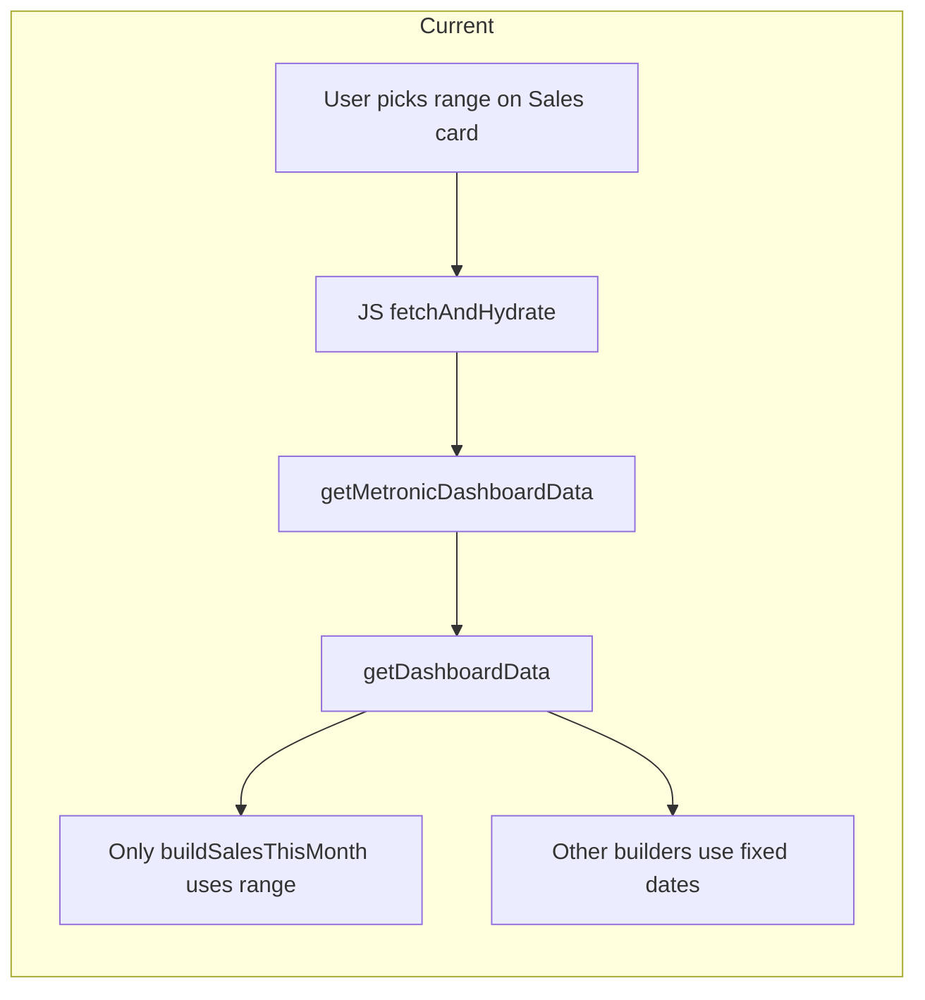

# Home Dashboard: Root Data and Global Date Filter

## Current state

- **Data flow:** [app/Utils/HomeMetronicDashboardUtil.php](app/Utils/HomeMetronicDashboardUtil.php) builds KPIs/charts/tables; [app/Http/Controllers/HomeController.php](app/Http/Controllers/HomeController.php) exposes them via `getMetronicDashboardData()` at `/home/metronic-dashboard-data`. [public/assets/app/js/home-metronic-dashboard.js](public/assets/app/js/home-metronic-dashboard.js) fetches and hydrates the DOM.
- **Blade:** [resources/views/home/index.blade.php](resources/views/home/index.blade.php) (lines 5–2352) uses **static placeholders**; real values are injected by JS after the API response.
- **Filter:** The request already sends `sales_chart_range` and optional `sales_chart_start_date` / `sales_chart_end_date`. Only **buildSalesThisMonth()** uses this; all other builders use fixed periods (today, this month, last 7 days).

---

## Goal

1. **Root data everywhere:** Ensure every dashboard widget is driven by backend data (already largely true; verify and fix any missing bindings).
2. **Global date filter:** When the user selects week / month / quarter / year / custom, **all** date-based widgets (KPI cards, charts, recent orders, product orders, delivery feed) use that same range.

---

## Implementation plan

### 1. Backend: Use one date range for all widgets

**File:** [app/Utils/HomeMetronicDashboardUtil.php](app/Utils/HomeMetronicDashboardUtil.php)

- At the start of `getDashboardData()`, call **resolveSalesChartRange()** once (already done for the sales chart). Treat this as the **global** range for the request.
- Pass the resolved range (`current_start`, `current_end`, `previous_start`, `previous_end`, `range`, `label`) into every date-sensitive builder instead of hardcoded today/month/last7.

**Builders to refactor (accept range params instead of fixed dates):**

| Builder                       | Currently uses                   | Change                                                                                |
| ----------------------------- | -------------------------------- | ------------------------------------------------------------------------------------- |
| `buildExpectedEarnings`       | Today vs yesterday               | Use `current_`* vs `previous_`* from global range                                     |
| `buildSalesSummary`           | Current month vs previous month  | Use global `current_`* / `previous_`*                                                 |
| `buildOrdersThisMonth`        | Current month                    | Use global `current_start` / `current_end` (and previous for delta)                   |
| `buildAverageDailySales`      | Last 7 vs previous 7 days        | Use global range for “current” and existing getPreviousComparableRange for “previous” |
| `buildNewCustomersThisMonth`  | Current month                    | Use global `current_start` / `current_end`                                            |
| `buildSalesThisMonth`         | Already uses range               | Keep as-is; already receives range from same source                                   |
| `buildDiscountedProductSales` | Current month vs previous month  | Use global `current_`* / `previous_*`                                                 |
| `buildRecentOrderTabs`        | Current month                    | Use global `current_start` / `current_end`                                            |
| `buildProductOrders`          | No date filter (last 7 by order) | Add optional `start_date` / `end_date`; filter `transaction_date` when provided       |
| `buildDeliveryFeed`           | No date filter                   | Same as buildProductOrders                                                            |

- **KPI labels:** Where labels say “This month” or “Orders This Month”, derive the label from the global range (e.g. use existing `buildSalesChartRangeLabel()` or the `label` from `resolveSalesChartRange`) so the UI reflects the selected period (e.g. “This week”, “Custom: 2025-01-01 - 2025-01-15”).
- **emptyPayload():** No change needed; it already returns safe defaults. Optional: ensure `sales_this_month.range_label` can reflect “Current range” when unauthorized.

**Controller:** [app/Http/Controllers/HomeController.php](app/Http/Controllers/HomeController.php) — `getMetronicDashboardData()` already passes `sales_chart_range`, `sales_chart_start_date`, `sales_chart_end_date` in `$sales_chart_filter`. No change required.

---

### 2. Frontend: Global filter UI and JS

**Option A (recommended): Single global filter**

- **Blade:** In [resources/views/home/index.blade.php](resources/views/home/index.blade.php), add a **global date filter** at the top of the dashboard content (e.g. above the first row of cards, or in the same toolbar as any existing “Dashboard” link around line 2361). Reuse the same pattern as the “Sales This Month” card: dropdown with “This week”, “This month”, “This quarter”, “This year”, “Custom date”, plus two date inputs and an “Apply” button for custom. Use the same `data-sales-chart-range`, `data-sales-chart-start-date`, `data-sales-chart-end-date`, `data-sales-chart-apply-custom` and a single `data-sales-chart-range-label` for the active range label.
- **JS:** In [public/assets/app/js/home-metronic-dashboard.js](public/assets/app/js/home-metronic-dashboard.js):
  - **Init:** If a global filter block exists (e.g. a dedicated `#dashboard-date-filter` or first `[data-sales-chart-range-label]` in a global toolbar), initialize `salesChartFilter` and the range label from it (same logic as current `initSalesChartFilter` but target the global block).
  - **Events:** Bind the same range and custom-apply behaviour to the **global** filter (in addition to or instead of the Sales card menu), so changing the global filter updates `salesChartFilter` and calls `fetchAndHydrate()`. Ensure only one set of handlers runs (e.g. bind to the global container so one refetch applies to the whole dashboard).
- **Result:** User selects date range once at the top; entire dashboard (all KPIs, charts, tables) refreshes for that range.

**Option B: Reuse existing “Sales This Month” filter as global**

- Do **not** add new UI. Treat the existing dropdown in the “Sales This Month” card (lines 252–308) as the **global** filter: when the user changes it, the backend already receives the same params; after step 1, all widgets will use that range. Only ensure the range label (e.g. “Current month”) is visible and that the JS continues to send the selected range on every fetch. No Blade changes; optional small JS change to show the active range somewhere prominent if desired.

**Recommendation:** Option A for clearer UX (one obvious place to filter the whole dashboard). Option B if you want zero UI change and are fine with the filter living only on the chart card.

---

### 3. Verify data binding (root data everywhere)

- **JS:** In [public/assets/app/js/home-metronic-dashboard.js](public/assets/app/js/home-metronic-dashboard.js), confirm each `apply`* method maps the right payload keys to the right DOM elements. Known quirk: `applyExpectedEarnings` uses `payload.kpis.sales_summary` (not `expected_earnings`). Ensure all of these receive data from the updated payload: expected_earnings/sales_summary, orders_this_month, average_daily_sales, new_customers, sales_this_month, discounted_product_sales, recent_orders_tabs, product_orders, delivery_feed, stock_rows.
- **Blade:** Keep Blade presentation-only; no new logic. Placeholder numbers can stay as fallbacks until JS runs. Optional (see step 4): pass initial payload from controller for first-paint real data.

---

### 4. Optional: Server-side initial payload for first paint

- In [app/Http/Controllers/HomeController.php](app/Http/Controllers/HomeController.php) `index()`, when the user has `dashboard.data`, call `HomeMetronicDashboardUtil::getDashboardData($business_id, null, ['range' => 'month'])` once and pass the result to the view (e.g. `$dashboardData`).
- In [resources/views/home/index.blade.php](resources/views/home/index.blade.php), for each KPI card and label that currently shows a static value, output the corresponding value from `$dashboardData` (e.g. `@format_currency($dashboardData['kpis']['sales_summary']['value'] ?? 0)`), with fallback to the current placeholder when `$dashboardData` is missing. Do **not** add logic in Blade; only echo prepared values.
- **Benefit:** First paint shows real numbers without waiting for the AJAX call; JS can still overwrite after refetch when the user changes the global filter.

---

## Verification

- Change global filter to “This week”, “This quarter”, “Custom” with a specific range: all KPI cards, “Sales This Month” chart, “Discounted Product Sales” chart, “Recent Orders” tabs, “Product Orders” table, and “Product Delivery” list update to the same period.
- Confirm “Total Sales” (sales_summary), “Orders This Month”, “Average Daily Sales”, “New Customers” and “Sales This Month” chart all reflect the selected range.
- Confirm product orders and delivery feed (when step 1 adds date filter) only show transactions within the selected range.
- No N+1; all queries remain scoped by `business_id` and permitted locations.

---

## Files to touch (summary)

| File                                                                                               | Changes                                                                                                                                                               |
| -------------------------------------------------------------------------------------------------- | --------------------------------------------------------------------------------------------------------------------------------------------------------------------- |
| [app/Utils/HomeMetronicDashboardUtil.php](app/Utils/HomeMetronicDashboardUtil.php)                 | Resolve range once; pass it into all date-based builders; add optional date filter to buildProductOrders and buildDeliveryFeed; use range-derived labels where needed |
| [app/Http/Controllers/HomeController.php](app/Http/Controllers/HomeController.php)                 | Optional: call getDashboardData for initial payload and pass to view                                                                                                  |
| [resources/views/home/index.blade.php](resources/views/home/index.blade.php)                       | Add global date filter block (Option A); optional: echo initial $dashboardData for first paint                                                                        |
| [public/assets/app/js/home-metronic-dashboard.js](public/assets/app/js/home-metronic-dashboard.js) | Init and bind global filter (Option A); ensure all apply* use payload that now reflects global range                                                                  |

---

## Compliance

- **Laravel constitution:** No business logic in Blade; view data prepared in Controller/Util. Validation/authorization unchanged (existing `dashboard.data` check).
- **AGENTS.md:** Controller stays thin (orchestration); business logic in Util; multi-tenant scoping preserved; no DB in Blade.

