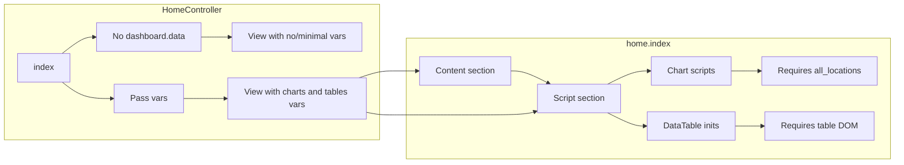

# Home Index: Asset Migration + Data Correctness and Modals (No UI Change)

## Current state

- **Content (lines 1–2371):** Metronic 8.3.3 layout with static demo content; no backend data bound to the new cards.
- **Controller:** When user has `dashboard.data`, passes `sells_chart_1`, `sells_chart_2`, `widgets`, `all_locations`, `common_settings`, `is_admin`. When user lacks permission, returns `view('home.index')` with no variables.
- **Script section (lines 2378–2782):** Uses `$asset_v` (global), `$all_locations`, `$sells_chart_1`, `$sells_chart_2`, `$common_settings`, `$custom_labels`, `$is_service_staff_enabled`. Initializes DataTables for `#sales_order_table`, `#so_location`, `#cash_flow_table`, `#purchase_order_table`, `#po_location`, `#purchase_requisition_table`, `#pr_location`, `#shipments_table`, `#pending_shipments_location`.
- **Gap:** `$custom_labels` and `$is_service_staff_enabled` are never passed by [app/Http/Controllers/HomeController.php](app/Http/Controllers/HomeController.php). The table elements (`#sales_order_table`, `#shipments_table`, etc.) do not exist in the view, so DataTable inits run against missing DOM and will error or no-op. When user has no `dashboard.data`, `$common_settings` (and possibly `$all_locations`) are undefined but referenced in `@if` in the script section.
- **Home views:** [resources/views/home/calendar.blade.php](resources/views/home/calendar.blade.php) is a full page (route `calendar`). [resources/views/home/todays_profit_modal.blade.php](resources/views/home/todays_profit_modal.blade.php) is included in `layouts/restaurant` and triggered by `#view_todays_profit` in old header; the Metronic layout ([resources/views/layouts/partials/M-header.blade.php](resources/views/layouts/partials/M-header.blade.php)) does not include the modal or the button.

## Architecture (data flow)

---

## Phase 0: Migrate public/css and public/js to public/assets (use only public/assets)

**Goal:** Clone all logic from [public/css](public/css) and [public/js](public/js) into [public/assets](public/assets) so the project uses only `asset('assets/...')`. Enables future removal of public/css and public/js.

**UI alignment with Metronic:** The project uses **Metronic 8.3.3** (Bootstrap 5) project-wide (AGENTS.md Section 10, ai/ui-components.md). Cloning CSS/JS preserves **behavior only**; any UI that these assets drive (modals, buttons, tables, forms) must **align with Metronic UI style and components**. Use only Metronic/Bootstrap 5 class patterns and component structure from public/html and ai/ui-components.md; do not introduce a parallel design system. App-specific CSS in `assets/app/css` should be minimal overrides that work with Metronic, not a full alternate theme.

**Convention:** Use a subfolder under public/assets for **app-specific** (project) assets so Metronic’s existing [public/assets/css](public/assets/css) and [public/assets/js](public/assets/js) are not overwritten. Use **public/assets/app/js/** and **public/assets/app/css/**.

**Tasks:**

1. **Create app asset directories**
  - Create [public/assets/app/js](public/assets/app/js) and [public/assets/app/css](public/assets/app/css).
2. **Clone public/js into public/assets/app/js**
  - Copy all files and subdirectories from [public/js](public/js) into `public/assets/app/js/` (e.g. home.js, payment.js, app.js, vendor.js, functions.js, common.js, help-tour.js, documents_and_note.js, login.js, report.js, product.js, purchase.js, pos.js, printer.js, opening_stock.js, restaurant.js, stock_transfer.js, stock_adjustment.js, sell_return.js, purchase_return.js, labels.js, init.js; and folders such as **lang/** and **jquery-validation-1.16.0/**). Preserve directory structure so paths like `js/lang/en.js` become `assets/app/js/lang/en.js`.
3. **Clone public/css into public/assets/app/css**
  - If [public/css](public/css) exists, copy all contents into `public/assets/app/css/` (e.g. app.css, vendor.css, rtl.css, tailwind/app.css). If public/css does not exist in the project root, skip or create the directory and only add any CSS referenced by views (e.g. from build output) so that all `asset('css/...')` references can point to `assets/app/css/...`.
4. **Update all references to use public/assets**
  - Replace every `asset('js/...')` with `asset('assets/app/js/...')` and every `asset('css/...')` with `asset('assets/app/css/...')` in:
    - [resources/views/home/index.blade.php](resources/views/home/index.blade.php) (home.js, payment.js).
    - [resources/views/layouts/partials/javascripts.blade.php](resources/views/layouts/partials/javascripts.blade.php) (vendor.js, lang/*, functions.js, common.js, app.js, help-tour.js, documents_and_note.js, jquery-validation-1.16.0/...).
    - All other views under [resources/views](resources/views) that reference `asset('js/...')` or `asset('css/...')` (see grep list: report/*, sell/*, purchase/*, product/*, sale_pos/*, stock_*, contact, expense, labels, opening_stock, layouts: install, home, guest, restaurant, purchase_order/receipts, extracss_auth, etc.).
  - Replace every `public_path('js/...')` with `public_path('assets/app/js/...')` (e.g. in [resources/views/layouts/partials/javascripts.blade.php](resources/views/layouts/partials/javascripts.blade.php) for `file_exists(public_path('js/lang/...'))` and similar checks).
  - Leave any existing `asset('assets/...')` that already point to Metronic (plugins, css/style.bundle.css, etc.) unchanged.
5. **Optional: AdminLTE / other legacy paths**
  - If any view references `asset('AdminLTE/...')` or other legacy paths, either move those assets under `public/assets/app/` and update references or leave as-is until a separate cleanup; the plan scope is public/js and public/css only.
6. **Ensure UI touched by cloned assets aligns with Metronic**
  - Where the cloned app JS/CSS affect UI (e.g. modals, DataTables, buttons, forms), the corresponding Blade markup must use Metronic 8.3.3 components and classes (card, modal, btn, form-control, table, etc. per [ai/ui-components.md](ai/ui-components.md) and [public/html](public/html)). This applies to the home index dashboard tables section (Phase 3), Today's profit modal (Phase 4), and any other views that load assets/app/js or assets/app/css. No legacy AdminLTE or custom component classes that conflict with Metronic.

**Verification:** After migration, no view or layout should load scripts or styles from `asset('js/...')` or `asset('css/...')`; all such assets from `asset('assets/app/...')`. Home and key flows run the same. All UI that uses these assets or is added in this plan (tables, modals, buttons) follows Metronic 8.3.3 style and components.

---

## Phase 1: Controller – Always pass required variables

**Goal:** Every variable used in [resources/views/home/index.blade.php](resources/views/home/index.blade.php) (including the script section) is passed by the controller so there are no undefined variable notices or errors.

**Tasks:**

1. **Pass `custom_labels` and `is_service_staff_enabled` when user has `dashboard.data`**
  - In `HomeController::index()`, before the `return view(...)` that passes chart/widget data:
    - `custom_labels`: from `session('business.custom_labels')` decoded (e.g. `json_decode(session('business.custom_labels'), true) ?? []`). If `business` is the full model, use `$business->custom_labels` decoded.
    - `is_service_staff_enabled`: from session or from existing app logic (e.g. `session('business.is_service_staff_enabled')` or a check on enabled modules/settings). Default `false` if not set.
  - Add both to the `compact()` (or array) passed to the view.
2. **When user does not have `dashboard.data`, pass safe defaults**
  - Change `return view('home.index');` to pass at least: `all_locations` => `[]`, `common_settings` => `[]`, `custom_labels` => `[]`, `is_service_staff_enabled` => `false`, and optionally `widgets` => `[]`, `is_admin` => `false`, so that the script section’s `@if (!empty($all_locations))`, `@if (!empty($common_settings['enable_purchase_order']))`, etc., and any `$custom_labels` / `$is_service_staff_enabled` references never hit undefined variables.

**Verification:** Load `/home` as user with and without `dashboard.data`; no PHP undefined variable warnings; script block renders without PHP errors.

---

## Phase 2: View – Safe fallbacks and chart/script guards

**Goal:** Script section is safe even if a variable is missing; chart scripts only run when data exists.

**Tasks:**

1. **Optional defensive fallbacks in Blade (script section)**
  - Where `$custom_labels` and `$is_service_staff_enabled` are used (e.g. around lines 2727, 2763), use null-coalescing so the view does not depend solely on controller: e.g. `$custom_labels ?? []`, `$is_service_staff_enabled ?? false`. This keeps behavior correct if controller is ever missed in a code path.
2. **Guard chart script output**
  - The block `@if (!empty($all_locations))` that outputs `$sells_chart_1->script()` and `$sells_chart_2->script()` is correct; ensure `$sells_chart_1` and `$sells_chart_2` are only used when the user has dashboard data (they are not passed when permission is missing, so that block will not run if we also ensure `all_locations` is passed as `[]` when no permission—already covered in Phase 1).

**Verification:** No PHP notices; chart scripts only output when `all_locations` is non-empty.

---

## Phase 3: DataTables DOM – Add missing table markup so data runs

**Goal:** All DataTable initializations in the script section target existing elements so they run without JS errors. No change to the existing Metronic card/UI above the fold; only add the missing dashboard table section.

**Tasks:**

1. **Add one “Dashboard data” section at the bottom of the content section** (before `@endsection` of `content`, e.g. before the closing `
` of `#kt_content`).
  - Use Metronic card/table styling consistent with [public/html](public/html) (e.g. `card`, `card-header`, `card-body`, `table`, `form-select` for location dropdowns).
  - Include the following elements so existing script finds them:
    - **Sales orders:** A card containing a location dropdown with `id="so_location"` (optional; script already checks `$('#so_location').length`) and a `<table id="sales_order_table">` with a `<thead>` (columns can match SellController index response).
    - **Pending shipments:** Dropdown `id="pending_shipments_location"` and `<table id="shipments_table">`.
    - **Cash flow (when account.access and config):** `<table id="cash_flow_table">` (only render this block if the app has the same permission/config as the script’s `@if`).
    - **Purchase orders (when enable_purchase_order):** `id="po_location"` and `<table id="purchase_order_table">` inside an `@if (!empty($common_settings['enable_purchase_order']))` block.
    - **Purchase requisition (when enable_purchase_requisition):** `id="pr_location"` and `<table id="purchase_requisition_table">` inside an `@if (!empty($common_settings['enable_purchase_requisition']))` block.
  - You can mirror the structure from [dreampos/resources/views/home/index.blade.php](dreampos/resources/views/home/index.blade.php) (e.g. around lines 1998, 2189, 2266) for table IDs and location dropdowns, but use Metronic classes and layout so the new section fits the current theme.
2. **Optionally wrap the whole “Dashboard data” section in a permission check**
  - Only output the table section (and optionally the button that reveals it) when the user has `dashboard.data` (e.g. `@if (!empty($all_locations))` or a dedicated permission check), so users without permission do not see empty tables. The script section already conditionally inits cash_flow, purchase_order, and purchase_requisition tables; sales_order and shipments_table run unconditionally in `$(document).ready`. So either:
    - Always add the DOM and wrap DataTable inits in “element exists” checks so that when section is not rendered there is no error; or
    - Only add the DOM when user has `dashboard.data` and keep current script (then when no permission, `all_locations` is [] and we don’t render the section; we must then wrap `sales_order_table` and `sell_table` inits in `if ($('#sales_order_table').length)` and `if ($('#shipments_table').length)` so they don’t run when tables are absent).
3. **Recommended:** Add the table section only when user has dashboard data (e.g. `@if (!empty($all_locations))`), and in the script section wrap each DataTable init in a check for the corresponding element (e.g. `if ($('#sales_order_table').length) { ... }`) so that when the section is not rendered (no permission), no JS error occurs.

**Verification:** With `dashboard.data`, all relevant tables and dropdowns are present; DataTables initialize and load data; no console errors. Without permission, no tables in DOM and no JS errors.

---

## Phase 4: Buttons and modals for home views

**Goal:** Add button(s) and modal(s) so users can open home-related views (Today’s profit, and optionally Calendar) without changing the existing Metronic UI.

**Tasks:**

1. **Today’s profit modal**
  - Ensure the modal is available on the home (or main) layout used by the Metronic theme:
    - Either include `@include('home.todays_profit_modal')` in [resources/views/layouts/app.blade.php](resources/views/layouts/app.blade.php) (if not already), or include it at the bottom of [resources/views/home/index.blade.php](resources/views/home/index.blade.php) so it is present on the dashboard.
  - Update [resources/views/home/todays_profit_modal.blade.php](resources/views/home/todays_profit_modal.blade.php) to use Metronic modal markup (e.g. `modal`, `modal-dialog`, `modal-content`, `data-bs-dismiss` instead of `data-dismiss`) so it works with Bootstrap 5 and the current theme. Keep the same behaviour: `#todays_profit` container and `#modal_today`; existing JS that loads today’s profit can stay.
  - Add a “Today’s profit” button that opens this modal:
    - Either in [resources/views/layouts/partials/M-header.blade.php](resources/views/layouts/partials/M-header.blade.php) in the toolbar area (icon + label), or on the home page (e.g. in the first row of cards or in a small toolbar) so it’s visible on the dashboard. Use Metronic button classes and `data-bs-toggle="modal"` / `data-bs-target="#todays_profit_modal"`.
2. **Calendar**
  - Ensure a Calendar link exists in the main layout (e.g. M-header or aside) pointing to `route('calendar')` so users can open [resources/views/home/calendar.blade.php](resources/views/home/calendar.blade.php). If it already exists in another header/partial used by the app layout, no change; otherwise add it in M-header or aside with Metronic styling.
3. **Optional: “Dashboard data” reveal**
  - If the new table section from Phase 3 is long, add a single button (e.g. “Dashboard tables” or “Sales orders & shipments”) that scrolls to the new section or toggles its visibility (e.g. collapse), so the main dashboard look is unchanged until the user chooses to see tables. Use Metronic button/collapse classes.

**Verification:** “Today’s profit” opens the modal and content loads; Calendar is reachable; no layout or UI change to the existing cards and structure.

---

## Phase 5: Lint and smoke test

**Tasks:**

1. Run linter on [app/Http/Controllers/HomeController.php](app/Http/Controllers/HomeController.php) and [resources/views/home/index.blade.php](resources/views/home/index.blade.php) (and any modified home partials/layouts).
2. Smoke test: load `/home` as user with and without `dashboard.data`; open Today’s profit modal and Calendar; confirm no PHP/JS errors and tables load when permission and DOM are present.

---

## Todo list (for tracking)

| ID                     | Task                                                                                                                                                                                                                             |
| ---------------------- | -------------------------------------------------------------------------------------------------------------------------------------------------------------------------------------------------------------------------------- |
| asset-dirs             | Create public/assets/app/js and public/assets/app/css                                                                                                                                                                            |
| asset-clone-js         | Clone all public/js contents (files + lang/, jquery-validation-1.16.0/, etc.) to public/assets/app/js                                                                                                                            |
| asset-clone-css        | Clone public/css contents to public/assets/app/css (or create and add any referenced app CSS)                                                                                                                                    |
| asset-refs-views       | Update all asset('js/...') and asset('css/...') to asset('assets/app/js/...') and asset('assets/app/css/...') in resources/views                                                                                                 |
| asset-refs-public-path | Update public_path('js/...') to public_path('assets/app/js/...') in javascripts.blade.php and any file that checks js path                                                                                                       |
| ui-metronic-align      | Ensure UI touched by cloned assets and new sections (tables, modals, buttons) uses Metronic 8.3.3 components and classes per ai/ui-components.md and public/html                                                                 |
| controller-vars        | Controller: pass custom_labels and is_service_staff_enabled when user has dashboard.data                                                                                                                                         |
| controller-defaults    | Controller: when user lacks dashboard.data, pass all_locations, common_settings, custom_labels, is_service_staff_enabled (and optionally widgets, is_admin) as safe defaults                                                     |
| view-fallbacks         | View: add $custom_labels ?? [] and $is_service_staff_enabled ?? false in script section where used                                                                                                                               |
| view-dom-tables        | View: add “Dashboard data” section with #sales_order_table, #so_location, #shipments_table, #pending_shipments_location, and conditional cash_flow, purchase_order, purchase_requisition tables and dropdowns (Metronic styling) |
| view-script-guards     | View: wrap each DataTable init in script section in element-exists check (e.g. if ($('#sales_order_table').length)) so no JS error when section not rendered                                                                     |
| modal-include          | Include todays_profit_modal in app layout or home index; ensure modal uses Metronic/Bootstrap 5 markup                                                                                                                           |
| button-todays-profit   | Add “Today’s profit” button (header or home) that opens #todays_profit_modal                                                                                                                                                     |
| calendar-link          | Ensure Calendar link (route('calendar')) exists in M-header or aside                                                                                                                                                             |
| optional-reveal        | Optional: add button to scroll/toggle “Dashboard tables” section                                                                                                                                                                 |
| verify-lint-test       | Run lints and smoke test with/without dashboard.data; verify all assets load from public/assets only                                                                                                                             |

---

## Files to touch (summary)

**Phase 0 (asset migration):** Create public/assets/app/js and public/assets/app/css; clone public/js and public/css (if present) into them. Update [resources/views/layouts/partials/javascripts.blade.php](resources/views/layouts/partials/javascripts.blade.php), [resources/views/home/index.blade.php](resources/views/home/index.blade.php), and all other views that reference asset('js/...') or asset('css/...').

**Phases 1–5:**

- [app/Http/Controllers/HomeController.php](app/Http/Controllers/HomeController.php) – pass new vars and defaults.
- [resources/views/home/index.blade.php](resources/views/home/index.blade.php) – script fallbacks, new table section, optional button, optional modal include.
- [resources/views/home/todays_profit_modal.blade.php](resources/views/home/todays_profit_modal.blade.php) – Metronic modal markup and BS5 attributes.
- [resources/views/layouts/app.blade.php](resources/views/layouts/app.blade.php) and/or [resources/views/layouts/partials/M-header.blade.php](resources/views/layouts/partials/M-header.blade.php) – include modal, add Today’s profit button and Calendar link if missing.

No new models or routes required; optional new route only if you add an AJAX endpoint for loading a modal body later.