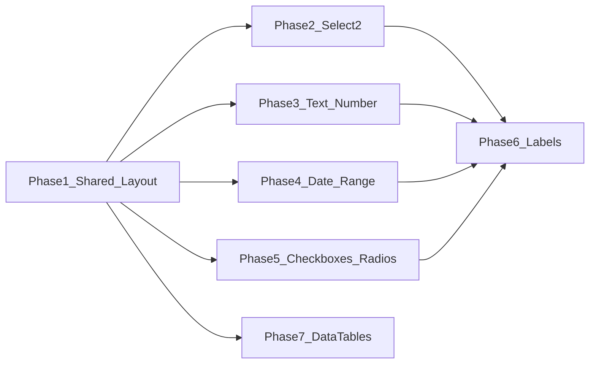

# Metronic Form Controls Rebuild — Phase-by-Phase Plan

## Reference and constraints

- **UI reference:** [Metronic Select2](https://preview.keenthemes.com/html/metronic/docs/?page=forms/select2), [Form controls](https://preview.keenthemes.com/html/metronic/docs/?page=base/forms/controls), [Checks & radios](https://preview.keenthemes.com/html/metronic/docs/?page=base/forms/checks-radios).
- **Project rules:** [ai/ui-components.md](ai/ui-components.md) (no native date/time; Flatpickr/Daterangepicker only), [.cursor/rules/laravel-coding-constitution.mdc](.cursor/rules/laravel-coding-constitution.mdc) (view data from controller; no logic in Blade).
- **Scope:** Core views under `resources/views/` only. Layout: [resources/views/layouts/app.blade.php](resources/views/layouts/app.blade.php) (Metronic bundles + [resources/views/layouts/partials/javascripts.blade.php](resources/views/layouts/partials/javascripts.blade.php) for app JS). Metronic Select2 is initialized in `public/assets/js/scripts.bundle.js` for `[data-control="select2"], [data-kt-select2="true"]`.
- **DataTables/tables reference:** Metronic HTML uses `table align-middle table-row-dashed fs-6 gy-5` (or `table-row-gray-300`, `gs-0`); thead row `text-start text-gray-500 fw-bold fs-7 text-uppercase gs-0`; see [public/html/apps/ecommerce/sales/listing.html](public/html/apps/ecommerce/sales/listing.html) (around line 4578).

---

## Phase 1: Shared / layout

**Goal:** One canonical stack for assets and one place that defines how Metronic form components are initialized, so all later phases can rely on it.

### 1.1 Layout asset paths and script order

- **Task:** In [resources/views/layouts/app.blade.php](resources/views/layouts/app.blade.php), replace hardcoded script paths (e.g. `assets/plugins/global/plugins.bundle.js`) with `{{ asset('assets/...') }}` so assets load correctly from any base URL.
- **Task:** Confirm script order: Metronic `plugins.bundle.js` and `scripts.bundle.js` load **before** `@include('layouts.partials.javascripts')` (so `data-control="select2"` init runs; app JS can still override Select2 defaults in common.js if needed).
- **Verification:** Open any page that extends `layouts.app`; ensure no 404s for JS/CSS and that a test select with `data-control="select2"` becomes a Select2 widget.

### 1.2 Document Metronic form patterns (single source of truth)

- **Task:** Add a short “Root form controls” subsection to [ai/ui-components.md](ai/ui-components.md) (or a dedicated `ai/forms-metronic-reference.md`) that prescribes:
  - **Text/number:** `class="form-control form-control-solid"`; label `class="form-label"` and `required` when mandatory.
  - **Select (Select2):** `class="form-select form-select-solid"`, first option empty, `data-control="select2"`, `data-placeholder`, `data-allow-clear"true"` / `data-hide-search="true"` as needed; inside modals: `data-dropdown-parent="#modal_id"`.
  - **Date:** `<input type="text" class="form-control form-control-solid" ...>` + Flatpickr in page JS; no `type="date"`.
  - **Date range:** Same input class + Daterangepicker (or Flatpickr range) in page JS.
  - **Checkbox:** Wrapper `form-check form-check-custom form-check-solid`, input `form-check-input`, label `form-check-label`; switch: add `form-switch`.
  - **Radio:** Same wrapper/input/label with `type="radio"`.
- **Verification:** Agents use this doc for every form edit in Phases 2–6.

### 1.3 Modal Select2 compatibility

- **Task:** In [public/assets/app/js/common.js](public/assets/app/js/common.js), the `shown.bs.modal` handler (around line 571) currently re-inits `.select2` with `dropdownParent`. After Phase 2, selects in modals will use `data-control="select2"` and `data-dropdown-parent`. Either: (a) extend the handler to also find `select[data-control="select2"]` inside the modal and ensure dropdownParent is applied from `data-dropdown-parent`, or (b) confirm that Metronic’s init in `scripts.bundle.js` already respects `data-dropdown-parent` on the element. If (b) is true, document that modals must set `data-dropdown-parent="#modal_id"` on the select; no common.js change. If (a), implement and test in one modal.
- **Verification:** Open a modal that contains a Select2; dropdown opens and search works (no z-index or focus traps).

---

## Phase 2: Selects (Select2)

**Goal:** Every root `<select>` that should be Select2 uses Metronic markup and `data-control="select2"`; no `form-control select2` or inline `style="width:100%"` for Select2.

**Pattern to apply (every file):**

- Replace `Form::select(..., ['class' => 'form-control select2', 'style' => 'width:100%', ...])` with a native `<select>` (or Form::select with new class/attributes):
  - `class="form-select form-select-solid"`
  - `data-control="select2"`
  - `data-placeholder="{{ __('...') }}"`
  - `data-allow-clear="true"` when clearing is allowed
  - `data-hide-search="true"` for short lists
  - First option: `<option value=""></option>` for placeholder
  - In modals: `data-dropdown-parent="#id_of_modal"`
- Remove class `select2` and any `style="width:100%"` used only for Select2.
- Keep existing `name`, `id`, `required`, and option values; preserve RTL/locale if present.

**Batches (implement in order; each batch is one task):**

| Batch | Scope (files/dirs)                             | Notes                                                                                                                                                                                                                                                                                                                                                                                                                                                                                                                                                                                                                                                                                                                                                                                                                                                                                                                                                                                                                                                                                                                                                                                                                   |
| ----- | ---------------------------------------------- | ----------------------------------------------------------------------------------------------------------------------------------------------------------------------------------------------------------------------------------------------------------------------------------------------------------------------------------------------------------------------------------------------------------------------------------------------------------------------------------------------------------------------------------------------------------------------------------------------------------------------------------------------------------------------------------------------------------------------------------------------------------------------------------------------------------------------------------------------------------------------------------------------------------------------------------------------------------------------------------------------------------------------------------------------------------------------------------------------------------------------------------------------------------------------------------------------------------------------- |
| 2.1   | Report filters                                 | [resources/views/report/](resources/views/report/) (purchase_report, product_sell_report, stock_expiry_report, tax_report, table_report, gst_sales_report, gst_purchase_report, etc.) and [resources/views/sell/shipments.blade.php](resources/views/sell/shipments.blade.php), [resources/views/sell/partials/sell_list_filters.blade.php](resources/views/sell/partials/sell_list_filters.blade.php), [resources/views/sales_order/index.blade.php](resources/views/sales_order/index.blade.php), [resources/views/sale_pos/quotations.blade.php](resources/views/sale_pos/quotations.blade.php), [resources/views/sale_pos/draft.blade.php](resources/views/sale_pos/draft.blade.php), [resources/views/sell/index.blade.php](resources/views/sell/index.blade.php).                                                                                                                                                                                                                                                                                                                                                                                                                                                 |
| 2.2   | Sell, purchase, POS (main + partials)          | [resources/views/sell/](resources/views/sell/), [resources/views/purchase/](resources/views/purchase/), [resources/views/sale_pos/](resources/views/sale_pos/), [resources/views/purchase_order/](resources/views/purchase_order/), [resources/views/transaction_payment/](resources/views/transaction_payment/), [resources/views/purchase_return/](resources/views/purchase_return/), [resources/views/stock_transfer/](resources/views/stock_transfer/).                                                                                                                                                                                                                                                                                                                                                                                                                                                                                                                                                                                                                                                                                                                                                             |
| 2.3   | Contact, account, expense, product (non-quote) | [resources/views/contact/](resources/views/contact/), [resources/views/account/](resources/views/account/), [resources/views/account_reports/](resources/views/account_reports/), [resources/views/expense/](resources/views/expense/), [resources/views/product/](resources/views/product/) (exclude partials already Metronic, e.g. detail_quotes, quotes/create                                                                                                                                                                                                                                                                                                                                                                                                                                                                                                                                                                                                                                                                                                                                                                                                                                                      |
| 2.4   | Business settings, types of service, rest      | [resources/views/business/partials/](resources/views/business/partials/), [resources/views/types_of_service/](resources/views/types_of_service/), [resources/views/discount/](resources/views/discount/), [resources/views/invoice_scheme/](resources/views/invoice_scheme/), [resources/views/manage_user/](resources/views/manage_user/), [resources/views/restaurant/](resources/views/restaurant/), [resources/views/location_settings/](resources/views/location_settings/), [resources/views/stock_adjustment/](resources/views/stock_adjustment/), [resources/views/import_sales/](resources/views/import_sales/), [resources/views/sell_return/](resources/views/sell_return/), [resources/views/home/](resources/views/home/), [resources/views/cash_register/](resources/views/cash_register/), [resources/views/printer/](resources/views/printer/), [resources/views/tax_group/](resources/views/tax_group/), [resources/views/purchase_requisition/](resources/views/purchase_requisition/), [resources/views/user/profile.blade.php](resources/views/user/profile.blade.php), [resources/views/labels/show.blade.php](resources/views/labels/show.blade.php), and any remaining files from the grep list. |

**Verification per batch:** Lint changed Blade files; manually open 2–3 affected pages and confirm selects render as Select2 with correct placeholder and options; in one modal, confirm dropdown and search.

---

## Phase 3: Text and number inputs

**Goal:** Every root text/number form input that is not already Metronic uses `form-control form-control-solid` (and keeps `input_number` only where JS depends on it).

**Pattern:**

- `Form::text(..., ['class' => 'form-control ...'])` → add `form-control-solid` to the class string (e.g. `'class' => 'form-control form-control-solid input_number'`).
- `Form::number(...)` → same: ensure class includes `form-control form-control-solid`.
- Raw `<input type="text" class="form-control" ...>` → `class="form-control form-control-solid"`.
- Raw `<input type="number" class="form-control" ...>` → `class="form-control form-control-solid"`.
- Do not remove `input_number` or other JS hooks without checking [public/assets/app/js/](public/assets/app/js/) and inline scripts.

**Batches:**

| Batch | Scope                                                                                                               |
| ----- | ------------------------------------------------------------------------------------------------------------------- |
| 3.1   | Sell, purchase, POS, transaction_payment (payment rows, edit modals, pos_form, sell edit/create).                   |
| 3.2   | Product (create, edit, partials except already-solid), contact (create, edit), expense, account, business partials. |
| 3.3   | Reports, rest of views (discount, invoice_scheme, manage_user, stock_transfer, purchase_return, etc.).              |

**Verification:** No new lint errors; spot-check pages for consistent solid input styling; ensure numeric/currency inputs still behave (e.g. input_number formatting).

---

## Phase 4: Date and date range

**Goal:** Single-date inputs use Flatpickr; date-range inputs use Daterangepicker (or Flatpickr range); all use `form-control form-control-solid`. No native `type="date"`/`time`/`datetime-local`.

**4.1 Single-date inputs**

- **Task:** Find all inputs that use bootstrap-datepicker or jQuery UI datepicker (e.g. class `expiry_datepicker`, or `.datepicker()` in JS). Replace with: `<input type="text" class="form-control form-control-solid" ... readonly>` (or keep existing structure but add `form-control-solid` and ensure no native date type). In the same view or in a shared JS file loaded on that page, init Flatpickr with business date format (use existing `datepicker_date_format` or equivalent from [resources/views/layouts/partials/javascripts.blade.php](resources/views/layouts/partials/javascripts.blade.php) and locale).
- **Files (representative):** [resources/views/purchase/partials/edit_purchase_entry_row.blade.php](resources/views/purchase/partials/edit_purchase_entry_row.blade.php) (expiry_datepicker, mfg_date), [public/assets/app/js/opening_stock.js](public/assets/app/js/opening_stock.js), [public/assets/app/js/labels.js](public/assets/app/js/labels.js), [public/assets/app/js/purchase_return.js](public/assets/app/js/purchase_return.js), [public/assets/app/js/pos.js](public/assets/app/js/pos.js), and any other view that binds `.datepicker()`.
- **Verification:** Date fields open a Flatpickr popup; value submits in expected format (e.g. Y-m-d).

**4.2 Date-range inputs**

- **Task:** Find all date-range inputs (e.g. `sell_list_filter_date_range`, `gst_sr_date_filter`, report date filters). Ensure input has `class="form-control form-control-solid"` (and `readonly` if desired). Ensure Daterangepicker (or Flatpickr range) is initialized in the page script with business format and locale (reuse moment_date_format / existing daterangepicker config). If Metronic provides a daterangepicker bundle, use it for consistent styling.
- **Files:** [resources/views/sell/shipments.blade.php](resources/views/sell/shipments.blade.php), [resources/views/report/gst_sales_report.blade.php](resources/views/report/gst_sales_report.blade.php), [resources/views/sell/partials/sell_list_filters.blade.php](resources/views/sell/partials/sell_list_filters.blade.php), [resources/views/sale_pos/quotations.blade.php](resources/views/sale_pos/quotations.blade.php), [resources/views/sale_pos/draft.blade.php](resources/views/sale_pos/draft.blade.php), [resources/views/sell/index.blade.php](resources/views/sell/index.blade.php), and other report/filter views that use `.daterangepicker()` or similar.
- **Verification:** Range picker opens; range submits correctly; format matches business settings.

**4.3 Remove legacy datepicker references**

- **Task:** After migration, remove or guard any bootstrap-datepicker / jQuery UI datepicker defaults or includes that are no longer needed (e.g. in [public/assets/app/js/common.js](public/assets/app/js/common.js) lines 42–44) so they do not affect new Flatpickr inputs. Prefer commenting or feature-flag over deleting until all date usages are confirmed migrated.
- **Verification:** No console errors; no duplicate inits on same input.

---

## Phase 5: Checkboxes and radios

**Goal:** Every root checkbox/radio uses Metronic structure: `form-check form-check-custom form-check-solid` (and `form-switch` for toggles). No `div.checkbox`, no `input-icheck` for styling.

**Pattern:**

- **Checkbox:**  
`
`  
`<input class="form-check-input" type="checkbox" name="..." value="..." id="...">`  
`<label class="form-check-label" for="...">...</label>`  
`
`  
Or wrap with `<label class="form-check form-check-custom form-check-solid">` and put input + `` inside.
- **Switch:** Add `form-switch` to the wrapper class.
- **Radio:** Same wrapper and `form-check-input`/`form-check-label` with `type="radio"` and same `name` for group.

**Batches:**

| Batch | Scope (files with checkbox/radio/icheck)                                                                                                                                                                                                                                                                                                                                                                                                                                                                                                                                                                                                                                                                                                                                                                                                                                                                                                                                                                                                                                                                                                                                                                                                                                                                                                                                                                                                                                                                                  |
| ----- | ------------------------------------------------------------------------------------------------------------------------------------------------------------------------------------------------------------------------------------------------------------------------------------------------------------------------------------------------------------------------------------------------------------------------------------------------------------------------------------------------------------------------------------------------------------------------------------------------------------------------------------------------------------------------------------------------------------------------------------------------------------------------------------------------------------------------------------------------------------------------------------------------------------------------------------------------------------------------------------------------------------------------------------------------------------------------------------------------------------------------------------------------------------------------------------------------------------------------------------------------------------------------------------------------------------------------------------------------------------------------------------------------------------------------------------------------------------------------------------------------------------------------- |
| 5.1   | [resources/views/business/partials/](resources/views/business/partials/) (settings_email, settings_tax, settings_custom_labels, settings_display_pos, settings_pos, settings_product, settings_purchase, settings_sales, settings_reward_point, settings_business, settings_system, settings_modules, register_form), [resources/views/barcode/create.blade.php](resources/views/barcode/create.blade.php), [resources/views/barcode/edit.blade.php](resources/views/barcode/edit.blade.php), [resources/views/tax_rate/edit.blade.php](resources/views/tax_rate/edit.blade.php), [resources/views/product/create.blade.php](resources/views/product/create.blade.php), [resources/views/product/edit.blade.php](resources/views/product/edit.blade.php).                                                                                                                                                                                                                                                                                                                                                                                                                                                                                                                                                                                                                                                                                                                                                                 |
| 5.2   | [resources/views/role/](resources/views/role/), [resources/views/manage_user/](resources/views/manage_user/), [resources/views/contact/](resources/views/contact/), [resources/views/expense/](resources/views/expense/), [resources/views/discount/](resources/views/discount/), [resources/views/invoice_layout/](resources/views/invoice_layout/), [resources/views/invoice_scheme/](resources/views/invoice_scheme/), [resources/views/types_of_service/](resources/views/types_of_service/), [resources/views/expense_category/](resources/views/expense_category/), [resources/views/taxonomy/](resources/views/taxonomy/), [resources/views/brand/](resources/views/brand/), [resources/views/unit/](resources/views/unit/), [resources/views/documents_and_notes/](resources/views/documents_and_notes/), [resources/views/restaurant/](resources/views/restaurant/), [resources/views/notification_template/](resources/views/notification_template/), [resources/views/sale_pos/](resources/views/sale_pos/) (pos_form, configure_search_modal, etc.), [resources/views/sell/](resources/views/sell/) (create, edit, sell_list_filters), [resources/views/report/](resources/views/report/) (stock_report, lot_report, items_report), [resources/views/labels/show.blade.php](resources/views/labels/show.blade.php), [resources/views/auth/login.blade.php](resources/views/auth/login.blade.php), [resources/views/layouts/partials/M-header.blade.php](resources/views/layouts/partials/M-header.blade.php). |

**Verification:** Checkboxes/radios/switches render with Metronic styling; checked state and form submit values unchanged; no icheck or old checkbox class left in use.

---

## Phase 6: Labels

**Goal:** Every form label uses `class="form-label"` and, when the field is required, the label has class `required` (or the required indicator is next to the input per Metronic).

**Pattern:**

- `Form::label('name', 'Text', ['class' => '...'])` → ensure class includes `form-label`; add `required` for required fields.
- Raw `<label ...>` for form controls → `class="form-label"` (and `required` if mandatory).
- Optional: for “required in input” style, use a wrapper with `position-relative` and a `required` element inside per Metronic controls doc.

**Task:** Apply across all views touched in Phases 2–5 and any remaining form views under [resources/views/](resources/views/) (auth, install, etc.). Prefer one pass per directory (reports, sell, purchase, business, product, contact, …) so agents can batch by area.

**Verification:** Required fields show a clear required indicator; no duplicate or missing labels; accessibility (for/id) unchanged.

---

## Phase 7: DataTables / tables (Metronic alignment)

**Goal:** All root listing/data tables and report tables use Metronic table classes so styling matches the theme. DataTables JS (jQuery `.DataTable()` / Yajra server-side) stays; only HTML/CSS markup is aligned.

**Current state:** Many views use legacy classes: `table table-bordered table-striped`, `table table-condensed`, `table table-striped table-slim`; some use `ajax_view` for server-side DataTables. A few already use Metronic: e.g. [resources/views/product/quotes/index.blade.php](resources/views/product/quotes/index.blade.php), [resources/views/quotes/public_quote.blade.php](resources/views/quotes/public_quote.blade.php) with `table table-row-dashed table-row-gray-300 align-middle gs-0 gy-4`.

**Metronic pattern (from public/html):**

- **Table:** `class="table align-middle table-row-dashed fs-6 gy-5"` (or `table-row-gray-300`, `gs-0` for spacing). Keep existing `id` for DataTables JS.
- **thead row:** `class="text-start text-gray-500 fw-bold fs-7 text-uppercase gs-0"` (use `text-end` for right-aligned columns).
- **th:** Add Metronic utilities where helpful: `min-w-100px`, `text-end`, `pe-0`, `w-10px` (e.g. for checkbox column).
- **tbody:** Optional `class="fw-semibold text-gray-600"` on row or leave default.
- **Card wrapper:** Tables that are main content should sit in `card` > `card-body pt-0`; many views already have a card.
- **Do not remove:** `id` (used by DataTable()), `ajax_view` or other server-side hooks, or column structure required by Yajra/JS.

**What to replace:**

- `table table-bordered table-striped` → `table align-middle table-row-dashed fs-6 gy-5` (or `table-row-gray-300 align-middle gs-0 gy-4`).
- `table table-condensed` → same Metronic base; drop `table-condensed` (Metronic uses `gy-5` / `gy-4` for row spacing).
- `table table-striped table-slim` → Metronic base; drop legacy classes.
- Add thead row class and optional th utilities for alignment and min-widths.

**Batches (implement in order):**

| Batch | Scope                                    | Notes                                                                                                                                                                                                                                                                                                                                                                                                                                                                                                                                                                                                                                                                                                                                                                                                                                                                                                                                                                                                                                                                                                                                                                                                                                                                                                                                                                                                                                                                                                                                                                                                                                                                                                                                                                                                                                                                                            |
| ----- | ---------------------------------------- | ------------------------------------------------------------------------------------------------------------------------------------------------------------------------------------------------------------------------------------------------------------------------------------------------------------------------------------------------------------------------------------------------------------------------------------------------------------------------------------------------------------------------------------------------------------------------------------------------------------------------------------------------------------------------------------------------------------------------------------------------------------------------------------------------------------------------------------------------------------------------------------------------------------------------------------------------------------------------------------------------------------------------------------------------------------------------------------------------------------------------------------------------------------------------------------------------------------------------------------------------------------------------------------------------------------------------------------------------------------------------------------------------------------------------------------------------------------------------------------------------------------------------------------------------------------------------------------------------------------------------------------------------------------------------------------------------------------------------------------------------------------------------------------------------------------------------------------------------------------------------------------------------ |
| 7.1   | **Listing/data tables (DataTable-init)** | Views that call `.DataTable()` or use Yajra server-side: [resources/views/sale_pos/partials/sales_table.blade.php](resources/views/sale_pos/partials/sales_table.blade.php), [resources/views/purchase/partials/purchase_table.blade.php](resources/views/purchase/partials/purchase_table.blade.php), [resources/views/sell_return/partials/sell_return_list.blade.php](resources/views/sell_return/partials/sell_return_list.blade.php), [resources/views/sale_pos/partials/subscriptions_table.blade.php](resources/views/sale_pos/partials/subscriptions_table.blade.php), [resources/views/sell/index.blade.php](resources/views/sell/index.blade.php), [resources/views/purchase_order/index.blade.php](resources/views/purchase_order/index.blade.php), [resources/views/home/index.blade.php](resources/views/home/index.blade.php) (multiple tables), [resources/views/role/index.blade.php](resources/views/role/index.blade.php), [resources/views/warranties/index.blade.php](resources/views/warranties/index.blade.php), [resources/views/product/quotes/index.blade.php](resources/views/product/quotes/index.blade.php) (already partial), [resources/views/contact/index.blade.php](resources/views/contact/index.blade.php), [resources/views/manage_user/index.blade.php](resources/views/manage_user/index.blade.php), [resources/views/expense/index.blade.php](resources/views/expense/index.blade.php), [resources/views/stock_transfer/index.blade.php](resources/views/stock_transfer/index.blade.php), [resources/views/purchase_return/index.blade.php](resources/views/purchase_return/index.blade.php), [resources/views/account/index.blade.php](resources/views/account/index.blade.php), [resources/views/transaction_payment/index.blade.php](resources/views/transaction_payment/index.blade.php), and other index/listing views that render a main DataTable. |
| 7.2   | **Report tables**                        | [resources/views/report/](resources/views/report/) (purchase_report, sale_report, product_sell_report, customer_group, register_report, sell_payment_report, purchase_payment_report, tax_report, gst_sales_report, gst_purchase_report, stock_expiry_report, lot_report, items_report, activity_log, etc.) and report partials that output `<table>`.                                                                                                                                                                                                                                                                                                                                                                                                                                                                                                                                                                                                                                                                                                                                                                                                                                                                                                                                                                                                                                                                                                                                                                                                                                                                                                                                                                                                                                                                                                                                           |
| 7.3   | **Remaining tables**                     | All other views with `table table-bordered table-striped`, `table table-condensed`, or `table table-striped`: purchase/create, purchase/edit, sale_pos partials (pos_form, pos_details, keyboard_shortcuts), sell/create, sell/edit, contact (ledger, show, stock_report_tab), product partials (product_list, variation_row, etc.), business_location, cash_register, labels, printer, discount, invoice_scheme, types_of_service, selling_price_group, sales_commission_agent, customer_group, variation, unit, brand, taxonomy, documents_and_notes, opening_stock, import_sales, stock_adjustment, restaurant, and receipt/PDF tables where styling is safe to change (avoid breaking print/PDF layout if table classes affect it).                                                                                                                                                                                                                                                                                                                                                                                                                                                                                                                                                                                                                                                                                                                                                                                                                                                                                                                                                                                                                                                                                                                                                          |

**Verification per batch:** Lint changed files; load 2–3 listing/report pages and confirm table appearance matches Metronic (row borders/spacing, header style); confirm DataTables still initializes (sort, search, pagination, AJAX if used).

---

## Agent todo list (implementation order)

Use this checklist when implementing; mark items complete only after verification.

**Phase 1**  

- 1.1 Fix app.blade.php script paths to use `asset('assets/...')`; confirm script order.  
- 1.2 Add “Root form controls” (or forms-metronic-reference) to ai/ui-components.md (or new ai doc).  
- 1.3 Resolve modal Select2: either document `data-dropdown-parent` or extend common.js for `data-control="select2"` in modals.

**Phase 2**  

- 2.1 Select2: Report filters + sell/sales_order/sale_pos list filters and shipments.  
- 2.2 Select2: Sell, purchase, POS, purchase_order, transaction_payment, purchase_return, stock_transfer.  
- 2.3 Select2: Contact, account, account_reports, expense, product (non-Metronic selects).  
- 2.4 Select2: Business partials, types_of_service, discount, invoice_scheme, manage_user, restaurant, location_settings, stock_adjustment, import_sales, sell_return, home, cash_register, printer, tax_group, purchase_requisition, user/profile, labels/show, and remaining.

**Phase 3**  

- 3.1 Text/number: Sell, purchase, POS, transaction_payment.  
- 3.2 Text/number: Product, contact, expense, account, business partials.  
- 3.3 Text/number: Reports and rest of views.

**Phase 4**  

- 4.1 Single-date: Replace bootstrap/jQuery UI datepicker with Flatpickr + form-control-solid; update all affected views and JS.  
- 4.2 Date-range: form-control-solid + Daterangepicker (or Flatpickr range); all report/filter date ranges.  
- 4.3 Remove or guard legacy datepicker defaults/includes in common.js.

**Phase 5**  

- 5.1 Checkboxes/radios: Business partials, barcode, tax_rate, product create/edit.  
- 5.2 Checkboxes/radios: Role, manage_user, contact, expense, discount, invoice_layout, invoice_scheme, types_of_service, expense_category, taxonomy, brand, unit, documents_and_notes, restaurant, notification_template, sale_pos, sell, report (stock, lot, items), labels, auth, M-header.

**Phase 6**  

- 6.1 Labels: Apply form-label + required across all form views (by directory batches).

**Phase 7 (DataTables / tables)**  

- 7.1 DataTables: Listing/data tables (sales_table, purchase_table, sell_return_list, subscriptions_table, sell/index, purchase_order/index, home/index, role, warranties, product/quotes/index, contact, manage_user, expense, stock_transfer, purchase_return, account, transaction_payment, etc.).  
- 7.2 DataTables: Report tables (report/* and report partials).  
- 7.3 DataTables: Remaining tables (purchase/sell/pos forms, contact ledger, product partials, business_location, cash_register, labels, printer, discount, invoice_scheme, types_of_service, selling_price_group, sales_commission_agent, customer_group, variation, unit, brand, taxonomy, documents_and_notes, opening_stock, import_sales, stock_adjustment, restaurant; avoid breaking receipt/PDF layouts).

---

## Dependency diagram

Phases 2–5 and 7 can be done in parallel after Phase 1; Phase 6 should run after the relevant 2–5 batch so labels are applied on the same views. Phase 7 (DataTables) is independent of form controls.

---

## Coding rules reminder for agents

- **Blade:** Presentation only; no business logic or variable assignment in `@php`. All defaults and config from controller/Util/view composer.  
- **Controller:** Thin; validation via FormRequest; use response helpers for JSON.  
- **No new classes:** Use only Metronic/Bootstrap 5 classes from [ai/ui-components.md](ai/ui-components.md) and the new form reference.  
- **Assets:** Core `asset('assets/...')`.  
- **Verification:** After each task: Read lints on changed files; manual smoke test on 1–2 affected pages (and one modal for Select2).

