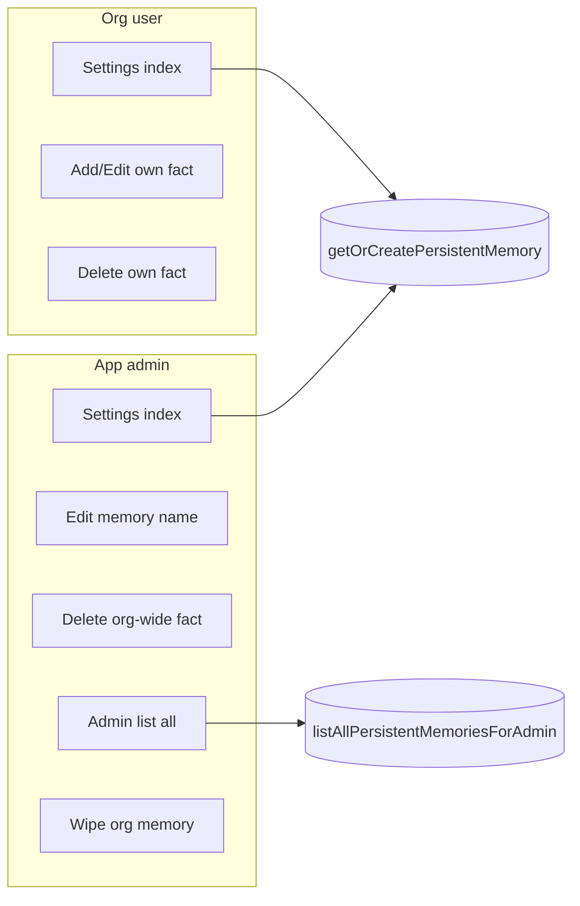

# One auto-created memory per org + admin-only delete and ADMINISTRATOR_USERNAMES see all / edit name

## Current state (brief)

- **Facts only:** [aichat_chat_memory](Modules/Aichat/Database/Migrations/2026_03_01_000007_create_aichat_chat_memory_table.php) stores many key-value facts per `business_id` (and optional `user_id`). No "container" row per org.
- **Visibility:** Already scoped by session `business_id`; each org sees only its own facts.
- **Delete:** Controller allows delete only when `user_id === current user` ([ChatSettingsController::userCanManageMemoryFact](Modules/Aichat/Http/Controllers/ChatSettingsController.php)); org-wide facts (`user_id` null) are effectively undeletable.
- **ADMINISTRATOR_USERNAMES:** Used in [AuthServiceProvider](app/Providers/AuthServiceProvider.php) (Gate::before for `backup`, `superadmin`, `manage_modules`) and [Superadmin](app/Http/Middleware/Superadmin.php) middleware; not used in Aichat.

## Target behavior

- One **container** row per org (auto-created, `business_id` + `slug` + `display_name`).
- **Delete:** Only app administrators can delete (wipe) an org's memory; regular users can delete only their **own** facts (unchanged for user-scoped facts; org-wide facts deletable only by admin).
- **Admins (ADMINISTRATOR_USERNAMES):** Can see a list of all orgs' memories, edit container display name, and wipe an org's memory (delete all facts for that business).

---

## 1. Schema

### 1.1 New table: `aichat_persistent_memory`

One row per business (the "Persistent Memory" container).

| Column         | Type                  | Notes                                                  |
| -------------- | --------------------- | ------------------------------------------------------ |
| `id`           | bigint, PK            |                                                        |
| `business_id`  | unsigned int          | FK to `business`, unique                               |
| `slug`         | string(32)            | Unique, random identifier (e.g. `Str::random(16)`)     |
| `display_name` | string(150), nullable | Editable by admin; optional label for the org's memory |
| `timestamps`   |                       |                                                        |

- Unique on `business_id`.
- Foreign key `business_id` → `business.id` ON DELETE CASCADE.
- Index on `slug` (unique) for lookups if needed later.

Existing table `aichat_chat_memory` stays as-is (no FK to the new table). Facts remain identified by `business_id`; the container is metadata (slug, display name) and the scope for "wipe" and "edit name."

---

## 2. Permission / admin check

- **Reuse app-admin check:** Use the same source as [AuthServiceProvider](app/Providers/AuthServiceProvider.php): `config('constants.administrator_usernames')` (comma-separated); user is admin if `strtolower($user->username)` is in that list (after `explode(',', strtolower(...))`).
- **Gate (recommended):** In [app/Providers/AuthServiceProvider.php](app/Providers/AuthServiceProvider.php), add one ability to the existing `Gate::before` list, e.g. `'aichat.manage_all_memories'`, so that when the ability is one of `['backup', 'superadmin', 'manage_modules', 'aichat.manage_all_memories']`, return `true` for users in the administrator list. No new permission in DB; only username-based check.
- **Usage in Aichat:** Controllers and views use `auth()->user()->can('aichat.manage_all_memories')` to show admin-only actions (edit name, wipe, link to "all memories" page) and to authorize those actions.

---

## 3. Code changes (step-by-step)

### 3.1 Migration and model

- **New migration** in `Modules/Aichat/Database/Migrations/`: create `aichat_persistent_memory` with columns above. Run only if table does not exist.
- **New entity** `Modules/Aichat/Entities\PersistentMemory.php`: table `aichat_persistent_memory`, `$guarded = ['id']`, `business()` relationship to `App\Business`, `scopeForBusiness($query, $business_id)`.

### 3.2 Util: get-or-create container and admin helpers

- **ChatUtil** ([Modules/Aichat/Utils/ChatUtil.php](Modules/Aichat/Utils/ChatUtil.php)):
  - **getOrCreatePersistentMemory(int $business_id):** Return the single `PersistentMemory` for this business. If none exists, create one: `slug = Str::random(16)`, `display_name = null`. Use lock or firstOrCreate to avoid duplicates.
  - **updatePersistentMemoryDisplayName(int $business_id, string $display_name):** Update `display_name` for that business's container (admin-only in controller).
  - **wipeBusinessMemory(int $business_id):** Delete all rows in `aichat_chat_memory` where `business_id = ?`. Optionally keep the container row (so the org still has "a" memory, now empty); do **not** delete the container so no need to re-create on next access. (If product owner prefers "delete container too," then delete container and auto-create again in getOrCreatePersistentMemory when missing.)
- **Admin list:** Add **listAllPersistentMemoriesForAdmin()** in ChatUtil (or a dedicated Util): Return collection of PersistentMemory with `business_id`, `slug`, `display_name`, and optionally `business->name` and fact count. Only called when `auth()->user()->can('aichat.manage_all_memories')`; controller will enforce.

### 3.3 AuthServiceProvider

- In [app/Providers/AuthServiceProvider.php](app/Providers/AuthServiceProvider.php), add `'aichat.manage_all_memories'` to the `in_array($ability, [...])` list so administrator usernames receive `true` for this ability.

### 3.4 Controllers

- **ChatSettingsController** ([Modules/Aichat/Http/Controllers/ChatSettingsController.php](Modules/Aichat/Http/Controllers/ChatSettingsController.php)):
  - **index:** When loading settings, call `getOrCreatePersistentMemory($business_id)` so the container exists. Pass the container (or at least `display_name`, `slug`) to the view so the UI can show the memory "name" and, for admin, an edit-name form.
  - **destroyMemory (single fact):** Keep existing permission `aichat.chat.settings`. Change **userCanManageMemoryFact** logic to: user can delete if `(int) $memoryFact->user_id === $user_id`, **or** if `$memoryFact->user_id` is null (org-wide fact) and `auth()->user()->can('aichat.manage_all_memories')`. So: org-wide facts only deletable by admin; user-scoped facts still by owner.
  - **New: updateMemoryName (PATCH):** Accept request with `display_name` (and optionally `business_id` for admin editing another org). Authorize: only `aichat.manage_all_memories`. If editing another org, require `business_id` in request and validate it; else use session `business_id`. Call `updatePersistentMemoryDisplayName`.
  - **New: wipeMemory (DELETE):** Authorize: only `aichat.manage_all_memories`. Accept `business_id` (route or body) for which org to wipe. Validate business exists and optionally that current user is admin. Call `wipeBusinessMemory($business_id)`. Return JSON or redirect with message.
- **New admin controller (optional but clear):** e.g. `Modules/Aichat/Http/Controllers\ChatMemoryAdminController.php` with:
  - **index:** `can('aichat.manage_all_memories')`; get `listAllPersistentMemoriesForAdmin()`, return view listing all orgs' memories (business name, display_name, slug, fact count, actions: Edit name, Wipe).
  - **updateName:** PATCH one container's display name (by business_id or container id); `can('aichat.manage_all_memories')`.
  - **wipe:** DELETE wipe one business's memory; `can('aichat.manage_all_memories')`.

Either a single controller (ChatSettingsController) with new methods and optional `business_id` for admin, or a separate admin controller is fine; plan assumes one of these.

### 3.5 Routes

- In [Modules/Aichat/Routes/web.php](Modules/Aichat/Routes/web.php), inside the existing `aichat.chat` prefix group:
  - **Admin list:** `Route::get('/settings/memories/admin', [ChatMemoryAdminController::class, 'index'])->name('settings.memories.admin');` (or equivalent on ChatSettingsController).
  - **Edit name:** `Route::patch('/settings/memory/name', ...)->name('settings.memory.updateName');` with optional `business_id` for admin.
  - **Wipe:** `Route::delete('/settings/memory/wipe/{business}', ...)->name('settings.memory.wipe');` (admin only).
- All behind existing middleware (`web`, `auth`, `SetSessionData`, etc.); no new middleware; authorization inside controller/FormRequest.

### 3.6 Form requests (optional but recommended)

- **UpdatePersistentMemoryNameRequest:** authorize `aichat.manage_all_memories`; rules: `display_name` nullable string max 150; if admin can target another org, `business_id` required integer exists in business table.
- **WipeBusinessMemoryRequest:** authorize `aichat.manage_all_memories`; rules: `business_id` required integer exists in business table.

### 3.7 Views

- **Settings view** ([Modules/Aichat/Resources/views/chat/settings.blade.php](Modules/Aichat/Resources/views/chat/settings.blade.php)):
  - **Data from controller:** Pass `persistentMemory` (or `memoryDisplayName`, `memorySlug`) and `canManageAllMemories` (or use `@can('aichat.manage_all_memories')`).
  - **Persistent Memory card:** Show display name (or fallback to default "Persistent Memory" / slug) for the current org. If `can('aichat.manage_all_memories')`, show inline form or link to edit display name (PATCH to updateName route). No variable defaulting in Blade; controller provides all values.
  - **Delete fact:** Keep current delete button; backend logic already updated so org-wide facts show delete only for admin.
- **New admin view:** e.g. `Modules/Aichat/Resources/views/chat/memories_admin.blade.php`: table (or cards) of all businesses with their persistent memory container (business name, display_name, slug, fact count), and per row: "Edit name" (form or modal), "Wipe memory" (form with confirm). Only linked/visible when `can('aichat.manage_all_memories')` (e.g. link from main settings or sidebar when admin).

### 3.8 Sidebar / entry point for admin

- Where Aichat exposes settings (e.g. [DataController](Modules/Aichat/Http/Controllers/DataController.php) menu or settings page): if `auth()->user()->can('aichat.manage_all_memories')`, add a link to the admin memories list (e.g. "Manage all memories" or "Memory admin") pointing to the new route.

### 3.9 Auto-create trigger

- Ensure the container is created on first use: call `getOrCreatePersistentMemory($business_id)` in **ChatSettingsController::index** (and optionally in **ChatUtil::buildMemoryContext** when building prompt context, so the container exists even if the user never opened settings). Prefer one place (e.g. settings index) to avoid scattered logic; buildMemoryContext can call getOrCreatePersistentMemory so that the row exists before listing facts.

### 3.10 Backfill existing businesses (optional)

- One-time migration or command: for each `business_id` that has at least one row in `aichat_chat_memory` (or for all businesses), ensure a row in `aichat_persistent_memory` exists. Alternatively, rely on getOrCreatePersistentMemory on next access; then no backfill needed.

---

## 4. Flow summary

- **Org user:** Opens settings → container auto-created; sees only own org's facts; can add/edit/delete only facts where they are owner; cannot delete org-wide facts.
- **App admin:** Same as org user, plus: can delete org-wide facts; can edit container display name; can open "Memory admin" and see all orgs, edit any name, wipe any org's memory.

---

## 5. Files to add

| File                                                                                             | Purpose                                           |
| ------------------------------------------------------------------------------------------------ | ------------------------------------------------- |
| `Modules/Aichat/Database/Migrations/YYYY_MM_DD_HHMMSS_create_aichat_persistent_memory_table.php` | Create container table                            |
| `Modules/Aichat/Entities/PersistentMemory.php`                                                   | Model for container                               |
| `Modules/Aichat/Http/Controllers/ChatMemoryAdminController.php`                                  | Optional; admin list / updateName / wipe          |
| `Modules/Aichat/Http/Requests/Chat/UpdatePersistentMemoryNameRequest.php`                        | Validate display_name (and business_id for admin) |
| `Modules/Aichat/Http/Requests/Chat/WipeBusinessMemoryRequest.php`                                | Validate business_id for wipe                     |
| `Modules/Aichat/Resources/views/chat/memories_admin.blade.php`                                   | Admin list view                                   |

## 6. Files to modify

| File                                                                                                                     | Changes                                                                                                                                                                       |
| ------------------------------------------------------------------------------------------------------------------------ | ----------------------------------------------------------------------------------------------------------------------------------------------------------------------------- |
| [app/Providers/AuthServiceProvider.php](app/Providers/AuthServiceProvider.php)                                           | Add `aichat.manage_all_memories` to Gate::before ability list                                                                                                                 |
| [Modules/Aichat/Utils/ChatUtil.php](Modules/Aichat/Utils/ChatUtil.php)                                                   | getOrCreatePersistentMemory, updatePersistentMemoryDisplayName, wipeBusinessMemory, listAllPersistentMemoriesForAdmin                                                         |
| [Modules/Aichat/Http/Controllers/ChatSettingsController.php](Modules/Aichat/Http/Controllers/ChatSettingsController.php) | index: load/create container, pass to view; destroyMemory: allow admin to delete org-wide facts; optionally add updateMemoryName / wipeMemory or delegate to admin controller |
| [Modules/Aichat/Routes/web.php](Modules/Aichat/Routes/web.php)                                                           | Routes for admin list, update name, wipe                                                                                                                                      |
| [Modules/Aichat/Resources/views/chat/settings.blade.php](Modules/Aichat/Resources/views/chat/settings.blade.php)         | Show container display name; admin: edit-name form and link to memory admin                                                                                                   |
| [Modules/Aichat/Http/Controllers/DataController.php](Modules/Aichat/Http/Controllers/DataController.php) or menu config  | Link "Manage all memories" when `can('aichat.manage_all_memories')`                                                                                                           |

## 7. Verification

- **Lint:** Run linter on new/changed PHP and Blade files.
- **Tenant isolation:** Admin wipe/update name by `business_id` must not use session for target org; list must only include businesses the app can resolve (no cross-tenant leak).
- **Permissions:** As non-admin, cannot access admin routes (403); cannot delete org-wide fact. As admin (username in ADMINISTRATOR_USERNAMES), can access admin list, edit name, wipe, and delete org-wide facts.
- **Auto-create:** New business (or existing with no container) gets container on first settings load or first buildMemoryContext.

---

## 8. Compliance (Laravel / AGENTS)

- **View data:** All view data (including `persistentMemory`, `canManageAllMemories`, default display name) prepared in controller or Util; no `@php` defaulting in Blade.
- **Controller thin:** Orchestration only; business logic in ChatUtil.
- **Authorization:** FormRequest and controller checks; use existing `aichat.chat.settings` plus new `aichat.manage_all_memories` (username-based).
- **Multi-tenant:** All fact and container access scoped by `business_id`; admin actions explicitly take `business_id` for the target org.

