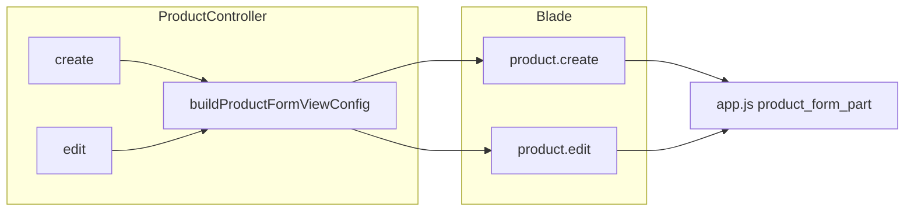

# Product Create & Edit – Metronic Rebuild Plan

## Goal

- Rebuild [resources/views/product/edit.blade.php](resources/views/product/edit.blade.php) and [resources/views/product/create.blade.php](resources/views/product/create.blade.php) to follow Metronic 8.3.3 structure from [public/html/apps/ecommerce/catalog/edit-product.html](public/html/apps/ecommerce/catalog/edit-product.html) and [add-product.html](public/html/apps/ecommerce/catalog/add-product.html).
- Move all view-derived logic out of Blade into the controller (or a single private helper): no `@php` blocks for defaults, expiry, custom labels, or visibility flags.
- Keep existing behavior: form `id="product_add_form"`, class `product_form`, `#product_form_part` AJAX, `#type` with `data-action` / `data-product_id`, and all IDs required by [public/assets/app/js/product.js](public/assets/app/js/product.js) and [public/assets/app/js/app.js](public/assets/app/js/app.js) (e.g. `show_product_type_form()`).

## Architecture

- **Controller:** `create()` and `edit()` build or merge the same set of “view config” keys (URLs, flags, custom fields array, expiry state, etc.) and pass them to the view. Option: one private method `buildProductFormViewConfig($mode, $productOrDuplicate)` returning an array merged into the existing compact.
- **Blade:** Presentation only. Uses Metronic layout (toolbar + aside column + main column with General/Advanced tabs), receives prepared data, and renders using the field mapping table from the prior chat.

---

## Metronic UI scope (all implemented views)

**All views implemented in this plan must use Metronic 8.3.3 UI only.** No legacy AdminLTE, no `content-header` / `box-primary` / `form-group` / `col-sm-`* grid from the old theme, and no invented CSS classes.

| Delivered in this plan                                                                     | Metronic?     | Notes                                                                                                                                                                                                                                                                                                                                                                                                                                                                                     |
| ------------------------------------------------------------------------------------------ | ------------- | ----------------------------------------------------------------------------------------------------------------------------------------------------------------------------------------------------------------------------------------------------------------------------------------------------------------------------------------------------------------------------------------------------------------------------------------------------------------------------------------- |
| [resources/views/product/create.blade.php](resources/views/product/create.blade.php)       | **Yes, 100%** | Toolbar, cards (`card card-flush py-4`), form (`form d-flex flex-column flex-lg-row`), tabs (`nav nav-custom nav-tabs`), inputs (`form-control form-control-solid`, `form-select form-select-solid`), buttons (`btn btn-primary`, `btn btn-light`), labels (`form-label`). Reference: [edit-product.html](public/html/apps/ecommerce/catalog/edit-product.html) / [add-product.html](public/html/apps/ecommerce/catalog/add-product.html) and [ai/ui-components.md](ai/ui-components.md). |
| [resources/views/product/edit.blade.php](resources/views/product/edit.blade.php)           | **Yes, 100%** | Same as create: full Metronic structure and classes only.                                                                                                                                                                                                                                                                                                                                                                                                                                 |
| `view_modal` container (in [layouts/app.blade.php](resources/views/layouts/app.blade.php)) | **Yes**       | Use Metronic modal structure: `modal`, `modal-dialog`, `modal-content`, `modal-header`, `modal-body` (empty) so it matches the theme and quick-add unit/brand content loads inside it.                                                                                                                                                                                                                                                                                                    |

**Left as-is in this plan (mixed UI until follow-up):** The partials loaded into `#product_form_part` are **not** restyled in the main phases below. They keep their current markup so single/variable/combo flows work unchanged. A **follow-up detail task** (see "Phase 6: Product form part partials – Metronic UI alignment") will migrate these partials to Metronic UI only so the whole product create/edit page is consistent. All IDs and form names must be preserved when doing that alignment.

**Implementation rule:** When building create and edit Blade, every element must use only Metronic/Bootstrap 5 classes from the reference HTML or [ai/ui-components.md](ai/ui-components.md). Use `form-select form-select-solid` (and `data-control="select2"` where needed), `form-control form-control-solid`, `form-check` for checkboxes, `btn btn-primary` / `btn btn-light`, `card card-flush py-4`, `form-label`, `text-muted fs-7` for help text. Asset paths: `asset('assets/...')` for core.

---

## Partials, modals, and data (create/edit correctness)

### Partials used by create/edit (AJAX into `#product_form_part`)

These are loaded by `ProductController::getProductVariationFormPart()` (POST `/products/product_form_part`) when the user changes product type or on edit page load. The **parent create/edit view only provides** the container `
` and the `#type` select with `data-action` and `data-product_id`. Do **not** change the partials’ markup in this plan; keep them as-is so single/variable/combo flows keep working.

| Partial                                                                                                             | Used when                      | Data from controller (getProductVariationFormPart)                                    | Notes                                                                                                                                     |
| ------------------------------------------------------------------------------------------------------------------- | ------------------------------ | ------------------------------------------------------------------------------------- | ----------------------------------------------------------------------------------------------------------------------------------------- |
| [single_product_form_part.blade.php](resources/views/product/partials/single_product_form_part.blade.php)           | type = single (add)            | `$profit_percent`                                                                     | Uses `session('business.enable_price_tax')` in @php; IDs: single_dpp, single_dpp_inc_tax, profit_percent, single_dsp, single_dsp_inc_tax. |
| [edit_single_product_form_part.blade.php](resources/views/product/partials/edit_single_product_form_part.blade.php) | type = single (edit/duplicate) | `$product_deatails`, `$action`                                                        | Single variation pricing + variation images; single_variation_id hidden.                                                                  |
| [variable_product_form_part.blade.php](resources/views/product/partials/variable_product_form_part.blade.php)       | type = variable                | `$variation_templates`, `$profit_percent`, `$action`; edit: `$product_variations`     | Contains table id="product_variation_form_part", button id="add_variation", includes product_variation_row or edit_product_variation_row. |
| [product_variation_row.blade.php](resources/views/product/partials/product_variation_row.blade.php)                 | variable add row               | `$row_index`, `$variation_templates`, `$profit_percent` (from getProductVariationRow) | New variation row; app.js POST get_product_variation_row.                                                                                 |
| [edit_product_variation_row.blade.php](resources/views/product/partials/edit_product_variation_row.blade.php)       | variable edit                  | `$product_variation`, `$row_index`, `$action`                                         | Uses product_variation_edit / variations_edit for edit, product_variation / variations for duplicate.                                     |
| [combo_product_form_part.blade.php](resources/views/product/partials/combo_product_form_part.blade.php)             | type = combo                   | `$profit_percent`, `$action`; edit: `$combo_variations`, `$variation_id`              | Combo table, search_product, combo_product_entry_row.                                                                                     |

**Required in parent view:** `#product_form_part` (empty on edit; on create include single_product_form_part once). `#type` with correct `data-action` and `data-product_id`. No change to route or controller for getProductVariationFormPart / getProductVariationRow.

### Stock (create/edit)

- **On form:** `enable_stock` (id="enable_stock"), `alert_quantity` (id="alert_quantity"), wrapper id="alert_quantity_div" (visibility from `$alert_quantity_div_visible` on edit; on create show when no duplicate or duplicate has enable_stock). product.js shows/hides alert_quantity_div and enables/disables expiry_period_type and opening_stock_button.
- **Opening stock:** Not a table on create/edit. Buttons “Save & add opening stock” / “Update & edit opening stock” (id="opening_stock_button") submit with submit_type and redirect to opening stock flow. Keep these buttons and IDs.
- **quick_product_opening_stock** partial is used only in [quick_add_product.blade.php](resources/views/product/partials/quick_add_product.blade.php) (modal), not on main create form. No change.

### Location and category (create/edit)

- **Location:** Form field `product_locations[]` (id="product_locations", multiple select) in Aside “Product details” card. Options from `$business_locations`; edit value from `$product->product_locations->pluck('id')`; create value from `$default_product_locations`. This is the only location input on create/edit.
- **edit_product_location_modal:** Used on **product list** page ([product_list.blade.php](resources/views/product/partials/product_list.blade.php)) for bulk add/remove location. Needs `$business_locations`. **Do not include** this modal in create/edit views. No controller data for create/edit.
- **Category / sub_category:** `category_id` (id="category_id"), `sub_category_id` (id="sub_category_id") in Aside. app.js get_sub_categories() on #category_id change; ensure these IDs exist so sub_category dropdown updates. Options from `$categories`, `$sub_categories`; values from product or duplicate.

### WooCommerce (create/edit)

- **toggle_woocommerce_sync_modal:** Used on **product list** page for bulk WooCommerce sync. **Do not include** in create/edit.
- **WooCommerce on form:** product.js references `input[name="woocommerce_disable_sync"]` when type is combo (iCheck uncheck enable_stock, check woocommerce_disable_sync). That input may be injected by a **module** via `getModuleData` / module form part (e.g. Woocommerce module). Keep `@include('layouts.partials.module_form_part')` in the Advanced tab so any module can inject fields. No extra partial or controller key required unless a module is documented to need one.

### Quick-add unit/brand modal (view_modal container)

- Create/edit have buttons with `class="btn-modal"` and `data-container=".view_modal"` that load unit create or brand create in a modal ([app.js](public/assets/app/js/app.js) loads URL into `$(container)` and shows modal). The DOM must contain an element with **class="view_modal"** (e.g. a div) for this to work.
- [layouts/app.blade.php](resources/views/layouts/app.blade.php) does **not** currently define a `.view_modal` in the scanned region. **Add** to the plan: ensure a modal container with class `view_modal` exists when product create/edit are rendered—either add `

` to the layout (e.g. before `@include('home.todays_profit_modal')`) or add it inside the product create/edit content section so quick-add unit and quick-add brand modals have a target. Use the same structure as [edit_product_location_modal](resources/views/product/partials/edit_product_location_modal.blade.php) (modal fade, empty body) so app.js can `.html(result).modal('show')`.

---

## Phase 1: Controller – add prepared view config

**File:** [app/Http/Controllers/ProductController.php](app/Http/Controllers/ProductController.php)

### 1.1 Add a private method `buildProductFormViewConfig`

- **Signature:** `buildProductFormViewConfig(string $mode, $productOrDuplicate): array` where `$mode` is `'create'` or `'edit'` and `$productOrDuplicate` is `$duplicate_product` (nullable) or `$product` (edit).
- **Return array** with the following keys (shared unless noted):

| Key                                         | Source / logic                                                                                                                                                          |
| ------------------------------------------- | ----------------------------------------------------------------------------------------------------------------------------------------------------------------------- |
| `form_action`                               | Create: `route('products.store')`; Edit: `route('products.update', $product->id)`                                                                                       |
| `form_method`                               | `'POST'` (create) or `'PUT'` (edit)                                                                                                                                     |
| `cancel_url`                                | `route('products.index')`                                                                                                                                               |
| `product_form_part_url`                     | `url('/products/product_form_part')` (for any JS that might need it; app.js uses relative `/products/product_form_part`)                                                |
| `is_image_required`                         | Create: `!empty($common_settings['is_product_image_required'])`; Edit: same plus `empty($product->image)`                                                               |
| `show_sub_units`                            | `(bool) session('business.enable_sub_units')`                                                                                                                           |
| `show_secondary_unit`                       | `!empty($common_settings['enable_secondary_unit'])`                                                                                                                     |
| `show_brand`                                | `(bool) session('business.enable_brand')`                                                                                                                               |
| `show_category`                             | `(bool) session('business.enable_category')`                                                                                                                            |
| `show_sub_category`                         | `session('business.enable_category') && session('business.enable_sub_category')`                                                                                        |
| `show_price_tax`                            | `(bool) session('business.enable_price_tax')`                                                                                                                           |
| `show_warranty`                             | `!empty($common_settings['enable_product_warranty'])`                                                                                                                   |
| `show_expiry`                               | `(bool) session('business.enable_product_expiry')`                                                                                                                      |
| `show_racks`, `show_row`, `show_position`   | From `session('business.enable_racks')` etc.                                                                                                                            |
| `expiry_config`                             | `['hide' => session('business.expiry_type') === 'add_expiry', 'default_period' => ..., 'default_type' => 'months' or null]`                                             |
| `expiry_disabled`, `expiry_period_disabled` | **Edit only:** from `$product->enable_stock` and `expiry_period_type`                                                                                                   |
| `alert_quantity_div_visible`                | **Edit only:** `(bool) $product->enable_stock`; create can derive from duplicate or default true                                                                        |
| `custom_fields_config`                      | Parse `session('business.custom_labels')` into array of `['name' => 'product_custom_fieldN', 'label' => ..., 'type' => 'text'                                           |
| `document_size_limit_mb`                    | `config('constants.document_size_limit') / 1000000`                                                                                                                     |
| `brochure_mimes_help`                       | Build string (or render partial once) from `config('constants.document_upload_mimes_types')` and document help text                                                     |
| `quick_add_unit_url`                        | `route('units.create', ['quick_add' => true])` (or equivalent from existing Blade action)                                                                               |
| `quick_add_brand_url`                       | `route('brands.create', ['quick_add' => true])` (or equivalent)                                                                                                         |
| `can_unit_create`                           | `auth()->user()->can('unit.create')`                                                                                                                                    |
| `can_brand_create`                          | `auth()->user()->can('brand.create')`                                                                                                                                   |
| `breadcrumb`                                | Array of `['label' => ..., 'url' => ...]` for Home → Products → Add/Edit Product (use `route('products.index')`, `route('products.create')`, and product name for edit) |

**Create-only keys** (add in `create()` after calling the helper):

- `default_product_locations`: if `count($business_locations) === 1` then `[array_key_first($business_locations->toArray())]`, else `[]`.
- `form_class`: `'create'` when not duplicate, or `''` when duplicate so app.js treats it as edit-like for type change.

**Edit-only:** pass `alert_quantity` and `alert_quantity_div_visible` (already have `alert_quantity`; add visibility flag in helper).

### 1.2 Call the helper from `create()` and `edit()`

- In **create()**: after existing variable setup, call `$viewConfig = $this->buildProductFormViewConfig('create', $duplicate_product);` then merge into the compact or pass as `$viewConfig` and in the Blade use `$viewConfig['key']` or spread. Alternatively merge keys into a single `compact()` so Blade keeps current variable names (e.g. `$form_action`, `$show_brand`).
- In **edit()**: same pattern; call helper with `'edit'` and `$product`, merge returned keys into view data.

Ensure existing variables (`$categories`, `$brands`, `$product`, `$duplicate_product`, `$units`, `$sub_units` (edit), `$taxes`, `$tax_attributes`, `$barcode_types`, `$sub_categories`, `$default_profit_percent`, `$business_locations`, `$rack_details`, `$selling_price_group_count`, `$module_form_parts`, `$product_types`, `$common_settings`, `$warranties`, `$pos_module_data`, `$alert_quantity` (edit), `$barcode_default` (create)) remain passed; add the new keys from the helper.

---

## Phase 2: Rebuild edit Blade (Metronic structure + mapping)

**File:** [resources/views/product/edit.blade.php](resources/views/product/edit.blade.php)

**Metronic:** Every element in this view must use Metronic 8.3.3 classes only (see "Metronic UI scope" above). No legacy `content-header`, `box-primary`, `form-group`, or `col-sm-`*; use `card card-flush`, `form-control form-control-solid`, `form-select form-select-solid`, `btn btn-primary`/`btn btn-light`, `form-label`, etc.

### 2.1 Layout and toolbar

- Extend `layouts.app` (already has `@hasSection('toolbar')` and `@yield('content')` in [resources/views/layouts/app.blade.php](resources/views/layouts/app.blade.php)).
- Add `@section('toolbar')`: Metronic toolbar (`toolbar d-flex flex-stack py-3 py-lg-5`, `container-xxl`), page title “Edit Product”, breadcrumb from `$breadcrumb`, then actions: link “Cancel” to `$cancel_url`, and submit button (form="product_add_form", value="submit", class including `submit_product_form`) for “Update”.
- No Filter menu or Create button from the reference; keep only Cancel + primary submit in toolbar. Optional: duplicate submit row at bottom of form.

### 2.2 Form wrapper

- Single `<form id="product_add_form" class="product_form form d-flex flex-column flex-lg-row" action="{{ $form_action }}" method="POST" enctype="multipart/form-data">`.
- Inside: `@csrf`, `@method($form_method)`, hidden inputs: `#product_id` (value `$product->id`), `name="submit_type"` id="submit_type", `#variation_counter` (0), `#default_profit_percent`.

### 2.3 Aside column (left)

- Wrapper: `d-flex flex-column gap-7 gap-lg-10 w-100 w-lg-300px mb-7 me-lg-10`.
- **Thumbnail card:** `card card-flush py-4`. Header “Product image”, body: file input `name="image"` id="upload_image" accept="image/*", required when `$is_image_required`. Help text using `$document_size_limit_mb`; optional “previous image will be replaced” for edit.
- **Product details card:** Same card structure. Insert fields in this order (visibility from controller flags): unit_id (with optional quick-add button), sub_unit_ids (if `$show_sub_units`), secondary_unit_id (if `$show_secondary_unit`), brand_id (optional quick-add), category_id, sub_category_id, product_locations[], barcode_type, enable_stock (checkbox; keep id="enable_stock"), wrapper div id="alert_quantity_div" (class `d-none` when not `$alert_quantity_div_visible`), alert_quantity input (id="alert_quantity"), warranty_id (if `$show_warranty`), then `@foreach($pos_module_data)` includes. Use Metronic classes: `form-select form-select-solid`, `form-control form-control-solid`, `form-check` for checkboxes. Options from existing vars (`$units`, `$sub_units`, `$brands`, `$categories`, `$sub_categories`, `$business_locations`, `$barcode_types`, `$warranties`). Values from `$product` per mapping table.

### 2.4 Main column (right)

- **Tabs:** `nav nav-custom nav-tabs nav-line-tabs nav-line-tabs-2x` with two tabs: General, Advanced.
- **General tab content:**
  - Card “General”: name (required), sku, product_description textarea, product_brochure file + help (`$document_size_limit_mb`, `$brochure_mimes_help`).
  - Card “Tax & type”: tax select (if `$show_price_tax`; output options with data-rate from `$tax_attributes`), tax_type select, type select (id="type", data-action="edit", data-product_id="{{ $product->id }}", required, disabled), then empty `
`.
- **Advanced tab content:**
  - Card “Advanced”: expiry_period and expiry_period_type (if `$show_expiry`; use `$expiry_config`, `$expiry_disabled`, `$expiry_period_disabled`), enable_sr_no, not_for_selling, rack/row/position per location (loop `$business_locations`, names product_racks_update or product_racks per existing edit logic; use `$show_racks` etc.), weight, loop `$custom_fields_config` (input or select by type), preparation_time_in_minutes, then `@include('layouts.partials.module_form_part')`.
- **Submit row:** Buttons: selling price group (if `$selling_price_group_count`), opening stock (id="opening_stock_button", disabled when !product.enable_stock), “Update & add another”, “Update”. All `form="product_add_form"` and same value/class as current so existing submit_type JS works.

### 2.5 JavaScript

- Keep `@section('javascript')`: script src product.js with `$asset_v`, and `__page_leave_confirmation('#product_add_form')`.

### 2.6 Quick-add modal container

- Ensure quick-add unit/brand work: either the layout already provides a `
...
` or add one (e.g. in [layouts/app.blade.php](resources/views/layouts/app.blade.php) before `@include('home.todays_profit_modal')`). Buttons on edit use `data-container=".view_modal"` and `data-href="{{ $quick_add_unit_url }}"` / `$quick_add_brand_url`; app.js loads content into that div and shows it as a modal.

### 2.7 Remove

- All `@php` blocks. All `Form::`* helpers (replace with plain HTML inputs/selects using the mapping table). Legacy classes (content-header, box-primary, input-icheck if switching to form-check; if keeping iCheck, retain input-icheck and ensure product.js still binds).

---

## Phase 3: Rebuild create Blade (Metronic structure + mapping)

**File:** [resources/views/product/create.blade.php](resources/views/product/create.blade.php)

**Metronic:** Same as Phase 2: this view must be 100% Metronic 8.3.3 (see "Metronic UI scope"). No legacy classes.

### 3.1 Same structure as edit, with these differences

- **Toolbar:** Title “Add new product”, breadcrumb, Cancel + “Save” submit.
- **Form:** `class="product_form {{ $form_class }} form d-flex ..."` so app.js sees `product_form create` and does not overwrite `#product_form_part` on load when type is pre-selected (duplicate). No `#product_id` hidden input. `#variation_counter` value 1.
- **Aside:** Same cards. product_locations selected values: `$default_product_locations`. Other defaults from `$duplicate_product` when set; otherwise null/empty.
- **General:** Same; brochure help text same.
- **Tax & type:** type select data-action = `!empty($duplicate_product) ? 'duplicate' : 'add'`, data-product_id = `$duplicate_product->id ?? '0'`. Initial `#product_form_part` content: `@include('product.partials.single_product_form_part', ['profit_percent' => $default_profit_percent])`.
- **Advanced:** Same structure; rack names always `product_racks[$id][...]`; values from `$rack_details` and `$duplicate_product`; custom fields from `$custom_fields_config` (value from duplicate or null).
- **Submit buttons:** “Save & add selling price group”, “Save & add opening stock” (id="opening_stock_button", disabled when duplicate and !enable_stock), “Save & add another”, “Save”.
- **JavaScript:** product.js + page leave confirmation; optionally re-attach barcode scanner (onScan) for create if currently used.

### 3.2 Remove

- All `@php`; all `Form::`*; legacy layout classes. Use same Metronic and variable names as in mapping table.

---

## Phase 4: JS and compatibility checks

- **Form ID and class:** Both views must output `id="product_add_form"` and class including `product_form`. Create must also output class `create` or empty per `$form_class` so [public/assets/app/js/app.js](public/assets/app/js/app.js) (lines 907–912) only runs `show_product_type_form()` when appropriate.
- **Selectors used by product.js / app.js:** Keep these IDs and names: `#type`, `#product_id`, `#product_form_part`, `#variation_counter`, `#default_profit_percent`, `#enable_stock`, `#alert_quantity_div`, `#alert_quantity`, `#expiry_period_type`, `#opening_stock_button`, `#tax`, `#sku`, `#upload_image`, `#product_locations`, `#sub_unit_ids`, `#category_id`, `#sub_category_id`. Buttons that set submit_type: keep same `value` and class `submit_product_form` so existing script that sets `#submit_type` and submits continues to work.
- **iCheck vs Metronic:** If replacing iCheck with Metronic form-check, update [public/assets/app/js/product.js](public/assets/app/js/product.js) so `#enable_stock` show/hide of `#alert_quantity_div` and enable/disable of `#expiry_period_type` and `#opening_stock_button` use a normal `change` handler instead of `ifChecked`/`ifUnchecked`. If keeping iCheck, retain `input-icheck` class and ensure layout still loads iCheck so it initializes.

---

## Phase 5: Verification

- **Lint:** Run linter on ProductController and both Blade files.
- **Manual:** Load products create and products edit; confirm form renders (aside + tabs), all dropdowns and checkboxes work, type change loads product_form_part via AJAX (create and edit), enable_stock toggles alert_quantity div and expiry/opening stock button. Submit “Update” / “Save” and confirm request hits store/update with correct submit_type and fields.
- **Permissions:** Test with user that can/cannot unit.create, brand.create, product.opening_stock; confirm buttons and visibility match.
- **Duplicate:** Create from ?d=id; confirm form prefills and type/data-action/data-product_id and initial product_form_part are correct.
- **Create/edit correctness checklist:** (1) **Stock:** enable_stock toggles alert_quantity div and opening_stock button; opening_stock submit redirects correctly. (2) **Single product:** type Single loads single_product_form_part (add) or edit_single_product_form_part (edit); save stores pricing and variation. (3) **Variable product:** type Variable loads variable_product_form_part; “Add variation” (id="add_variation") loads new row via get_product_variation_row; table id="product_variation_form_part" and variation_counter work; save stores variations. (4) **Location:** product_locations[] multi-select saves and loads on edit. (5) **Category:** category_id and sub_category_id load; changing category_id updates sub_category_id options (get_sub_categories). (6) **WooCommerce:** If module injects woocommerce_disable_sync, combo type still behaves; list-page WooCommerce modal is separate. (7) **Quick-add:** Unit and brand quick-add buttons open modal (view_modal container) and save refreshes dropdown.

---

## Phase 6: Product form part partials – Metronic UI alignment (follow-up detail task)

**Goal:** Align all partials that render inside `#product_form_part` with Metronic 8.3.3 UI only, so the product create/edit page has no mixed legacy UI. This is a **separate detail task** after Phases 1–5 are done.

**Constraint:** Do not change any `id`, `name`, or `data-`* attributes used by product.js or app.js (e.g. single_dpp, profit_percent, single_dsp, product_variation_form_part, add_variation, variation_counter, input_sub_sku, variation_value_name, apply-all targets, variation_images, etc.). Only replace layout and CSS classes with Metronic equivalents.

### Partials to update (in dependency order)

| Order | Partial                                 | Change                                                                                                                                                                                                                                                                                                                                                      |
| ----- | --------------------------------------- | ----------------------------------------------------------------------------------------------------------------------------------------------------------------------------------------------------------------------------------------------------------------------------------------------------------------------------------------------------------- |
| 1     | single_product_form_part.blade.php      | Replace outer table with Metronic card + table (`card card-flush py-4`, `table table-row-dashed align-middle`). Inputs: `form-control form-control-solid`. Labels: `form-label`. Move @php (enable_price_tax) to controller or keep minimal; hide columns via `d-none`.                                                                                     |
| 2     | edit_single_product_form_part.blade.php | Same: Metronic card + table, form-control-solid, form-label. Media/delete: `btn btn-icon btn-active-color-primary`. Keep single_variation_id, single_dpp, profit_percent, single_dsp IDs.                                                                                                                                                                   |
| 3     | variable_product_form_part.blade.php    | Wrapper: `card card-flush py-4`. sku_type: `form-check form-check-custom form-check-solid`. Button id="add_variation": `btn btn-sm btn-primary`. Table id="product_variation_form_part": Metronic table classes.                                                                                                                                            |
| 4     | product_variation_row.blade.php         | Inputs: `form-control form-control-solid`; selects: `form-select form-select-solid`. Buttons: `btn btn-sm btn-icon btn-active-color-danger` (delete), `btn btn-sm btn-icon btn-active-color-primary` (add). Keep row_index, variation_template, input_sub_sku, variation_value_name, variable_dpp, variable_dsp, variation_row_index, file input names/IDs. |
| 5     | edit_product_variation_row.blade.php    | Same as product_variation_row: Metronic table row, inputs, buttons. Keep product_variation_edit / variations_edit (edit) and product_variation / variations (duplicate), row_variation_id, all variation image IDs.                                                                                                                                         |
| 6     | variation_value_row.blade.php           | Metronic inputs and buttons; keep name patterns and classes used by JS (input_sub_sku, is_variation_value_hidden, variable_dpp, variable_dsp, etc.).                                                                                                                                                                                                        |
| 7     | combo_product_form_part.blade.php       | Card wrapper; Metronic table. Search: `form-control form-control-solid`. Buttons: `btn btn-primary` / `btn btn-light`. Keep combo_product_table, search_product, item_level_purchase_price_total, margin, selling_price IDs/names.                                                                                                                          |
| 8     | combo_product_entry_row.blade.php       | Table row: Metronic. Keep structure for combo table body.                                                                                                                                                                                                                                                                                                   |

### Implementation rules for Phase 6

- Use only classes from ai/ui-components.md and reference HTML (edit-product.html pricing/tables).
- Replace `form-control` with `form-control form-control-solid`; `form-control input-sm` with `form-control form-control-solid form-control-sm` if needed.
- Replace legacy `btn btn-default` with `btn btn-light`; use `btn btn-icon` for icon-only.
- Tables: `table table-row-dashed align-middle` per Metronic; avoid `table-bordered add-product-price-table`.
- Move remaining @php in partials to controller (getProductVariationFormPart / getProductVariationRow) where possible; pass flags (e.g. $show_price_tax) so Blade stays presentation-only.
- After each partial: run create/edit, switch type to single/variable/combo, add variable row, submit; confirm no JS errors and data saves.

---

## File summary

| File                                                                                                                                                                                                                            | Action                                                                                                                                                                   |
| ------------------------------------------------------------------------------------------------------------------------------------------------------------------------------------------------------------------------------- | ------------------------------------------------------------------------------------------------------------------------------------------------------------------------ |
| [app/Http/Controllers/ProductController.php](app/Http/Controllers/ProductController.php)                                                                                                                                        | Add `buildProductFormViewConfig()`; in `create()` and `edit()` call it and pass merged view data.                                                                        |
| [resources/views/product/edit.blade.php](resources/views/product/edit.blade.php)                                                                                                                                                | Full replace: Metronic toolbar + form (aside + main with tabs), all fields per mapping table, no @php/Form::*. Quick-add buttons use data-container=".view_modal".       |
| [resources/views/product/create.blade.php](resources/views/product/create.blade.php)                                                                                                                                            | Full replace: same structure as edit with create-specific defaults, form_class, initial product_form_part include, and submit values. Quick-add buttons use .view_modal. |
| [resources/views/layouts/app.blade.php](resources/views/layouts/app.blade.php)                                                                                                                                                  | Add a `
` container (empty body) so btn-modal quick-add unit/brand can inject content and show modal.                              |
| [public/assets/app/js/product.js](public/assets/app/js/product.js)                                                                                                                                                              | Only if switching from iCheck to form-check: change #enable_stock binding from iCheck events to `change`.                                                                |
| **Phase 6 (follow-up)**                                                                                                                                                                                                         |                                                                                                                                                                          |
| product/partials: single_product_form_part, edit_single_product_form_part, variable_product_form_part, product_variation_row, edit_product_variation_row, variation_value_row, combo_product_form_part, combo_product_entry_row | Restyle to Metronic UI only (card, form-control-solid, form-select-solid, btn classes, table classes). Preserve all IDs and form names. See Phase 6.                     |

---

## Reference mapping (quick lookup)

Use the **field → Metronic input and variable** mapping table from the previous chat when implementing each Blade section: Aside (unit_id, sub_unit_ids, brand_id, category_id, sub_category_id, product_locations, barcode_type, enable_stock, alert_quantity_div, alert_quantity, warranty_id, pos_module_data); General (name, sku, product_description, product_brochure); Tax & type (tax, tax_type, type, product_form_part); Advanced (expiry_period, expiry_period_type, enable_sr_no, not_for_selling, product_racks/weight/custom_fields/preparation_time, module_form_part). All values and visibility flags come from controller/prepared config; Blade only renders.