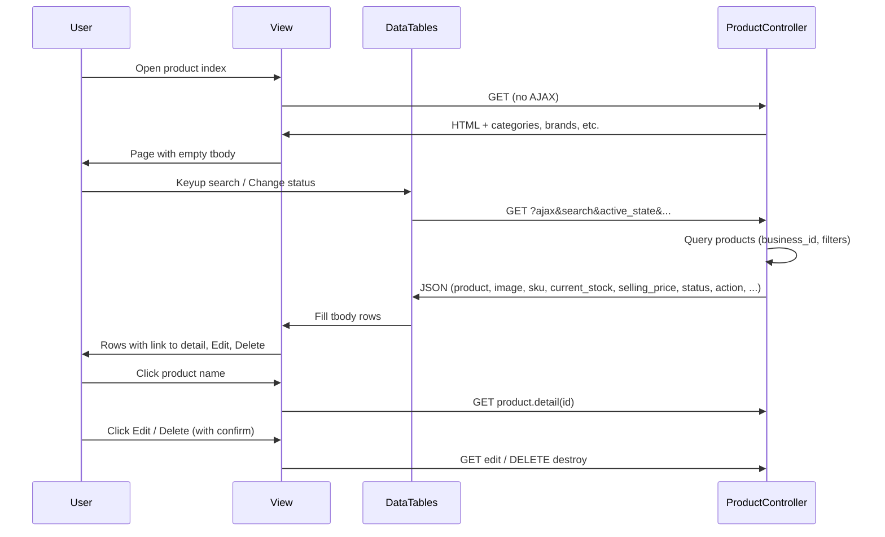

# Product index: real data, links, edit/delete, search/filter (UI unchanged)

## Current state

- **[resources/views/product/index.blade.php](resources/views/product/index.blade.php)**  
Metronic layout with toolbar (Filter, Create), card with search input, Status select, “Add Product”, and table `#kt_ecommerce_products_table`. The table body is **fully static** (~3500 lines of repeated `<tr>` with “Product 1”, “Product 2”, etc.). No DataTables init; `@section('javascript')` is empty. The **product_list partial** (DataTables `#product_table`) is **not** included here.
- **[app/Http/Controllers/ProductController.php](app/Http\Controllers\ProductController.php)**  
`index()` already supports DataTables: when `request()->ajax()` it returns Yajra DataTables JSON with product list (columns: product, image, sku, current_stock, selling_price, is_inactive, action, mass_delete, etc.), with filters (location_id, type, category_id, brand_id, active_state, etc.) and search (filterColumn on sku). Non-AJAX returns the view with categories, brands, units, etc. (no products array).
- **Routes**  
Resource `products` (index, create, store, show, edit, update, destroy), plus `products/detail/{id}` named `product.detail` and `products/view/{id}` for view.

## Goal (no UI style change)

- Keep the **exact same** Metronic table structure and classes (checkbox, Product with image+name, SKU, Qty, Price, Rating, Status, Actions).
- Show **real products** from the database (tenant-scoped) in that table.
- **Product name** → link to product detail page (`product.detail`).
- **Edit** and **Delete** available from the Actions column (with permission checks).
- **Search** and **filter** (e.g. by status) on the product list.

---

## 1. Controller: DataTables response for Metronic table

**File:** [app/Http/Controllers/ProductController.php](app/Http/Controllers/ProductController.php)

- **Product column link**  
In the existing `editColumn('product', ...)` (or equivalent) for the index DataTables response, wrap the product name in a link to the detail page so the list shows a clickable name:
  - Use `route('product.detail', ['id' => $row->id])` for the href.
  - Keep existing badges (inactive, not_for_selling, etc.) and escaping.
- **Status column**  
Add an `addColumn('status', ...)` that returns Metronic-style badge HTML:
  - `is_inactive == 1` → e.g. `
Inactive
`
  - else → e.g. `
Published
`
  Include `status` in `rawColumns` so it renders as HTML.
- **Action column (Metronic-style)**  
The current `addColumn('action', ...)` builds a dropdown with view/edit/delete. To keep **UI style unchanged**, either:
  - **Option A:** Change the action column HTML to use the same structure as the static rows: the Actions button and dropdown menu with classes from the current Blade (e.g. `btn btn-sm btn-light btn-flex btn-center btn-active-light-primary`, `menu menu-sub menu-sub-dropdown ...`, Edit link to `route('products.edit', $row->id)`, Delete link/button with confirm and destroy URL), or  
  - **Option B:** Keep existing action HTML but ensure Edit and Delete are present and correct; styling can be adjusted later if needed.
- **Search**  
Ensure the DataTables query applies the global search (or a dedicated search parameter) to product name (e.g. `products.name`). Add `filterColumn` for `products.name` if the default search does not already cover it.
- **Rating**  
No product rating in DB; the Metronic table has a Rating column. The response does not need a rating column; the frontend will render a fixed placeholder (e.g. “—” or empty) for that column.

No new routes or new controller methods are required; reuse the existing `index()` AJAX branch.

---

## 2. View: Single table body + toolbar wiring

**File:** [resources/views/product/index.blade.php](resources/views/product/index.blade.php)

- **Toolbar / breadcrumb**  
  - “Home” link: set `href` to the app’s home route (e.g. `route('home')` or the correct name).  
  - “Create” and “Add Product” buttons: set `href` to `route('products.create')` (and remove `data-bs-toggle="modal" data-bs-target="#kt_modal_create_app"` if present so the button goes to the create page).
- **Table body**  
Replace the entire static `<tbody>...</tbody>` (all repeated product rows, from the first `<tr>` after `<thead>` to the closing `</tbody>`) with a **single empty** `<tbody></tbody>`. DataTables will fill it via AJAX. Optionally show one “Loading…” row that gets replaced on first load.
- **Filter dropdown**  
Keep the current Filter dropdown UI. Wire it so that when the user applies filters (e.g. Status), the chosen values are sent to the DataTables request (e.g. `active_state` for status). This can be done in the DataTables `ajax.data` callback (see below). No change to dropdown markup/classes.
- **Status select**  
Keep the existing Status select in the card toolbar. Map options to backend semantics, e.g. “All”, “Published” (active), “Inactive”, and pass the selected value as `active_state` (or equivalent) in the DataTables request.

Do **not** change table classes, header structure, or card layout; only replace tbody content and set correct links/buttons.

---

## 3. JavaScript: DataTables init and search/filter

**File:** [resources/views/product/index.blade.php](resources/views/product/index.blade.php) — `@section('javascript')`

- **DataTables init**  
Use **jQuery DataTables** (same as other app views, e.g. [resources/views/sell/index.blade.php](resources/views/sell/index.blade.php)) with:
  - `serverSide: true`
  - `ajax: { url: <product index URL or named route>, type: 'GET', data: function(d) { ... } }`  
  In `data`, pass:
    - Existing DataTables params (search, order, start, length).
    - `active_state` (and any other filter params) from the Status dropdown and Filter menu so backend filters are applied.
  - `columns`: map backend response to the **current table column order** (no new columns):
    1. Checkbox → `mass_delete` (or equivalent from backend).
    2. Product → one column that combines `image` and `product` (both already contain HTML; product should include the detail link from step 1). Use `render` if the backend sends them separately.
    3. SKU → `sku`.
    4. Qty → `current_stock`.
    5. Price → `selling_price`.
    6. Rating → no data; use `defaultContent: '—'` or similar so the column is present and the UI is unchanged.
    7. Status → `status` (new column from step 1).
    8. Actions → `action`.
  - `order`: e.g. `[[1, 'asc']]` (by product name) if the second column is product.
  - `columnDefs`: mark checkbox and actions columns as `orderable: false`; optionally rating column as well.
- **Search input**  
Bind the existing search input `[data-kt-ecommerce-product-filter="search"]` so that on keyup (with debounce) the DataTables search value is updated and the table is redrawn (e.g. `dt.search(value).draw()`). This uses server-side search.
- **Status dropdown**  
On change of the Status select, update the extra `ajax.data` params (e.g. `active_state`) and call `dt.ajax.reload()` (or equivalent) so the list is filtered without changing the UI.
- **Delete**  
Ensure the Actions column’s delete control triggers the real delete (e.g. link to destroy with confirmation, or JS that submits a form with `_method=DELETE` and CSRF). On success, remove the row with `dt.row(...).remove().draw()` or call `dt.ajax.reload()` so the list stays in sync. Use existing destroy URL and permission (user can only delete if allowed); no UI style change.
- **Edit**  
Edit link in the Actions column should point to `route('products.edit', ['product' => $row->id])` (or the correct route signature). No change to UI.
- **Product name click**  
Product name is a link to `product.detail` (handled in controller HTML). No extra JS required for navigation.

Ensure the layout already loads jQuery and the jQuery DataTables script used elsewhere (e.g. Yajra’s expected script). If the product index is the only page using this table ID, avoid loading the Metronic demo’s client-side-only products.js for this page so it doesn’t conflict with server-side DataTables.

---

## 4. Data flow (summary)

---

## 5. Verification

- **UI style:** Table and toolbar look the same as now; only the tbody content is dynamic.
- **Data:** List shows all products for the current business (and permitted locations); filters and search narrow the list.
- **Links:** Product name links to product detail; Edit and Delete work and respect permissions.
- **Search/filter:** Typing in search and changing Status updates the list via the existing index DataTables endpoint.
- **Constitution:** No business logic in Blade; view only receives prepared data and renders. Controller remains thin (existing index logic); validation/authorization already in place for edit/destroy.

---

## 6. Optional / out of scope

- **Rating column:** Leave as placeholder (“—” or empty); no backend change.
- **Filter menu:** If the toolbar Filter dropdown has more options later, extend `ajax.data` to send those as well.
- **Bulk actions:** The current static table has no bulk delete in the Metronic snippet; if you add checkboxes and bulk delete later, reuse the existing mass-delete endpoint and pass selected IDs; not part of this plan.
- **product_list partial:** No need to include or switch to the old `product_list.blade.php`; the single table on the index is the source of truth with the same UI style.

