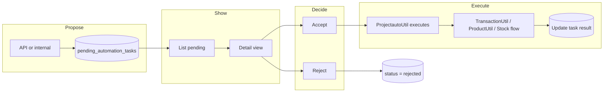

# Projectauto Module — Detailed Plan

## 0. Agent implementation checklist and coding rules

**Execution order:** Implement phases in order (Phase 1 → 2 → 2.5 → 3 → 4 → 5). Complete every task in a phase and run its verification before starting the next phase.

**Coding rules (agents must follow):**

- **AGENTS.md and .cursor/rules:** Read [AGENTS.md](AGENTS.md) and [.cursor/rules/laravel-coding-constitution.mdc](.cursor/rules/laravel-coding-constitution.mdc). No business logic in Blade; view data prepared in Controller/Util; thin controllers; FormRequest for validation; `business_id` on every tenant query.
- **UI:** Metronic 8.3.3 only; see [ai/ui-components.md](ai/ui-components.md). Use `asset('assets/...')` for core; no invented CSS classes.
- **Module pattern:** Follow [Modules/Aichat](Modules/Aichat) and [Modules/Cms](Modules/Cms) for structure, DataController, RouteServiceProvider, and menu registration.
- **After each task:** Run linter on changed files; run relevant tests if they exist; confirm no `business_id`-scoped query is missing.

**Todo list (track with TodoWrite):** Use the `todos` in the frontmatter above. Mark each task completed when done and verified.

## 1. Workflow (end-to-end)

- **Propose:** External system (e.g. OpenClaw via API) or internal “propose” action creates a row in `projectauto_pending_tasks` with `type` + `payload`, `status = pending`.
- **Store:** All data lives in one table; no execution yet.
- **Show:** User sees list of pending tasks, opens detail view (human-readable summary).
- **Decide:** User clicks Accept or Reject (with optional notes on Reject).
- **Execute (only on Accept):** Module’s executor (Util) runs existing core logic (sell, product, stock adjustment); result (e.g. created invoice id) saved on the task; task marked `approved`. On Reject, task marked `rejected`.

---

## 2. Detail view page (what the user sees)

- **Location:** `Modules/Projectauto/Resources/views/tasks/show.blade.php` (Metronic 8.3.3 per [ai/ui-components.md](ai/ui-components.md)).
- **URL:** e.g. `GET /projectauto/tasks/{id}` (route name: `projectauto.tasks.show`).
- **Content:**
  - **Header:** Task type label (e.g. “Create invoice”, “Add product”, “Stock adjustment”), status badge (pending/approved/rejected), requested date, optional “Requested by” (user or “System”).
  - **Summary card:** Human-readable description built from `payload` in the controller (not in Blade). Examples:
    - **create_invoice:** Contact name, location, line items (product name, qty, unit price, line total), subtotal, tax, total; no raw JSON.
    - **add_product:** Product name, SKU, type, category, purchase/selling price (if in payload).
    - **adjust_stock:** Location, adjustment type, list of product/variation + quantity + unit price (and lot if applicable).
  - **Actions (only if status = pending and user has approve permission):**
    - **Accept** → `POST /projectauto/tasks/{id}/accept` (optional modal: “Confirm: this will create the invoice / add the product / apply the stock adjustment.”).
    - **Reject** → `POST /projectauto/tasks/{id}/reject` (optional notes field); then redirect to list with success message.
  - **Result (if status = approved):** Show `result` payload in a read-only way (e.g. “Invoice #INV-001 created”, “Product ID 42 created”, “Stock adjustment ref SA-005 applied”) with link to the created resource if applicable.
- **Authorization:** Task must belong to current `business_id`; user needs `projectauto.tasks.view`; Accept/Reject require `projectauto.tasks.approve`.

---

## 3. How tasks are “asked” and how the user approves

| Who asks                              | How                                                                                                                                                                                                     | User approves                                                                                   |
| ------------------------------------- | ------------------------------------------------------------------------------------------------------------------------------------------------------------------------------------------------------- | ----------------------------------------------------------------------------------------------- |
| **External (OpenClaw, Zapier, etc.)** | `POST /api/projectauto/tasks` (or module API route) with API token; body: `type`, `payload`, optional `notes`. Module validates payload per type and inserts one row with `status = pending`.           | User logs into the Laravel app → Projectauto → Pending tasks → opens detail → Accept or Reject. |
| **Rule-based (settings)**             | User configures rules in **Projectauto → Settings** (e.g. when sales order released to final → propose create_invoice; when payment set → propose issue bill). On event, module creates a pending task. | Same: list → detail → Accept or Reject.                                                         |
| **Internal (future)**                 | Same table: a “Propose” action elsewhere (e.g. “Propose invoice from quote”) or a scheduled job that inserts rows with `type` + `payload`.                                                              | Same: list → detail → Accept / Reject.                                                          |

**Approve flow (concrete):**

1. User goes to **Projectauto → Pending tasks** (list filtered by `status = pending`, `business_id`).
2. Clicks a row or “View” → **Detail view** (summary only; no raw JSON in UI).
3. Clicks **Accept** → POST to `projectauto.tasks.accept` → controller checks permission and `status === pending` → calls `ProjectautoUtil::executeTask($task)` → Util dispatches by `type` to core logic (see below) → saves `result` and sets `status = approved`, `decided_at`, `decided_by` → redirect to list or back to detail with success and link to created resource.
4. Clicks **Reject** → POST to `projectauto.tasks.reject` → set `status = rejected`, `decided_at`, `decided_by`, optional `notes` → redirect to list.

---

## 3a. Settings page and rules (when to activate automation)

The module includes a **Settings** page where the user defines **rules**: “When X happens → create a pending task of type Y.” The user can enable/disable each rule so automation runs only when they want (e.g. “ask to issue bill when sales order is released to final” or “when payment is set”).

### Rules table (data model)

- **Table:** `projectauto_rules`
- **Columns:** id, business_id (FK), name (label for the rule), trigger_type (string), trigger_config (JSON), action_type (string), action_config (nullable JSON), is_active (boolean), created_at, updated_at.
- **trigger_type** examples:
  - `sales_order_status_updated` — when a sales order’s status is changed (e.g. to “completed” / final).
  - `payment_status_updated` — when a transaction’s payment status is updated (e.g. to “paid” or “partial”).
- **trigger_config** (JSON): e.g. `{"status": "completed"}` for “only when SO status = completed”; `{"payment_status": "paid"}` for “only when payment is set to paid”.
- **action_type:** same as task type: `create_invoice`, `add_product`, `adjust_stock`. When the trigger fires, the module creates a pending task with this type and a payload built from the event (e.g. from the transaction/sales order).

### Settings page (UI)

- **Location:** Projectauto → Settings (route e.g. `projectauto.settings.index`). Add “Settings” to the Projectauto dropdown in the menu (permission: `projectauto.settings.manage` or reuse approve).
- **Content:** List of rules (name, trigger description, action, active toggle, Edit, Delete). Button “Add rule”. Form (create/edit): name, trigger type (dropdown: “Sales order released to final”, “Payment set”, etc.), trigger config (e.g. status = completed, or payment_status = paid), action type (dropdown: “Create invoice”, “Add product”, “Adjust stock”), optional action config, is_active. All view data prepared in controller/Util; Blade only renders.
- **Validation:** FormRequest for store/update; ensure trigger_type + action_type are allowed values; business_id from session.

### How rules fire (hooks)

- **Payment status updated:** Core already calls `getModuleData('after_payment_status_updated', ['transaction' => $transaction])` in [TransactionUtil::updatePaymentStatus](app/Utils/TransactionUtil.php) (line 3098). In Projectauto’s **DataController**, implement `after_payment_status_updated`: get active rules for this business with trigger_type `payment_status_updated`; if transaction’s payment_status matches rule’s trigger_config (e.g. paid), build payload for the rule’s action_type (e.g. create_invoice from this transaction) and create a row in `projectauto_pending_tasks`.
- **Sales order status updated:** Core does **not** currently call a hook when sales order status is changed. Status is updated in [SalesOrderController::postEditSalesOrderStatus](app/Http/Controllers/SalesOrderController.php) (line 123). Two options:
  1. **Core change (recommended):** Add one line in `postEditSalesOrderStatus` after save: `$this->moduleUtil->getModuleData('after_sales_order_status_updated', ['transaction' => $transaction, 'old_status' => $transaction_before->status]);`. Then in Projectauto DataController implement `after_sales_order_status_updated`: if new status matches a rule’s trigger_config (e.g. completed), create pending task (e.g. create_invoice built from that sales order).
  2. **No core change:** Document that “sales order released” rule is not available unless core adds the hook; or use an Eloquent observer on `Transaction` (updated) for type = sales_order and detect status change (more fragile, runs on every SO update).

Payload builder: for “create_invoice” from a sales order or sell transaction, ProjectautoUtil (or a dedicated helper) builds the task payload from the transaction (contact_id, location_id, lines from sell_lines, discount, tax, etc.) so that when the user accepts, the executor can call TransactionUtil::createSellTransaction with that payload (e.g. convert SO to sell).

---

## 4. Execution layer (no new business logic)

The module must **only orchestrate**; all business rules stay in core.

- **create_invoice (sell):** Build input array from `payload` (contact_id, location_id, sale_type, products array, discount, tax, payment, etc.) then call `TransactionUtil::createSellTransaction()` and `TransactionUtil::createOrUpdateSellLines()` (and payment handling if in payload). Reuse the same shape of data that [SellController](app/Http/Controllers/SellController.php) / POS uses (see [TransactionUtil::createSellTransaction](app/Utils/TransactionUtil.php) around line 43).
- **add_product:** Build product + variation input from `payload` and call existing product creation flow (e.g. logic used in [ProductController::store](app/Http/Controllers/ProductController.php) or ProductUtil methods such as `createSingleProductVariation` / create variable product). Do not duplicate validation; reuse or mirror core validation rules.
- **adjust_stock:** Build input from `payload` (location_id, transaction_date, adjustment_type, products array with product_id, variation_id, quantity, unit_price, optional lot_no_line_id) then replicate the flow in [StockAdjustmentController::store](app/Http/Controllers/StockAdjustmentController.php) (Transaction::create, stock_adjustment_lines, ProductUtil::decreaseProductQuantity, TransactionUtil::mapPurchaseSell, event, activity log). Keep `business_id` and permitted_locations checks.

Executor lives in `**Modules/Projectauto/Utils/ProjectautoUtil.php`** (or a dedicated `ExecuteTaskUtil`): one public method e.g. `executeTask(PendingTask $task): array` that switches on `$task->type` and calls the appropriate core Util/flow, returns `['success' => true, 'result' => [...]]` or throws / returns error. Controller catches errors and can store failure in `result` and optionally set status to `failed` or keep `pending` with a note.

---

## 5. Phase-by-phase, task-by-task (implementation detail)

**Execution order:** Complete all tasks in Phase 1, verify, then Phase 2, then 2.5, then 3, then 4. After each task: run linter on changed files; run any existing tests that touch the area.

### 5.0 Agent todo list (track with TodoWrite; IDs = P1-01 through P4-01)

- P1-01 Create module scaffold — P1-02 Migration pending_tasks — P1-03 Entity PendingAutomationTask — P1-04 DataController permissions + menu — P1-05 Web routes — P1-06 Task controller — P1-07 Summary builder — P1-08 Views index + show — P1-09 Executor adjust_stock — P1-10 Seed permissions
- P2-01 Executor create_invoice — P2-02 Executor add_product — P2-03 Summary all types — P2-04 Payload validation
- P25-01 Migration rules — P25-02 Entity AutomationRule + settings permission — P25-03 Settings routes/controller/views — P25-04 Hooks + payload from transaction
- P3-01 API route + controller + docs — P4-01 Confirm modal, reject notes, links, permitted_locations, activity log
- P5-01 Modify then approve — P5-02 Idempotency — P5-03 Audit log table — P5-04 expires_at + escalation — P5-05 Recursion guard — P5-06 One trigger / bulk safety — P5-07 Cache module list

### Phase 1: Module scaffold, table, list + detail + Accept/Reject (one task type)

| #    | Task                            | Details                                                                                                                                                                                                                                                                                                                                                                                                                         |
| ---- | ------------------------------- | ------------------------------------------------------------------------------------------------------------------------------------------------------------------------------------------------------------------------------------------------------------------------------------------------------------------------------------------------------------------------------------------------------------------------------- |
| 1.1  | Create module scaffold          | `php artisan module:make Projectauto`. Add [module.json](Modules/Aichat/module.json) (name, alias, providers). Ensure [ProjectautoServiceProvider](Modules/Aichat/Providers/AichatServiceProvider.php) boot: migrations, views, config, translations; register RouteServiceProvider.                                                                                                                                            |
| 1.2  | Migration: pending tasks table  | Create `projectauto_pending_tasks`: id, business_id (FK business), type (string, e.g. create_invoice, add_product, adjust_stock), payload (JSON), status (pending, approved, rejected, optional failed), requested_at (timestamp), requested_by (nullable FK users), decided_at (nullable), decided_by (nullable FK users), result (nullable JSON), notes (nullable text). Indexes: business_id, status, (business_id, status). |
| 1.3  | Entity                          | `Modules/Projectauto/Entities/PendingAutomationTask.php`: guarded, casts (payload, result, requested_at, decided_at), relationships (business, requestedBy, decidedBy). All queries scope by business_id.                                                                                                                                                                                                                       |
| 1.4  | Permissions & menu              | In [DataController](Modules/Aichat/Http/Controllers/DataController.php) pattern: `user_permissions()` return `projectauto.tasks.view`, `projectauto.tasks.approve`; `modifyAdminMenu()` add “Projectauto” dropdown with “Pending tasks” (route projectauto.tasks.index) for users with view or approve. Register in Install/ModulesController flow so permissions exist.                                                        |
| 1.5  | Routes                          | Web: prefix `projectauto`, middleware web, auth, SetSessionData, language, timezone, AdminSidebarMenu. Routes: index (list), show (detail), accept (POST), reject (POST). Names: projectauto.tasks.index, show, accept, reject.                                                                                                                                                                                                 |
| 1.6  | Controller (thin)               | `ProjectautoTaskController`: index (DataTable or simple list, business_id scoped, filter status); show (load task by id + business_id, build summary array in controller or Util and pass to view); accept (authorize, call ProjectautoUtil::executeTask, update task, redirect); reject (authorize, set status/decided_*, redirect).                                                                                           |
| 1.7  | Summary builder                 | In controller or `ProjectautoUtil`: method that takes task and returns a structured array for the view (e.g. type_label, lines_for_invoice, contact_name, total, etc.). View receives this only; no business logic in Blade.                                                                                                                                                                                                    |
| 1.8  | Views (Metronic)                | List: [public/html](public/html) tables/list pattern, card layout. Detail: [show](Modules/Projectauto/Resources/views/tasks/show.blade.php) with summary and Accept/Reject buttons. Use Metronic card, badge, btn classes per [ai/ui-components.md](ai/ui-components.md).                                                                                                                                                       |
| 1.9  | Implement executor for one type | Start with **adjust_stock** only: in ProjectautoUtil::executeTask, if type === adjust_stock, build input from payload and call the same logic path as StockAdjustmentController::store (Transaction::create, lines, decreaseProductQuantity, mapPurchaseSell, event, activity log). Return created transaction id in result.                                                                                                    |
| 1.10 | Seed permissions                | Ensure module install/seed adds projectauto.tasks.view and projectauto.tasks.approve to a role (e.g. Admin) so the menu and actions work.                                                                                                                                                                                                                                                                                       |

**Phase 1 task detail (agents: do in order; verify after each)**

- **P1-01** Do: Run `php artisan module:make Projectauto`. Set module.json name, alias, providers. In ProjectautoServiceProvider boot: loadMigrationsFrom, loadViewsFrom, mergeConfigFrom, registerTranslations; register RouteServiceProvider. Files: `Modules/Projectauto/module.json`, `Providers/ProjectautoServiceProvider.php`, `Providers/RouteServiceProvider.php`. Verify: `php artisan module:list` shows Projectauto; `php artisan route:list` shows projectauto prefix. Do not: add business logic in Provider.
- **P1-02** Do: Create migration `create_projectauto_pending_tasks_table`. Columns: id, business_id (FK business), type (string 64), payload (JSON), status (string 32), requested_at (timestamp), requested_by (nullable FK users), decided_at (nullable), decided_by (nullable FK users), result (nullable JSON), notes (nullable text). Indexes: business_id, status, (business_id, status). File: `Modules/Projectauto/Database/Migrations/xxxx_create_projectauto_pending_tasks_table.php`. Verify: `php artisan migrate --path=Modules/Projectauto/Database/Migrations` succeeds; table exists. Do not: forget FK and business_id index.
- **P1-03** Do: Create entity PendingAutomationTask: $guarded = ['id']; casts payload/result/requested_at/decided_at; relationships business(), requestedBy(), decidedBy(). File: `Modules/Projectauto/Entities/PendingAutomationTask.php`. Verify: model resolves; any query must use where('business_id', ...). Do not: put business logic in model; no queries without business_id.
- **P1-04** Do: In DataController implement user_permissions() (return projectauto.tasks.view, projectauto.tasks.approve) and modifyAdminMenu() (add Projectauto dropdown with Pending tasks link; check module installed and user can view or approve). Follow Aichat DataController pattern. File: `Modules/Projectauto/Http/Controllers/DataController.php`. Verify: menu shows for user with permission; permissions appear in role editor. Do not: add menu without permission check.
- **P1-05** Do: In web.php add group middleware web, auth, SetSessionData, language, timezone, AdminSidebarMenu; prefix projectauto. Routes: get tasks -> index, get tasks/{id} -> show, post tasks/{id}/accept -> accept, post tasks/{id}/reject -> reject. Name prefix projectauto.tasks. File: `Modules/Projectauto/Routes/web.php`. Verify: route:list shows the four named routes. Do not: use route closures for accept/reject.
- **P1-06** Do: Create ProjectautoTaskController. index: business_id from session, query PendingAutomationTask by business_id, return view. show: find by id + business_id or 404, build summary via Util, return view. accept: authorize can projectauto.tasks.approve and status pending, call ProjectautoUtil::executeTask, update task status/decided_at/decided_by/result, redirect. reject: authorize, set status rejected and decided_*, redirect. Inject ProjectautoUtil. File: `Modules/Projectauto/Http/Controllers/ProjectautoTaskController.php`. Verify: list loads; show shows summary; accept executes and updates task; reject updates task only. Do not: put summary building or execution logic in controller.
- **P1-07** Do: In ProjectautoUtil add buildSummaryForTask($task): array. For adjust_stock return type_label, location_name, adjustment_type, lines (from payload). View receives only this array. File: `Modules/Projectauto/Utils/ProjectautoUtil.php`. Verify: show() passes single summary array; Blade has no @php computing summary. Do not: build summary in Blade; no DB in view.
- **P1-08** Do: Create index.blade.php (Metronic card + table: type, status, requested_at, link to show). Create show.blade.php (card with type, status, summary from $summary; if pending and can approve: Accept POST to accept route, Reject POST to reject route; @csrf). Use route(), Metronic classes per ai/ui-components.md. Files: `Modules/Projectauto/Resources/views/tasks/index.blade.php`, `show.blade.php`. Verify: list and detail render; buttons POST to correct routes. Do not: @php for defaulting or logic; only display passed data.
- **P1-09** Do: In ProjectautoUtil::executeTask($task): if type !== adjust_stock return/throw. Build input from $task->payload. Replicate StockAdjustmentController::store flow (Transaction::create, stock_adjustment_lines, ProductUtil::decreaseProductQuantity, TransactionUtil::mapPurchaseSell, event, activityLog). Use business_id and user_id from session or task. Return ['success'=>true,'result'=>['transaction_id'=>...]]. File: `Modules/Projectauto/Utils/ProjectautoUtil.php`. Verify: Accept on adjust_stock task creates stock adjustment; task updated. Do not: duplicate core rules; call existing Utils; use DB::transaction if needed.
- **P1-10** Do: Ensure permissions projectauto.tasks.view and projectauto.tasks.approve are seeded when module is installed (or document manual step). Add to Admin/default role. File: module seeder or install flow. Verify: Admin has permissions; menu visible. Do not: skip permission registration.

**Phase 1 deliverable:** User can see a list of pending tasks, open a detail view with a human-readable summary, and Accept (which runs the stock adjustment) or Reject. Tasks are created manually in DB or via tinker for testing.

---

### Phase 2: Add create_invoice and add_product execution

| #   | Task                          | Details                                                                                                                                                                                                                                                                           |
| --- | ----------------------------- | --------------------------------------------------------------------------------------------------------------------------------------------------------------------------------------------------------------------------------------------------------------------------------- |
| 2.1 | Executor: create_invoice      | In ProjectautoUtil::executeTask, handle type create_invoice: validate payload (contact_id, location_id, products, payment, etc.); call TransactionUtil::createSellTransaction and createOrUpdateSellLines (and add payment if needed). Store invoice id and invoice_no in result. |
| 2.2 | Executor: add_product         | Handle type add_product: build product/variation input from payload; call ProductUtil / product creation flow used by core (single or variable product). Store product_id and variation_id(s) in result.                                                                          |
| 2.3 | Summary builder for all types | Extend summary builder so detail view shows correct summary for create_invoice (contact, lines, total) and add_product (name, SKU, type, prices).                                                                                                                                 |
| 2.4 | Validation of payload         | Before execute (and ideally when task is created via API): validate payload per type (e.g. required keys, types). Use FormRequest or a dedicated validation class; keep controller thin.                                                                                          |

**Phase 2 task detail (agents: do in order; verify after each)**

- **P2-01** Do: In executeTask handle type create_invoice: validate payload (contact_id, location_id, products, payment); call TransactionUtil::createSellTransaction and createOrUpdateSellLines; add payment if in payload. Store invoice id and invoice_no in result. Verify: Accept on create_invoice task creates sell transaction. Do not: duplicate sell logic; use existing TransactionUtil.
- **P2-02** Do: In executeTask handle type add_product: build product/variation input from payload; call ProductUtil/product creation flow (single or variable). Store product_id and variation_id(s) in result. Verify: Accept on add_product task creates product. Do not: duplicate ProductController store logic.
- **P2-03** Do: Extend buildSummaryForTask for create_invoice (contact name, lines, total) and add_product (name, SKU, type, prices). Verify: Detail view shows correct summary for all three types. Do not: add logic in Blade.
- **P2-04** Do: Add payload validation before execute (and for API later): validate required keys per type. Use validation class or FormRequest; controller stays thin. Verify: Invalid payload fails before execution. Do not: skip validation for API-created tasks when implemented.

**Phase 2 deliverable:** All three types (adjust_stock, create_invoice, add_product) can be executed on Accept; detail view shows the right summary for each.

---

### Phase 2.5: Settings page and rules (when to activate automation)

| #      | Task                                   | Details                                                                                                                                                                                                                                |
| ------ | -------------------------------------- | -------------------------------------------------------------------------------------------------------------------------------------------------------------------------------------------------------------------------------------- |
| 2.5.1  | Migration: rules table                 | Create `projectauto_rules`: id, business_id (FK), name (string), trigger_type (string), trigger_config (JSON), action_type (string), action_config (nullable JSON), is_active (boolean), timestamps. Index (business_id, is_active).   |
| 2.5.2  | Entity: AutomationRule                 | `Modules/Projectauto/Entities/AutomationRule.php`; all queries scope by business_id.                                                                                                                                                   |
| 2.5.3  | Permission                             | Add `projectauto.settings.manage`; DataController user_permissions and menu "Settings" under Projectauto.                                                                                                                              |
| 2.5.4  | Settings routes                        | GET/POST projectauto/settings (index, store); GET/POST projectauto/settings/{id}/edit, PUT projectauto/settings/{id}, DELETE projectauto/settings/{id}.                                                                                |
| 2.5.5  | Settings controller                    | List rules (business_id scoped); create/update/delete with FormRequest; thin controller.                                                                                                                                               |
| 2.5.6  | Settings views                         | List rules (table + active toggle, Edit, Delete); form for add/edit: name, trigger_type (dropdown), trigger_config, action_type (dropdown), is_active. Metronic forms.                                                                 |
| 2.5.7  | Hook: after_payment_status_updated     | In DataController, implement for getModuleData. Load active rules for trigger_type = payment_status_updated; if transaction matches trigger_config, build payload and create PendingAutomationTask.                                    |
| 2.5.8  | Hook: after_sales_order_status_updated | Implement in DataController (used only if core calls getModuleData in SalesOrderController::postEditSalesOrderStatus). Build create_invoice payload from SO and create pending task when status matches.                               |
| 2.5.9  | Payload builder from transaction       | ProjectautoUtil: build create_invoice payload from Transaction (contact_id, location_id, lines, discount, tax) for executor.                                                                                                           |
| 2.5.10 | Core hook (optional)                   | In SalesOrderController::postEditSalesOrderStatus after save, add getModuleData('after_sales_order_status_updated', ['transaction' => $transaction, 'old_status' => $transaction_before->status]). Document if core cannot be changed. |

**Phase 2.5 task detail (agents: do in order; verify after each)**

- **P25-01** Do: Migration create_projectauto_rules: id, business_id (FK), name, trigger_type, trigger_config (JSON), action_type, action_config (nullable JSON), is_active (boolean), timestamps. Index (business_id, is_active). Verify: Migration runs; table exists.
- **P25-02** Do: Entity AutomationRule ($guarded, business_id scope). DataController: add projectauto.settings.manage to user_permissions; add Settings link under Projectauto menu. Verify: Settings appears in menu for users with permission.
- **P25-03** Do: Routes GET/POST settings, GET/PUT/DELETE settings/{id}. ProjectautoSettingsController: index (list rules by business_id), store/update/destroy with FormRequest. Views: list rules (table, active toggle, Edit, Delete), form (name, trigger_type dropdown, trigger_config, action_type dropdown, is_active). Metronic only. Verify: CRUD rules works; all queries by business_id.
- **P25-04** Do: DataController: implement after_payment_status_updated($data) — load active rules trigger_type=payment_status_updated, if transaction.payment_status matches rule trigger_config build payload (ProjectautoUtil::buildPayloadFromTransaction) and create PendingAutomationTask. Implement after_sales_order_status_updated if core calls it; same pattern. ProjectautoUtil: buildPayloadFromTransaction($transaction) for create_invoice (contact_id, location_id, lines, discount, tax). Verify: Updating payment status creates pending task when rule matches; payload builds correctly. Do not: create task without checking rule trigger_config; recursion guard: optional source_transaction_id on task and skip if open task exists for same source.

**Phase 2.5 deliverable:** User configures rules in Settings (e.g. when SO released to final or payment set → propose create_invoice). Those events create pending tasks; user approves in Pending tasks.

---

### Phase 3: API to create tasks (so “someone” can ask)

| #   | Task                   | Details                                                                                                                                                                                               |
| --- | ---------------------- | ----------------------------------------------------------------------------------------------------------------------------------------------------------------------------------------------------- |
| 3.1 | API route              | Under module or app: POST /api/projectauto/tasks (or similar). Protect with auth:api (Passport/Sanctum) and ensure business_id is determined from token or request.                                   |
| 3.2 | API controller         | Accept JSON: type, payload, notes. Validate type and payload per type; create PendingAutomationTask with status pending, requested_by nullable or from token. Return 201 with task id and link to UI. |
| 3.3 | Document payload shape | In module docs or README: exact payload structure for create_invoice, add_product, adjust_stock so OpenClaw or other systems can call the API.                                                        |

**Phase 3 task detail (agents: do in order; verify after each)**

- **P3-01** Do: Add POST route under api (auth:api), e.g. POST /api/projectauto/tasks. Controller or API method: accept JSON type, payload, notes; validate type and payload per type; create PendingAutomationTask (business_id from token/session), status pending; return 201 with task id and link to UI. Document in README or module docs the payload shape for create_invoice, add_product, adjust_stock. Verify: Authenticated API POST creates task; invalid payload returns 422; business_id set. Do not: allow unauthenticated create; never omit business_id.

**Phase 3 deliverable:** External systems can create pending tasks via API; users still approve only in the app.

---

### Phase 4: Polish and optional features

| #   | Task                       | Details                                                                                                                                        |
| --- | -------------------------- | ---------------------------------------------------------------------------------------------------------------------------------------------- |
| 4.1 | Confirm modal              | On “Accept”, show a Metronic modal: “This will create the invoice / add the product / apply the stock adjustment. Continue?” Then POST accept. |
| 4.2 | Reject notes               | Optional notes textarea on Reject; save to task.notes.                                                                                         |
| 4.3 | Links to created resources | After Accept, result stores ids; in detail view (when approved) show link to the sell invoice, product, or stock adjustment.                   |
| 4.4 | Permitted locations        | When executing sell or stock adjustment, enforce user’s permitted_locations (same as core controllers).                                        |
| 4.5 | Activity log               | Log “Task approved/rejected” and “Task executed” on the task model if the project uses activity log.                                           |

---

**Phase 4 task detail (agents)**  

- **P4-01** (4.1) Accept opens Metronic confirm modal then POST accept. (4.2) Reject form has notes textarea; save to task.notes. (4.3) When approved show link to created resource from result. (4.4) In executeTask enforce permitted_locations for sell/stock. (4.5) Log approve/reject/execute if project has activity log. Verify: modal, notes, links, location check, activity. Do not: skip CSRF or location check.

---

### Phase 5: Three actions, idempotency, audit log, escalation, recursion guard, bulk safety, cache

| ID        | Task                                | Details                                                                                                                                                                                                                                                                                                                                                                                                                                                                                                         |
| --------- | ----------------------------------- | --------------------------------------------------------------------------------------------------------------------------------------------------------------------------------------------------------------------------------------------------------------------------------------------------------------------------------------------------------------------------------------------------------------------------------------------------------------------------------------------------------------- |
| **P5-01** | Modify then approve                 | Add third action: user can edit payload (form pre-filled from task.payload) then submit as Accept. Route POST projectauto/tasks/{id}/modify-and-accept; controller validates modified payload per type, updates task.payload, then runs executeTask. View: "Modify" button opens modal/form with editable fields (e.g. for create_invoice: contact_id, lines; for adjust_stock: products).                                                                                                                      |
| **P5-02** | Idempotency                         | Before executeTask: if task.status is not pending or task.result is not null, do not run executor; return error "Already processed." Optionally add idempotency_key (string, nullable) to pending_tasks and reject duplicate API creates with same key per business_id. In executor use DB::transaction and set result immediately after success so retries do not double-apply.                                                                                                                                |
| **P5-03** | Dedicated audit log                 | Migration create_projectauto_audit_log: id, business_id (FK), task_id (FK pending_tasks), user_id (nullable FK), action (string: approved, rejected, modified_approved, executed, failed), acted_at (timestamp UTC), notes (nullable text), ip (nullable). Write row on every approve, reject, modify-and-accept, and after execute (success or failure). All queries by business_id.                                                                                                                           |
| **P5-04** | expires_at and escalation           | Add column expires_at (nullable timestamp) to projectauto_pending_tasks; set when task is created (e.g. requested_at + config hours). List/detail: hide or show "Expired" badge when now > expires_at; optional "At risk" at e.g. 80% of SLA. Config: projectauto.expires_in_hours, projectauto.escalation_action (none, remind, escalate, auto_reject). Cron command: find pending tasks where expires_at < now, run escalation (send notification to approvers, or reassign to role, or set status rejected). |
| **P5-05** | Recursion guard                     | Add source_transaction_id (nullable, FK or unsignedBigInteger) to projectauto_pending_tasks. When rule creates a task from a transaction/sales order, set source_transaction_id. In after_payment_status_updated and after_sales_order_status_updated, before creating a new task: if exists open (pending) task for same business_id and source_transaction_id, skip creating duplicate.                                                                                                                       |
| **P5-06** | One trigger per event / bulk safety | Document: when multiple rules match the same event, process in deterministic order (e.g. by rule id). In hook handler: load rules once; loop; avoid N+1; if processing many transactions (bulk), keep handler fast and optionally dispatch job to create tasks in queue. Do not run heavy logic inside hook.                                                                                                                                                                                                    |
| **P5-07** | Cache module list                   | In ProjectautoServiceProvider or where module list is used: if app has many modules, use Laravel/nwidart module cache (e.g. config('modules'), or php artisan module:list cache). Document in plan or Provider comment. No new table; optional.                                                                                                                                                                                                                                                                 |

**Phase 5 task detail (agents: do in order; verify after each)**

- **P5-01** Do: Add route POST tasks/{id}/modify-and-accept. Controller: load task, authorize, show form with payload pre-filled (or accept JSON body with modified payload); validate modified payload per type; update task.payload; call executeTask; redirect. View: "Modify" button + modal/form with fields for payload (type-specific). Verify: User can change e.g. quantity then accept; task executes with modified payload. Do not: allow arbitrary keys; validate same as create.
- **P5-02** Do: At start of executeTask check task.status === 'pending' and (optional) task.result === null; else return/throw "Already processed." In accept controller after executeTask update task (result, status) inside same transaction so retry does not re-run. Optionally add idempotency_key to migration and API: on create task if key provided check duplicate by business_id + key; reject 409 if exists. Verify: Double POST accept does not run executor twice; optional API duplicate key rejected. Do not: execute without status check.
- **P5-03** Do: Migration create_projectauto_audit_log (id, business_id, task_id, user_id, action, acted_at, notes, ip). Helper or Util: writeAuditLog($taskId, $action, $notes = null). Call on approve, reject, modify-and-accept, and after execute (success/failed). All queries by business_id. Verify: Every approve/reject/execute writes a row; list view or separate audit view can show history. Do not: log without business_id.
- **P5-04** Do: Migration add expires_at (nullable timestamp) to projectauto_pending_tasks. When creating task set expires_at = now + config('projectauto.expires_in_hours', 72) * 3600. List/detail: if expires_at and now > expires_at show "Expired" badge; optional "At risk" if now > requested_at + 0.8 * (expires_at - requested_at). Config: expires_in_hours, escalation_action (none|remind|escalate|auto_reject). Artisan command: projectauto:escalate — find pending tasks where expires_at < now, for each run escalation (notify, or reassign, or set status rejected). Schedule in console kernel. Verify: Expired tasks visible; cron runs escalation. Do not: run escalation without checking business_id.
- **P5-05** Do: Migration add source_transaction_id (nullable) to projectauto_pending_tasks. When creating task from hook pass transaction id into payload and set task.source_transaction_id. In after_payment_status_updated and after_sales_order_status_updated before create: query PendingAutomationTask where business_id, source_transaction_id = transaction->id, status = pending; if count > 0 skip create. Verify: Same transaction does not create two open tasks. Do not: skip guard when source is known.
- **P5-06** Do: In hook handler get active rules ordered by id; loop; for each matching rule create task (with recursion guard). No heavy work in hook; if core fires for many records document "one trigger per event" and consider single job that batches task creation. Verify: Multiple rules for same event create tasks in stable order; handler returns quickly. Do not: run queue or HTTP from inside hook synchronously for bulk.
- **P5-07** Do: In ProjectautoServiceProvider or bootstrap, if using module list for menu/permissions and app has many modules, ensure nwidart/laravel-modules cache is used (e.g. php artisan module:list; config cache). Add comment or one-line check; no new code path required if cache already used. Verify: module:list or menu load does not hit DB excessively when many modules. Do not: add cache layer that breaks module enable/disable without clear.

**Phase 5 deliverable:** Modify-then-approve available; retries do not double-apply; every decision logged in audit table; expired tasks get escalation; rule-created tasks do not duplicate for same source transaction; hook remains fast; module list cached when appropriate.

## 6. Suggested features to improve automation (beyond MVP)

- **Bulk approve/reject:** On list view, checkboxes + “Approve selected” / “Reject selected” for multiple pending tasks (with confirmation).
- **Task expiry:** Optional `expires_at`; hide or auto-reject tasks after expiry; show “Expired” badge.
- **Notifications:** When a new pending task is created (e.g. via API), notify users with `projectauto.tasks.approve` (email or in-app) with link to the task.
- **Audit trail:** Store last_error and execution attempt count in result for failed runs; show “Retry” for failed tasks (re-run executor once payload is fixed).
- **Propose from app:** “Propose invoice” from quote or “Propose restock” from a report: buttons that create a pending task so the flow is “propose in app → approve in Projectauto”.
- **Scheduled proposals:** Cron job that creates pending tasks (e.g. “Suggested stock adjustment for low stock”) so users only approve, not initiate.
- **Webhook out:** After a task is approved and executed, optional webhook callback to a URL (with task id, type, result) so OpenClaw or others can react to completion.
- **Per-type permissions:** Optional permissions like projectauto.tasks.approve_invoice, projectauto.tasks.approve_product, projectauto.tasks.approve_stock so different roles can approve only certain types.

---

## 7. File map (summary)

| Area               | Path                                                                                                                                                                                                                                 |
| ------------------ | ------------------------------------------------------------------------------------------------------------------------------------------------------------------------------------------------------------------------------------ |
| Module config      | `Modules/Projectauto/module.json`, `Config/config.php`                                                                                                                                                                               |
| Provider           | `Modules/Projectauto/Providers/ProjectautoServiceProvider.php`, `RouteServiceProvider.php`                                                                                                                                           |
| Migrations         | `.../create_projectauto_pending_tasks_table.php`, `.../create_projectauto_rules_table.php`, `.../create_projectauto_audit_log_table.php`, `.../add_source_transaction_id_and_expires_at_to_projectauto_pending_tasks.php` (or split) |
| Entities           | `PendingAutomationTask.php`, `AutomationRule.php`                                                                                                                                                                                    |
| Permissions & menu | `Modules/Projectauto/Http/Controllers/DataController.php` (incl. hooks for rules)                                                                                                                                                    |
| Routes             | `Modules/Projectauto/Routes/web.php` (tasks + settings), optional api.php                                                                                                                                                            |
| Controllers        | `ProjectautoTaskController.php`, `ProjectautoSettingsController.php`                                                                                                                                                                 |
| Util               | `Modules/Projectauto/Utils/ProjectautoUtil.php` (summary, executeTask, payload, audit log helper)                                                                                                                                    |
| Views              | `tasks/index.blade.php`, `tasks/show.blade.php`, `settings/index.blade.php`, modify-and-accept form/modal                                                                                                                            |
| Commands           | `Modules/Projectauto/Console/ProjectautoEscalationCommand.php` (cron: timeout escalation)                                                                                                                                            |
| Lang               | `Modules/Projectauto/Resources/lang/en/lang.php`                                                                                                                                                                                     |

---

## 8. Best practices (from online research)

These practices improve safety, compliance, and maintainability of the approval workflow.

### Human-in-the-loop and approval design

- **Store enough context per request** so reviewers can decide in seconds: operation type, parameters, and a clear summary (already planned: summary builder and detail view). [StackAI, Athenic]
- **Three actions where useful:** Approve, Reject, and **Modify then approve** (e.g. edit payload before execute). The plan currently has Approve/Reject only; “Modify” could be a later enhancement (show form pre-filled from payload, then submit as accept).
- **State in DB:** Pending tasks and rules are stored in the database so workflow survives restarts and is resumable (already in plan). [Cloudflare Agents]
- **Idempotency:** Design execute step so that retrying after a failure (e.g. timeout) does not double-apply; use transaction ids or idempotency keys where core supports it. [StackAI]

### Audit trail and compliance

- **Audit trail:** Record who approved/rejected what, when, and (on reject) why. The plan has `decided_by`, `decided_at`, `notes`; add explicit **audit log** (e.g. activity log or dedicated `projectauto_audit_log`: task_id, user_id, action [approved|rejected], at (UTC), notes, optional IP). [Sirion, HIVO]
- **Before/after state:** For compliance, store a snapshot of “payload before execution” and “result after” on the task (payload and result columns already give this). Optionally add “rejected_payload” so auditors see what was not applied.
- **Actor identity:** Always record authenticated user for approve/reject; for API-created tasks, record “requested_by” or “system” and optionally API client id.

### Timeouts and escalation

- **Task expiry (SLA):** Add optional `expires_at` on tasks; hide or auto-reject after expiry; show “Expired” and optionally “At risk” (e.g. 80% of SLA elapsed). [Power Automate, Conga]
- **Escalation:** If a task is not approved within SLA, optional actions: send reminder, escalate to another role, or auto-reject. Can be a Phase 4+ feature with a cron job that checks `expires_at` and runs escalation logic.
- **Configurable timeout:** In settings or config, allow per-rule or global “expires_in_hours” (e.g. 24 or 72) so `expires_at = requested_at + expires_in`.

### Rules and triggers

- **One trigger per logical event:** Avoid multiple rules that fire on the same event and conflict; keep rule conditions clear (e.g. trigger_config) and document execution order if multiple rules match. [Salesforce, Atlassian]
- **Recursion guard:** When a rule creates a pending task and the task’s execution (e.g. create_invoice) triggers the same event (e.g. payment_status_updated), prevent creating another task for the same transaction (e.g. store “source_transaction_id” on task and skip if an open task already exists for that source). [Apex Trigger best practices]
- **Bulk safety:** If core ever fires hooks in bulk (e.g. many transactions updated), create tasks in a loop but consider queueing or batching to avoid timeouts; keep hook handler fast.

### Laravel module structure

- **StudlyCase module name,** PSR-4, and standard directories (Config, Database, Entities, Http, Routes, Resources, Utils) as in the plan. [nwidart/laravel-modules]
- **Cache module list** if the app has many modules; use `php artisan module:list` and existing bootstrap/cache for module discovery. [Laravel Modules docs]

### Suggested plan additions (priority)

| Priority | Improvement                                                                                               | Where in plan                             |
| -------- | --------------------------------------------------------------------------------------------------------- | ----------------------------------------- |
| High     | **Audit log table or activity log** for every approve/reject (who, when, action, notes)                   | Phase 4 or 2.5                            |
| High     | **expires_at + optional “at risk”** on tasks; configurable SLA                                            | Phase 4 (already in “Suggested features”) |
| Medium   | **Recursion guard** for rule-created tasks (e.g. skip if open task exists for same source_transaction_id) | Phase 2.5 (hook implementation)           |
| Medium   | **Modify then approve** (edit payload before execute)                                                     | Post-MVP / Phase 4                        |
| Low      | **Escalation on timeout** (remind, escalate role, or auto-reject via cron)                                | Beyond MVP                                |

**Now in Phase 5:** Modify then approve (P5-01), Idempotency (P5-02), Dedicated audit log (P5-03), expires_at + escalation (P5-04), Recursion guard (P5-05), One trigger / bulk safety (P5-06), Cache module list (P5-07) are all concrete implementation tasks.

---

## 9. Compliance notes

- **Multi-tenant:** Every query on `projectauto_pending_tasks` uses `business_id` from session (or API context); executor passes business_id into core Utils.
- **Permissions:** All actions gated by `projectauto.tasks.view` / `projectauto.tasks.approve`; no new business logic in Blade; view data (summary) prepared in controller/Util.
- **Existing code:** No changes to core SellController, ProductController, StockAdjustmentController; module only calls the same Utils and flows they use.

