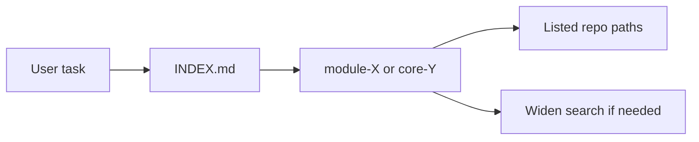

# Repo-wide agent entry maps (`ai/entrypoints`)

## Overview

Add **`ai/entrypoints/`** so agents read **[`ai/entrypoints/INDEX.md`](ai/entrypoints/INDEX.md) first**, then **one area map**, then **only listed repo paths**—reducing blind widen-search across [`Modules/`](Modules/) and [`app/`](app). Storage is **Markdown only** in v1 (no MCP/DB). **Full coverage** is incremental: INDEX lists every enabled module from [`modules_statuses.json`](modules_statuses.json); **thin maps** are valid when they list real routes + controller + views roots.

---

## Architecture

---

## Scale: many modules and `app/`

| Question | Answer |
|----------|--------|
| Enough as a **system**? | **Yes** — router + template + INDEX + thin maps scales. |
| Every feature in one PR? | **No** — use **tiers** below; grow maps as you touch code. |
| Large `app/`? | **[`core-http-entry.md`](ai/entrypoints/core-http-entry.md) stays thin**; add [`core-<domain>.md`](ai/entrypoints/) only for hot areas (sell, product, …). |

---

## Locked decisions

| Topic | Decision |
|-------|----------|
| Storage | `ai/entrypoints/*.md` only; **no MCP** in v1. |
| Flow | INDEX → one area map → paths in map → widen only if incomplete. |
| Names | `module-<PascalCase>.md`; `core-<area>.md` for root shards. |
| INDEX vs disk | Row per enabled module in `modules_statuses.json`. **Folder missing locally** → Notes `— (not in checkout)`; **no dead map link**. |
| Duplication | Link [`ai/aichat-authz-baseline.md`](ai/aichat-authz-baseline.md), [`ai/projectx-integration.md`](ai/projectx-integration.md), [`ai/ui-components.md`](ai/ui-components.md); do not copy long specs. |
| Maintenance | Update area map in **same PR** as route/controller/layout/JS wiring changes. |

---

## Tiered rollout

| Tier | Deliverable | When |
|------|-------------|------|
| **T0** | README, _TEMPLATE, INDEX | First |
| **T1** | Full **module-Cms**; thin **module-Aichat**; **core-http-entry**; optional **module-ProjectX** if folder exists | First implementation |
| **T2** | Minimal **module-*** for every other **`Modules/*`** on disk | Same or follow-up PR |
| **T3** | Thicker maps / **core-*** shards for heavy **`app/`** areas | As needed |
| **T4** | Optional CI: paths exist | Later |

---

## Phase 1 — Scaffold

| ID | Task | Detail |
|----|------|--------|
| 1.1 | [`ai/entrypoints/README.md`](ai/entrypoints/README.md) | Purpose; algorithm; naming; tiers; maintenance; fallbacks (`route:list`, routes files, grep). |
| 1.2 | [`ai/entrypoints/_TEMPLATE.md`](ai/entrypoints/_TEMPLATE.md) | Mandatory sections (Purpose, Routes, Controllers, module Routes path, Utils, Views, Assets/JS, keywords, related `ai/`, Last reviewed). |
| 1.3 | [`ai/entrypoints/INDEX.md`](ai/entrypoints/INDEX.md) | Columns **Trigger \| Map \| Notes**; all `modules_statuses` modules + **Core (root)**; checkout-aware. |

## Phase 2 — Seed maps

| ID | Task | Detail |
|----|------|--------|
| 2.1 | [`ai/entrypoints/core-http-entry.md`](ai/entrypoints/core-http-entry.md) | [`routes/web.php`](routes/web.php), [`routes/api.php`](routes/api.php), [`app/Http/Controllers/`](app/Http/Controllers/); defer depth to route discovery + future `core-*`. |
| 2.2 | [`ai/entrypoints/module-Cms.md`](ai/entrypoints/module-Cms.md) | From [`Modules/Cms/Routes/web.php`](Modules/Cms/Routes/web.php): named routes, **verified** App + Module controllers, layouts ([`app.blade.php`](Modules/Cms/Resources/views/frontend/layouts/app.blade.php), navbar, top, footer), key pages, reference HTML ([`demo-decor-store.html`](Modules/Cms/Resources/html/demo-decor-store.html)), JS from layout stacks. |
| 2.3 | [`ai/entrypoints/module-Aichat.md`](ai/entrypoints/module-Aichat.md) | Thin: module routes + link **`ai/aichat-authz-baseline.md`** + **`Modules/Aichat/README.md`**; verify controller paths exist. |
| 2.4 | **T2 batch** | Minimal [`module-<Name>.md`](ai/entrypoints/) per existing `Modules/*` (Essentials, StorageManager, …): `Routes/web.php`, `Http/Controllers`, `Resources/views` root. |
| 2.5 | Optional [`module-ProjectX.md`](ai/entrypoints/module-ProjectX.md) | Only if **`Modules/ProjectX`** exists; link [`ai/projectx-integration.md`](ai/projectx-integration.md). |

## Phase 3 — Wire canonical docs

| ID | Task | Detail |
|----|------|--------|
| 3.1 | [`AGENTS.md`](AGENTS.md) | **§5** file map: add `ai/entrypoints/` under `ai/`. **§6** table row: unclear entry points → **`ai/entrypoints/INDEX.md`** then area map + usual domain docs. |
| 3.2 | [`AGENTS-FAST.md`](AGENTS-FAST.md) | §6 table mirror + **INDEX-first** for `implement` / `tiny` when location unknown. |
| 3.3 | [`ai/agent-tools-and-mcp.md`](ai/agent-tools-and-mcp.md) | Short note: entry maps **narrow** reads; not a substitute for grep/GitNexus/semantic. |
| 3.4 | [`readme.md`](readme.md) | Optional: Agent Workflow bullet linking INDEX. |

## Phase 4 — Ongoing

- New module or major feature: extend **`module-*.md`** or **`core-*.md`** in the **same PR**.
- Periodically fix INDEX “not in checkout” rows when clones gain modules.

## Out of scope (v1)

MCP server; hash/stale CI; full `app/Utils` enumeration.

## Verification

- INDEX **Map** column: every linked file exists, or value is **—**.
- Every path inside **module-Cms** and other seeded maps exists on disk.
- Grep **`entrypoints`** in AGENTS, AGENTS-FAST, agent-tools: **consistent** wording.

---

## Single implementation checklist

- [ ] **1.1** `ai/entrypoints/README.md`
- [ ] **1.2** `ai/entrypoints/_TEMPLATE.md`
- [ ] **1.3** `ai/entrypoints/INDEX.md` (full + checkout-aware)
- [ ] **2.1** `ai/entrypoints/core-http-entry.md`
- [ ] **2.2** `ai/entrypoints/module-Cms.md` (fully verified)
- [ ] **2.3** `ai/entrypoints/module-Aichat.md` (thin + links)
- [ ] **2.4** T2 minimal `module-*.md` for each local `Modules/*` (except Cms/Aichat if done above)
- [ ] **2.5** Optional `module-ProjectX.md` if folder exists
- [ ] **3.1** `AGENTS.md` §5 + §6
- [ ] **3.2** `AGENTS-FAST.md`
- [ ] **3.3** `ai/agent-tools-and-mcp.md`
- [ ] **3.4** `readme.md` (optional)
- [ ] **Verify** links and paths; grep `entrypoints` for consistency
