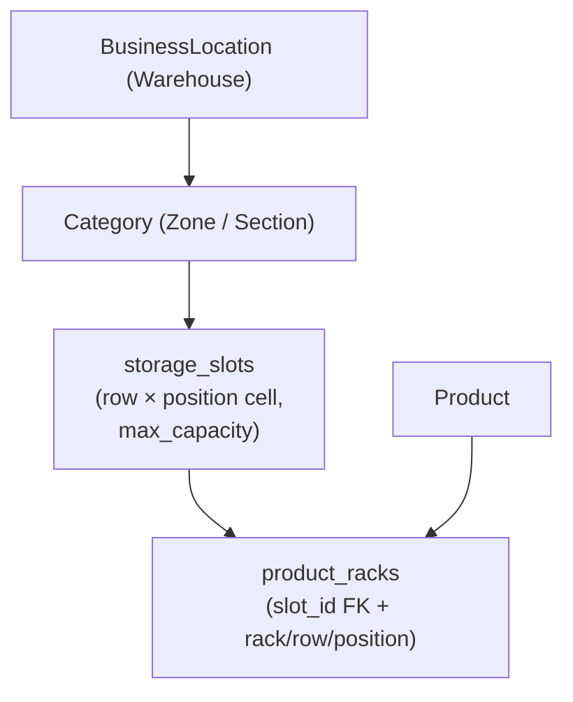

# Storage Manager — Full Implementation Plan

## Architecture




Key mapping:

- `business_locations` = warehouse
- `categories` (existing, `category_type = 'product'`) = zone/section (e.g., "A – Snacks & Drinks")
- `storage_slots` = one cell: location + category + row + position + max_capacity
- `product_racks` gains a `slot_id` FK; rack/row/position strings are kept for backward compat

---

## Phase 1 — Stock Tab: Slot Code Display

**Goal:** When rack features are on, show the storage slot code (e.g., "A / Row 1 / Pos 2") clearly in the existing rack table. No DB change.

Files changed:

- `[resources/views/product/partials/detail_stock.blade.php](resources/views/product/partials/detail_stock.blade.php)` — rename column headers; add a "Slot" computed badge column showing `{rack} › {row} › {position}`
- No controller change needed — `$details` already carries `rack`, `row`, `position`, and `name`

UI reference: `public/html/` badge pattern + `table-row-dashed` table

---

## Phase 2 — StorageManager Module: Foundation

**Goal:** Scaffold the module with migrations, model, Util, and basic slot CRUD.

### 2a. Module scaffold

```
Modules/StorageManager/
├── Database/Migrations/
│   ├── 2026_XX_XX_create_storage_slots_table.php
│   └── 2026_XX_XX_add_slot_id_to_product_racks.php
├── Entities/
│   └── StorageSlot.php
├── Http/Controllers/
│   ├── StorageManagerController.php     (index, create, store, edit, update, destroy)
│   └── StorageSlotController.php        (CRUD for individual slots)
├── Http/Requests/
│   ├── StoreStorageSlotRequest.php
│   └── UpdateStorageSlotRequest.php
├── Utils/
│   └── StorageManagerUtil.php
├── Routes/
│   └── web.php
├── Resources/views/
│   ├── index.blade.php                  (warehouse grid)
│   ├── slots/
│   │   ├── index.blade.php              (slot list per location+category)
│   │   ├── create.blade.php
│   │   └── edit.blade.php
└── StorageManagerServiceProvider.php
```

### 2b. `storage_slots` table


| column                  | type                  | notes                                            |
| ----------------------- | --------------------- | ------------------------------------------------ |
| id                      | unsignedInt PK        |                                                  |
| business_id             | unsignedInt           | tenant scope                                     |
| location_id             | unsignedInt           | FK business_locations                            |
| category_id             | unsignedInt           | FK categories                                    |
| row                     | varchar(50)           |                                                  |
| position                | varchar(50)           |                                                  |
| slot_code               | varchar(50) nullable  | auto-gen: `{category.short_code}{row}{position}` |
| max_capacity            | unsignedInt default 0 | manually set                                     |
| created_at / updated_at | timestamps            |                                                  |


### 2c. `product_racks` — add column

```sql
ALTER TABLE product_racks ADD COLUMN slot_id INT UNSIGNED NULL AFTER position;
```

### 2d. StorageSlot model (`Modules/StorageManager/Entities/StorageSlot.php`)

- `namespace Modules\StorageManager\Entities`
- `protected $guarded = ['id']`
- Relationships: `belongsTo BusinessLocation`, `belongsTo Category`, `hasMany ProductRack`

### 2e. StorageManagerUtil

Key methods:

- `getSlotsForLocation($business_id, $location_id)` — returns slots grouped by category
- `getSlotOccupancy($slot_id)` — count of products assigned to slot
- `assignProductToSlot($business_id, $product_id, $slot_id)` — updates `product_racks`

### 2f. Routes (`Modules/StorageManager/Routes/web.php`)

All under `middleware('web', 'authh', 'auth', 'SetSessionData', ...)`:

```
GET  /storage-manager                    → index (warehouse grid)
GET  /storage-manager/slots              → slot list
POST /storage-manager/slots              → store
GET  /storage-manager/slots/{id}/edit    → edit form
PUT  /storage-manager/slots/{id}         → update
DELETE /storage-manager/slots/{id}       → destroy
```

---

## Phase 3 — Warehouse Grid View

**Goal:** The visual storage map (matching the mockup — zones as cards, slots as cells, Available/Full states, capacity badge).

### View: `Modules/StorageManager/Resources/views/index.blade.php`

- Location selector dropdown at the top (filters by `business_location`)
- Each category = Metronic `card` with `card-header` (zone name) + `card-body` (slot grid)
- Each slot = Metronic badge-style button cell showing slot_code (e.g., A1)
- Color: available (light-primary) vs full (light-danger) based on occupancy vs max_capacity
- Overflow slots: collapsed with a "+N" badge (matches mockup)
- Capacity footer per zone: "Occupied X of Y cartons"

Controller method (`StorageManagerController::index`):

1. Load locations for dropdown
2. For selected location: load `getSlotsForLocation` grouped by category, with occupancy counts
3. Pass prepared `$zones` array (category name, slots with status, zone totals) to view — **no logic in Blade**

### Data shape prepared in controller:

```php
$zones = [
  ['category' => ..., 'slots' => [...], 'occupied' => 80, 'capacity' => 1200]
]
```

UI reference: `public/html/widgets/` card patterns + Metronic badge classes

---

## Phase 4 — Product–Slot Linking (Stock Tab upgrade)

**Goal:** Product Stock tab shows the assigned `StorageSlot` (slot_code, zone, capacity context) linked via `product_racks.slot_id`.

### 4a. `ProductUtil::getRackDetails` update

When `$get_location = true`, also join `storage_slots` and `categories` to return `slot_code` and `category_name` alongside existing `rack/row/position`.

### 4b. `ProductController::detail` — no change needed

`$details` will automatically carry the new fields once Util is updated.

### 4c. `detail_stock.blade.php` — add slot badge

Show a slot_code badge per row in the rack table: e.g., `badge-light-primary` with the category zone + code.

### 4d. Slot assignment from Stock tab (optional UI action)

A small "Change Slot" button per row opens a modal with a dropdown of available slots for that location. AJAX POST to `StorageManagerUtil::assignProductToSlot`.

---

## Permissions

Register two new permissions: `storage_manager.view`, `storage_manager.manage`. Check before every mutation.

## Translation keys (add to `lang_v1`)

- `storage_manager`, `storage_slot`, `slot_code`, `max_capacity`, `occupied`, `available`, `zone`, `warehouse_map`

## Metronic UI references

- Zone grid cards: `public/html/widgets/mixed.html` or `public/html/dashboards/`
- Slot cells (badge buttons): `public/html/utilities/modals/` + badge pattern
- Slot list table: `public/html/apps/ecommerce/sales/listing.html`
- Forms: `public/html/forms/`

