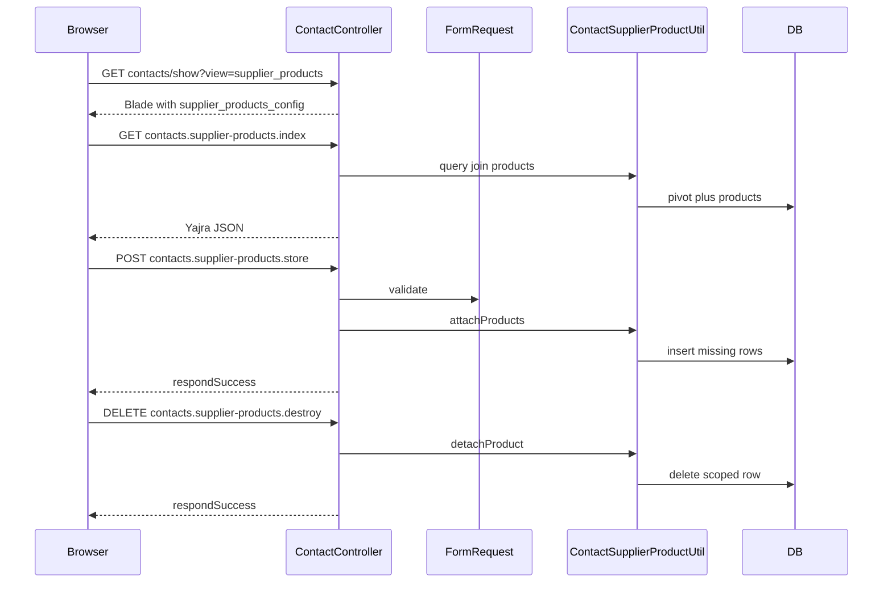

# Supplier products tab on contact show

## Goal

On [`resources/views/contact/show.blade.php`](resources/views/contact/show.blade.php), for contacts where `$is_supplier` is true (`supplier` or `both`), add a **Supplier products** tab that lists products the user associates with that supplier, with **add** and **remove** actions. Deep link: `contacts/{id}?view=supplier_products`.

## Locked decisions (implementation contract — do not reinterpret)

| Topic | Decision |
|--------|-----------|
| **Pivot table** | `contact_supplier_products` with `id`, `business_id`, `contact_id`, `product_id`, `timestamps`. Unique index on `(business_id, contact_id, product_id)`. |
| **Foreign keys** | `contact_id` → `contacts(id)` **ON DELETE CASCADE**. `product_id` → `products(id)` **ON DELETE CASCADE**. |
| **Tenant scope** | Every query/mutation includes `where('business_id', $business_id)` using session `user.business_id`. Resolve contact with `Contact::where('business_id', $business_id)->whereKey($id)->firstOrFail()` (or equivalent) — never bare `find` on tenant models. |
| **Who sees the tab** | Same as other supplier-only tabs: `$is_supplier` (`supplier` or `both`). |
| **Who can list (DataTable)** | Same authorization as viewing [`ContactController::show`](app/Http/Controllers/ContactController.php) (including `supplier.view_own` / `customer.view_own` rules already applied there). |
| **Who can attach/detach** | **`supplier.update` only** (align with [`updateStatus`](app/Http/Controllers/ContactController.php) supplier path pattern for a supplier-specific write). Users without `supplier.update` see the tab list **read-only** (no Add/Remove UI). Do **not** grant mutations via `customer.update` alone. |
| **Product eligibility** | Only products with `products.business_id = $business_id` and `products.type != 'modifier'` (match [`ProductController::getProductsWithoutVariations`](app/Http/Controllers/ProductController.php)). Ignore invalid IDs on attach; attach is idempotent for duplicates (unique index / firstOrCreate). |
| **Attach API** | `POST` JSON or form body: `product_ids` = array of integers, **max 500** per request, `required`, `array`, `*.integer`. |
| **Detach API** | `DELETE` to remove one link: URL includes `product` = product id (integer). |
| **Util class name** | `App\Utils\ContactSupplierProductUtil` (methods take `$business_id` first). |
| **Pivot Eloquent** | `App\ContactSupplierProduct` model, `$table = 'contact_supplier_products'`, `$guarded = ['id']`. |
| **Routes** | Register inside the same `auth` + session middleware group as [`Route::resource('contacts', ...)`](routes/web.php). Use explicit names below. Use route parameter `{contact}` (id). |
| **Route names** | `contacts.supplier-products.index` → `GET contacts/{contact}/supplier-products` (DataTables AJAX). `contacts.supplier-products.store` → `POST contacts/{contact}/supplier-products`. `contacts.supplier-products.destroy` → `DELETE contacts/{contact}/supplier-products/{product}`. |
| **Controller** | Add three methods on [`ContactController`](app/Http/Controllers/ContactController.php): e.g. `getContactSupplierProducts`, `attachContactSupplierProducts`, `detachContactSupplierProduct`. |
| **Form requests** | `AttachContactSupplierProductsRequest`, `DetachContactSupplierProductRequest` — validate input, resolve contact belongs to business and `type` in `supplier`, `both`; `authorize()` requires `supplier.update` for store/destroy; for index require same ability as datatable consumer (mirror show access — use `authorize` callback or dedicated gate). |
| **Responses** | Use existing helpers: `respondSuccess`, `respondWithError`, `respondUnauthorized`, `respondWentWrong` from project base controller. |
| **Blade / JS** | Prepare `supplier_products_config` (URLs, CSRF, `contact_id`, flags) and `can_manage_supplier_products` in `ContactController::show` — **no route assembly or permission logic in Blade** beyond `@can`/`@if` on passed booleans. |
| **UI kit** | **Metronic 8.3.3 only** (Bootstrap 5). Match patterns already used on [`contact/show.blade.php`](resources/views/contact/show.blade.php) (`card`, `card-body`, `table align-middle table-row-dashed fs-6 gy-5`, buttons `btn btn-sm btn-primary` / `btn-light-danger`). For structure reference, use [`public/html/widgets/mixed.html`](public/html/widgets/mixed.html) and table listing patterns under [`public/html/apps/ecommerce/`](public/html/apps/ecommerce/) — do **not** invent new CSS classes. Keenthemes docs: [Metronic base utilities](https://preview.keenthemes.com/html/metronic/docs/base/utilities) for spacing/layout only where it matches shipped Metronic. |
| **Product picker** | Reuse `GET /products/list-no-variation` ([`ProductController::getProductsWithoutVariations`](app/Http/Controllers/ProductController.php)) with Select2 (or existing global pattern in `show.blade.php`). |
| **Translations** | **English + Vietnamese only:** add keys to [`lang/en/lang_v1.php`](lang/en/lang_v1.php) and [`lang/vi/lang_v1.php`](lang/vi/lang_v1.php) (or [`lang/en/contact.php`](lang/en/contact.php) / [`lang/vi/contact.php`](lang/vi/contact.php) if strings are contact-specific — pick one file pair and stay consistent). |
| **Supplier index menu** | **Include** quick link `?view=supplier_products` next to existing `view=stock_report` / `view=purchase` links in [`ContactController`](app/Http/Controllers/ContactController.php) supplier dropdown HTML (same permission pattern as other view links). |
| **Out of scope** | Per-supplier price/lead time; auto-import from purchases; new Spatie permissions; module-only `get_contact_view_tabs` implementation. |

## Architecture

## Parallel worker strategy (Codex / Cursor)

Execute in order by dependency; **parallelize only where files do not overlap**.

| Stage | Owner | Tasks | Parallel with |
|--------|--------|--------|----------------|
| **1** | Main or Worker 1 | Migration `contact_supplier_products`, `App\ContactSupplierProduct`, `Contact::supplierProducts()` relationship (or equivalent `belongsToMany` name). | — |
| **2a** | Worker A | `ContactSupplierProductUtil` + **unit tests** (attach idempotent, detach scoped, rejects non-supplier). | **2b** |
| **2b** | Worker B | `AttachContactSupplierProductsRequest`, `DetachContactSupplierProductRequest` (rules + authorize skeleton; finalize `authorize` after util contact assertion exists). | **2a** |
| **3** | Main | `routes/web.php`, three `ContactController` methods, constructor injection for util. **Single writer** on `ContactController` to avoid merge conflicts. | — |
| **4a** | Worker C | [`supplier_products_tab.blade.php`](resources/views/contact/partials/supplier_products_tab.blade.php) + **en/vi** strings. | **4b** if URLs are already in plan |
| **4b** | Main or Worker D | [`show.blade.php`](resources/views/contact/show.blade.php) tab nav + pane + DataTables/Select2 JS; `show()` passes config. Prefer **one worker** for `show.blade.php` to reduce conflict. | After stage 3 |
| **5** | Main | Feature tests (403/404 paths, attach/detach happy path), `php artisan test`, lints, GitNexus impact on `ContactController`. | — |

**Rule:** Do not assign `ContactController.php` to two workers in the same phase.

---

## Phase 1 — Database and models

| Task | Detail |
|------|--------|
| 1.1 | Migration per locked decisions; indexes on `business_id`, `contact_id`, `product_id`. |
| 1.2 | `App\ContactSupplierProduct` model. |
| 1.3 | `Contact::belongsToMany(Product::class, 'contact_supplier_products', ...)` with `withTimestamps()`. |

**Verify:** `php artisan migrate --pretend`, then migrate locally.

---

## Phase 2 — Business logic (Util)

| Task | Detail |
|------|--------|
| 2.1 | `ContactSupplierProductUtil`: `assertSupplierContact`, `getQueryForDatatable`, `attachProducts`, `detachProduct`. |
| 2.2 | Inject util in `ContactController` constructor. |

**Verify:** Unit tests for util.

---

## Phase 3 — HTTP layer

| Task | Detail |
|------|--------|
| 3.1 | Form requests per locked decisions. |
| 3.2 | Named routes per locked decisions. |
| 3.3 | Yajra DataTables for index (columns: at minimum product name, SKU, action column with remove when `can_manage`). |
| 3.4 | GitNexus impact on changed `ContactController` symbols before merge. |

---

## Phase 4 — UI

| Task | Detail |
|------|--------|
| 4.1 | Partial + Metronic layout per locked decisions. |
| 4.2 | `show()`: `supplier_products_config`, `can_manage_supplier_products`. |
| 4.3 | Tab + JS: DataTables `ajax` to `contacts.supplier-products.index`; POST attach; DELETE remove; deep link `view=supplier_products`. |
| 4.4 | **en + vi** translations only. |
| 4.5 | Supplier dropdown quick link **included**. |

---

## Phase 5 — Tests and cleanup

| Task | Detail |
|------|--------|
| 5.1 | Feature tests: attach/detach; customer-only contact rejected; wrong `business_id` rejected; datatable lists only linked products. |
| 5.2 | Run filtered tests + lints. |

---

## Constitution / consistency checklist

- No business logic or route assembly in Blade; prepared config from controller.
- Form requests for non-trivial mutations; thin controller.
- All tenant queries scoped by `business_id`.
- No new permissions; reuse `supplier.update` / show visibility rules.
- Follow [`AGENTS.md`](AGENTS.md) and [`laravel-coding-constitution`](.cursor/rules/laravel-coding-constitution.mdc) for view data and tests.

---

## Out of scope (unchanged)

- Pivot pricing fields; purchase-history sync; module-only tabs.
